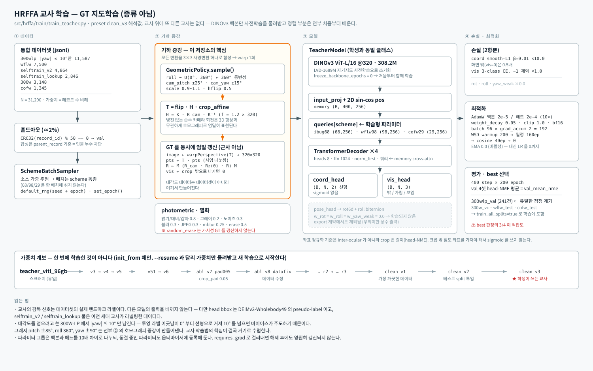
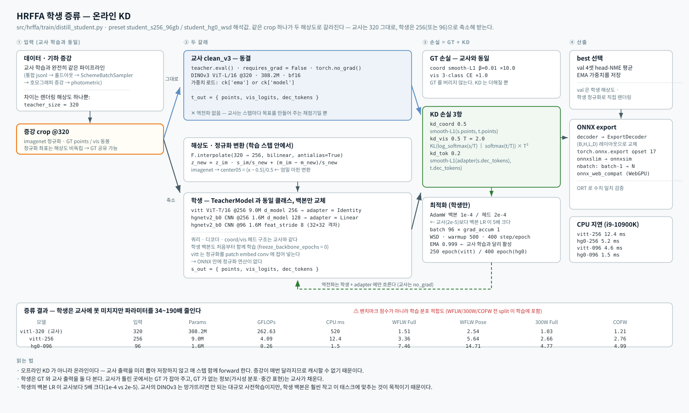

# HRFFA — High-Angle Robust Fast FaceAlignment

극단 자세에서 무너지지 않으면서 **CPU 실시간**으로 도는 whole-head 랜드마크 정렬.
교사 학습 → 온라인 증류 → ONNX 배포까지 한 저장소에 들어 있다.

> 공통 사항(랜드마크 규약·데이터셋·NME 정규화 기준·저장소 비교)은 **[FA2D.md](FA2D.md)** 를 본다.

- 원저장소: <https://github.com/PINTO0309/High-Angle_Robust_Fast_FaceAlignment>
- 로컬 사본: `<작업 루트>/2d_aligments/High-Angle_Robust_Fast_FaceAlignment`
- 라이선스: MIT · DOI 10.5281/zenodo.22161810
- 가중치: 저장소에 없다. [releases/tag/weights](https://github.com/PINTO0309/High-Angle_Robust_Fast_FaceAlignment/releases/tag/weights) 에서 ckpt / ONNX / TFLite 를 받는다 (`ckpts/` 는 비어 있음)

규모: Python 16.6k 줄 + TypeScript 웹 데모. 주석은 **일본어**다.

```
src/hrffa/
  dataset/   ← 가장 큼. converters(4개 DB→통합 jsonl) · pseudolabel(DEIMv2 head bbox)
             · selftrain · augment · qa(감사 11개 모듈)
  model/     teacher.py · backbone.py · vit_tiny.py · hgnetv2.py · losses.py · popos.py
             · export_modules.py
  train/     config.py · train_teacher.py · distill_student.py · evaluate.py
  export/    export_onnx.py · nbatch.py
configs/     58개 YAML
demo/web/    React + Electron + onnxruntime-web (WebGPU)
```

**학습 코드보다 데이터 파이프라인이 훨씬 크다.** 이 저장소의 무게중심이 어디인지 그대로 드러난다.

---

## 1. 설계 전제 — face crop 이 아니라 head crop

통상의 정렬 논문은 타이트한 **얼굴** crop 을 전제한다. HRFFA 는 **머리 전체** crop 에 건다.

저자의 근거 두 가지:

1. 여백에 담긴 배경 맥락까지 함께 넣어 특징을 더 받는다.
2. **실용적 이유가 더 크다** — 객체 검출기는 얼굴보다 머리를 훨씬 안정적으로 잡는다.
   pitch 가 커져 얼굴이 거의 안 보이는 프레임에서도 머리는 잡힌다.

대가는 명확하다. 유효 해상도가 줄고, **논문 벤치마크 대비 구조적으로 불리하다**.
저자도 "architecture is therefore at a considerable disadvantage against paper benchmarks"
라고 적어 뒀다.

커버 범위: pitch **±85° 초과**(실측), roll **360° 전체**, yaw **±90°** 프로필.

출력: **68 / 98 / 29 랜드마크 + 점마다 가시성 3-class**(0=화면 밖, 1=가림, 2=보임).

---

## 2. 모델 — 점 쿼리 디코더

[`src/hrffa/model/teacher.py`](../../../2d_aligments/High-Angle_Robust_Fast_FaceAlignment/src/hrffa/model/teacher.py)
의 `TeacherModel` **하나가 교사·학생 양쪽**이다. backbone 만 갈아끼운다
(`vitl16` / `vitt` / `hgnetv2_b0`). 코드 경로가 하나라 증류가 자연스럽게 붙는다.

```
이미지 → backbone → 패치 특징 (B,C,h,w) + CLS (B,C)
                      ↓ input_proj + 2D sin-cos 위치임베딩
                    memory (B,hw,d)
                      ↑ cross-attention
      scheme 별 학습형 쿼리 (N,d) → TransformerDecoder(4층) → dec (B,N,d)
                                                                ├→ coord_head → 좌표 (B,N,2)
                                                                └→ vis_head   → 가시성 (B,N,3)
```

### 2.1 scheme 별 학습형 쿼리

```python
self.queries = nn.ParameterDict({
    name: nn.Parameter(torch.randn(n, d_model) * 0.02)
    for name, n in self.schemes.items()      # ibug68:68, wflw98:98, cofw29:29
})
```

디코더·헤드는 공유하고 **쿼리 임베딩만 규약별로** 둔다. 한 모델이 68/98/29 를 모두 내는
근거가 이것이고, **점 수 확장이 쿼리 추가만으로** 끝난다. 배치는 scheme 동종으로 구성한다
(`SchemeBatchSampler`).

### 2.2 좌표는 sigmoid 없는 선형 출력

이유가 명시돼 있다 — **크롭 밖으로 나간 점(가시성 0)도 좌표를 가져야** 하므로 [0,1] 로
눌러버리면 안 된다. 정규화 기준은 inter-ocular 가 아니라 **crop 변 길이**(0..1 이 화면 안).

### 2.3 손실

[`model/losses.py`](../../../2d_aligments/High-Angle_Robust_Fast_FaceAlignment/src/hrffa/model/losses.py)

| 항 | 정의 | 비고 |
|---|---|---|
| `coord` | smooth-L1 (β=0.01), 점별 가중 | 가시성 0(화면 밖)은 `out_weight=0.5`, -1(불명)은 1.0 |
| `vis` | 3-class CE | -1(불명)은 마스크로 제외 |
| `rot` | 회전행렬 측지거리 | **배포 계열은 0** (§7.2) |
| `roll` | biternion cosine, `1 - <bit, (cos r, sin r)>` | 동 |
| `yaw_weak` | von Mises NLL `κ(1 - cos Δθ)` — direction8 약라벨용 | 동 |
| `dist` | POPoS 거리맵 (반경 내 L1 / 밖 hinge) | D8 아암 전용 |

자세는 **6D 회전 표현**(Gram-Schmidt)으로 짐벌락을 피하고 roll biternion 보조 헤드를 둔다.

### 2.4 실험 아암이 플래그로 들어 있다

`configs/` 의 `abl_*` 프리셋이 축을 하나씩 켠다.

| 아암 | 플래그 | 내용 |
|---|---|---|
| D5 | `feat_layers: [5,8,11]` | 중간 블록 다층 융합 |
| D6 | `dec_local_iters: N` | 추정 좌표로 memory 를 `grid_sample` → 게이트 융합 → 디코더 재적용 → 잔차 정밀화. `delta_head` **zero-init** 이라 추가 직후 항등 |
| D7 | `local_conv: true` | 학생 블록에 zero-init 국소 합성곱 분기 (LESA 유래) |
| D8 | `head: popos` | 거리맵 + multilateration 디코딩 |

**D8 POPoS** ([`model/popos.py`](../../../2d_aligments/High-Angle_Robust_Fast_FaceAlignment/src/hrffa/model/popos.py)):
각 쿼리가 격자 셀까지의 거리 `d` 를 예측하고, 거리 최소 top-K 셀을 앵커로 삼아 닫힌형
최소제곱으로 좌표를 푼다. 기준 앵커와의 차를 취하면 `x` 에 대해 선형이 된다.

```
2(p_i − p_0)·x = (‖p_i‖² − ‖p_0‖²) − (d_i² − d_0²)
```

16×16 같은 **저해상 격자에서도 서브셀 정밀도**가 나온다. top-K 선택은 미분 불가지만
선택 이후는 `d_i` 에 대해 미분 가능해 좌표 손실이 거리 예측으로 흐른다.
ONNX 로는 TopK / Gather / MatMul 만 남는다 — 처음부터 export 를 염두에 둔 설계다.

---

## 3. 핵심 기여 — 기하 증강이 GT 를 엄밀하게 갱신

[`dataset/augment/geometric.py`](../../../2d_aligments/High-Angle_Robust_Fast_FaceAlignment/src/hrffa/dataset/augment/geometric.py)
가 이 저장소의 심장이다.

crop · roll · 카메라회전 · flip · scale · translate 를 **3×3 사영변환 T 하나로 합성**해
**warp 를 1회만** 돌린다. 랜드마크는 T 로, 자세는 대응 3D 회전으로 갱신한다.

### 3.1 카메라 회전 워프 — 대각도 데이터를 만드는 수단

> 병진 없는 **순수 카메라 회전**에 의한 이미지 변화는 장면의 3D 형상과 **무관하게**
> 호모그래피 `H = K · R_cam · K⁻¹` 로 엄밀히 표현된다. 자세는 `R' = R_cam · R`.

즉 **3DMM 없이, 2D 랜드마크만으로** pitch/yaw 관점 변화를 라벨과 함께 정확히 만들어낸다.
"pitch ±85° 초과"를 학습 데이터로 확보한 실질적 수단이 이것이다.
[FA3D](../FA3D/FA3D.md) 가 3DMM 파라미터로 푸는 문제를 여기서는 호모그래피로 우회한다.

기본 샘플링 범위: `cam_pitch ±25°`, `cam_yaw ±15°` (`GeometricPolicy`).

### 3.2 Roll 360°

이미지 내 2D 회전 = 카메라 z 축 회전이므로 `R' = Rz(θ) · R` 로 엄밀하다.
`roll_mode: full360` 이면 `uniform(0, 360)` 에서 뽑는다.

그래서 **360° roll 등변성을 데이터로 심을 수 있고**, 평가에서 직접 잰다 —
`eval_roll360` 이 입력을 30° 간격으로 돌려 `geodesic(R̂(θ), Rz(θ)R̂(0))` 와
랜드마크 2D 회전 일관성(px)을 측정한다.

### 3.3 반전과 가시성

- hflip: `T ← flip · T`, 자세 `R' = M·R·M` (M = diag(−1,1,1)), 점은 scheme 의
  `flip_mapping` 으로 교환. Euler 로는 pitch 불변 · yaw/roll 부호 반전.
- 변환 후 출력 crop 밖으로 나간 점은 가시성을 **0(화면 밖)** 으로 갱신한다. 가림(1)은 보존.

### 3.4 한계 — "엄밀"의 범위

`camera_homography` 의 K 는 `focal_ratio = 1.2` 핀홀 가정이다. 주석이 "실기 K 는 미지"라고
인정한다. **기하적으로 엄밀하다는 것은 "가정한 카메라에 대해" 엄밀**이라는 뜻이다.
또한 새로 보이는 면이 생기지 않으므로 겉모습은 원 시점 그대로다 — 가려졌던 부분이
드러나는 진짜 시점 변화는 아니다.

---

## 4. 데이터 파이프라인

`dataset/` 이 `model/` + `train/` 합보다 크다.

| 하위 모듈 | 역할 |
|---|---|
| `converters/` | 300W-LP · WFLW · 300W · COFW → 통합 jsonl 스키마 |
| `pseudolabel/` | DEIMv2 로 head bbox 생성 (얼굴 bbox 가 아니라 머리) |
| `selftrain/` | 자가학습 — `mine_heads` · `pseudo_label` · `part_anchor_fix` · `pool_mirror_fix` |
| `augment/` | 기하(§3) · depth warp · **`gpt_head_gen.py` 3,866줄** |
| `qa/` | 감사 11종 — `angle_audit` · `lr_consistency_audit` · `yaw_band_conflict` · `lookup_pose_qa` · `sixdrepnet`(외부 자세추정기 교차검증) 등 |

`fix_flip_index.py` · `fix_yaw_semantics.py` — **라벨 규약 버그를 사후에 고친 흔적이
파일로 남아 있다.** 이런 파일이 있다는 것 자체가 이 태스크에서 규약 오류가 얼마나 쉽게
나는지 보여준다.

`gpt_head_gen.py`(3,866줄)는 OpenAI batch API 로 고각도 머리 이미지를 생성하는
오케스트레이터다. 테스트가 **1,671줄**이고 이름이 전부 실운영 실패다 — 멱등 submit,
토큰 초과 샤드 분할, SHA 대조로 중복 제출 방지, 만료된 부분 결과만 재시도,
stale 출력이 신규 시도의 id 를 덮지 못함.

**홀드아웃**: `record_id` 의 CRC32 % 50 == 0 을 검증용으로 뗀다(≈2%). 합성 데이터는
`parent_record` 기준으로 판정해 **부모가 검증측이면 자식도 검증측**으로 보낸다 —
동일 인물 누수 방지.

---

## 5. 학습 — 교사 → 온라인 증류

전체 흐름은 두 단계다. **교사를 GT 로 지도학습**한 뒤, 그 교사를 얼려 **학생을 온라인 증류**한다.



*교사 학습 — 통합 데이터셋에서 배치를 뽑아 호모그래피 기하 증강으로 GT 를 엄밀히 갱신하고,
DINOv3 백본 + 점 쿼리 디코더를 좌표·가시성 두 손실로 학습한다. 교사 위에 또 다른 교사는 없다.*

### 5.1 설정이 곧 실험 기록

`TrainConfig` dataclass 기본값 + YAML **차분만** + `_base_` 체인.
**미지 키는 에러**(오타 탐지). 조합 금지도 코드로 강제한다:

```python
if cfg.head == "popos" and cfg.dec_local_iters > 0:
    raise ValueError("head=popos cannot be combined with dec_local_iters>0 (045: one factor per arm)")
```

"아암 하나당 인자 하나"를 주석이 아니라 **검증으로** 박아 뒀다.

YAML 주석에 **판정 규칙까지** 있다 (`configs/clean_v3.yaml`):

> 20 epoch 창 평균 차가 −1% 미만이고 40 epoch 기울기가 −0.5%/10ep 미만이면 頭打ち →
> `epochs: <현 epoch + 40>` 으로 고쳐 `--resume` (즉시 decay 진입)

WSD 스케줄(warmup → 일정 LR → 말미 cosine 감쇠)을 쓴 이유도 여기서 나온다 —
**일정 LR 구간 길이가 `epochs` 에 의존하지 않아 resume 으로 연장/단축이 가능**하다.
`student_s256_96gb_r2` 는 e194 에서 200→300, e250 에서 300→400 으로 늘린 근거가
주석에 누적돼 있다.

### 5.2 온라인 증류



*증류 — 같은 증강 crop 하나가 두 해상도로 갈라진다. 교사는 320 을 그대로 받고(동결·no_grad),
학생은 256 으로 줄여 정규화를 변환해 받는다. 학생은 GT 손실 2항 + KD 3항을 함께 받는다.*

[`train/distill_student.py`](../../../2d_aligments/High-Angle_Robust_Fast_FaceAlignment/src/hrffa/train/distill_student.py)

**같은 증강 crop** 을 `teacher_size`(320)로 렌더링해서, 교사는 그대로 받고 학생은
`out_size`(256)로 줄여 받는다. 정규화 좌표는 해상도 비독립이라 GT·KD 목표를 공유할 수 있다.

```
crop@320 ─┬→ 교사(동결, bf16, no_grad) ─→ t_out
          └→ resize 256 + 정규화 변환 ─→ 학생 ─→ s_out
                                                  ├ compute_losses(s_out, GT)
                                                  └ kd_losses(s_out, t_out)
```

KD 3항: `kd_coord`(smooth-L1) · `kd_vis`(온도 T KL) · `kd_tok`(dec_tokens 특징, 차원이
다르면 `nn.Linear` 어댑터).

**입력 정규화 변환**: 교사는 ImageNet 상수, 학생은 `center05 = (x−0.5)/0.5`.
스텝 안에서 `z_new = z_im·s_im/s_new + (m_im−m_new)/s_new` 로 **엄밀 변환**한다.
학생 쪽은 이 정규화를 patch embed conv 에 접어 넣어 학습하므로 **ONNX 안에 정규화 연산이
없다** — 호출측이 규약대로 정규화하면 된다.

### 5.3 데이터 로더 난수 처리

`SchemeBatchSampler.__iter__` 가 `set_epoch()` + `np.random.default_rng(seed + epoch)` 로
**epoch 마다 스트림을 새로 만든다**. 데이터셋 쪽은 학습 시 `default_rng(None)`(호출마다
OS 엔트로피), 평가 시 `default_rng(seed + idx)`(결정적)로 나눈다.
워커 fork 로 인한 난수 중복이 구조적으로 생기지 않는다 —
[Pierrot 의 `BalancedConcat` 이 밟았던 함정](../FAS/FAS.md) 과 대조된다.

---

## 6. ONNX export 가 1급 시민

PINTO0309 저장소답게 export 가 부속물이 아니다. **실제로 export 해 본 사람만 쓰는 코드**다.

### 6.1 배치축이 사라지는 문제

`nn.MultiheadAttention` / `nn.TransformerDecoder` 는 내부적으로 `(L, B·H, D)` 로 배치축을
헤드축과 합친다. 그대로 export 하면 **배치 차원이 뭉개진 Reshape** 이 남아(의미는 맞지만)
나중에 배치 차원을 고쳐 쓰는 운용이 안 된다.

[`model/export_modules.py`](../../../2d_aligments/High-Angle_Robust_Fast_FaceAlignment/src/hrffa/model/export_modules.py)
가 **같은 가중치로 같은 계산을 `(B,H,L,D)` 레이아웃**으로 재구현한다.
학습 모듈은 건드리지 않고 **export 시점에만 디코더를 그 자리에서 교체**한다.

### 6.2 상수 폴딩 방지

```python
if STATIC_SHAPES:   # 정적 export: 입력값 의존으로 만들어 상수 폴딩을 막는다
    q = mem[:, :1, :1] * 0 + self.queries[scheme][None]
else:
    q = self.queries[scheme][None].expand(b, -1, -1)
```

### 6.3 onnxruntime-web 대응

`scripts/onnx_web_compat.py`(512줄)가 WebGPU/WASM 의 실제 실패 9종을 순서대로 우회하고
**에러 메시지를 주석에 남겼다**:

| 문제 | 원인 | 조치 |
|---|---|---|
| `Could not find an implementation for Cast(13)` | WASM 축소 빌드에 double 커널 없음 | `Cast(FLOAT→DOUBLE)` 과 DOUBLE 상수를 float32 로 |
| `Invalid dimension of 4294967295 for SizeToDimension` | WebGPU 가 1D MatMul 처리 못 함 | `Unsqueeze → MatMul → Squeeze` |
| GPU↔CPU 동기화 발생 | `IsInf` / `IsNaN` 이 WebGPU EP 에 없음 | `Not(Equal(x,x))` · `Greater(Abs(x), FLT_MAX)` 로 재작성 |

### 6.4 죽은 출력을 계약에서 제거

`ExportWrapper` 는 `points` 와 `vis_logits` **2본만** 낸다. 주석:

> rotation / roll_bit 은 2026-08-28 에 계약에서 제외했다 — 교사 clean_v* 와 전 학생이
> `w_rot = w_roll = 0` 이라 자세 헤드가 미갱신이어서 **무의미한 상수 출력**이었다.

자기 모델의 죽은 출력을 찾아내 뺀 기록이다.

---

## 7. 성능과 주의점

### 7.1 저자 공개 수치

inter-ocular NME %, 낮을수록 좋음. CPU 지연은 i9-10900K · onnxruntime 1.22 CPU EP · batch 1.

| 모델 | 입력 | Params | GFLOPs | CPU ms | WFLW Full | WFLW Pose | 300W Full | COFW |
|---|--:|--:|--:|--:|--:|--:|--:|--:|
| vitl-320 (교사) | 320 | 308.2M | 262.63 | 520 | 1.51 | 2.54 | 1.03 | 1.21 |
| vitt-256 | 256 | 9.0M | 4.09 | 12.4 | 3.36 | 5.64 | 2.66 | 2.76 |
| hg0-256 | 256 | 1.6M | 1.40 | 5.2 | 5.32 | 9.53 | 3.87 | 3.77 |
| vitt-096 | 96 | 9.0M | 0.85 | 4.6 | 5.14 | 8.65 | 3.86 | 3.90 |
| hg0-096 | 96 | 1.6M | 0.26 | 1.5 | 7.46 | 14.71 | 4.77 | 4.99 |

> ⚠ **이 값들은 벤치마크 점수가 아니다.** WFLW test · 300W · COFW 의 **모든 split 이
> 학습에 들어간다**(`train_all_splits: true`). 따라서 표는 **학습 분포에 대한 적합도**다.
> 저자가 README 에 명시하고 있다. 누수 없는 유일한 계기는 **`300wlp_val`(241건)** 뿐이다.
> D-ViT 논문 행이 함께 실려 있으나 "형식 참조용"이라고 못 박았다 — COFW 정규화 기준이
> inter-pupil 이고 테스트셋이 학습에서 빠져 있어 조건이 다르다.

### 7.2 코드를 읽을 때

1. **best 체크포인트 선택까지 누수 영향을 받는다.** `build_val_sets` 는
   `300wlp_val` / `300w_vc` / `wflw_test` / `cofw_test` 4개이고 best 판정은 그 **평균**
   (`val_mean_nme`)이다. 배포 계열에서는 4개 중 3개가 학습 데이터라, 저장되는 best 는
   사실상 적합도로 고른다. 저자는 이를 알고 **clean_v1(계측용) / clean_v2(배포용) 2단
   구성**으로 대응한다 — "決定は clean_v1 側の計器で行う".
2. **자세 관련 코드는 배포 경로에서 죽어 있다.** `pose_head` · 6D 회전 · roll biternion ·
   geodesic / von Mises 손실이 전부 살아 있지만 배포 프리셋은 `w_rot = w_roll = w_yaw_weak = 0`
   ("姿勢監督は恒久除外"). 코드만 훑으면 자세 추정을 하는 모델로 오해하기 쉽다.
3. **학습 재현성이 비대칭이다.** 체크포인트에 torch/cuda/numpy/python 전역 RNG 를 저장할
   정도로 공을 들였는데(`rng_states`), 증강 난수는 `default_rng(None)` 이라 그 밖에 있다.
   resume 이 완전 결정적이지 않다.
4. **`_random_erase` 가 가시성 GT 를 갱신하지 않는다.** "합성 가림 아래에서도 위치를
   맞히는 학습 의도"라고 명시된 선택이지만, 가려진 점이 여전히 "보임(2)"으로 남아
   vis 헤드에는 노이즈로 들어간다. 학생 설정의 `erase_prob: 0.5` 는 무시하기 어려운 비율이다.

### 7.3 실행 환경

`requires-python >= 3.12`, torch 2.11 / numpy 2.5.2 / opencv 5.0 고정, `uv` 전제.
**현재 이 서버(py3.9 · torch 2.2)에서는 그대로 돌지 않는다.**
`onnxruntime-gpu` 는 배타적 의존성 그룹으로 갈린다 — `ort`(1.22, 기본) / `tensorrt`(1.26, BF16).

---

## 8. Pierrot_FR 에 가져올 만한 것

알고리즘 자체보다 **방법론**이 쓸모 있다.

| 항목 | 내용 |
|---|---|
| **호모그래피 증강** | 3DMM 없이 2D 라벨만으로 대각도 데이터를 라벨과 함께 생성. [FA3D](../FA3D/FA3D.md) 의 300W-LP 의존을 줄일 수 있는 경로 |
| **설정 검증** | dataclass 필드 화이트리스트로 미지 키를 에러 처리 — [FAS 의 assert 방식](../FAS/FAS.md#4-설정) 보다 오타에 강하다 |
| **실험 축 강제** | "one factor per arm" 을 코드로 막는다 |
| **판정 규칙 문서화** | 설정 파일에 "언제 멈추고 언제 연장하는지"를 수치 기준으로 남긴다 |
| **export 선행 설계** | 트랜스포머를 배포할 거면 배치축 문제를 학습 코드 작성 시점에 고려한다 |
| **로더 난수** | 샘플러가 `set_epoch` + epoch 파생 시드로 스트림을 새로 만든다 |
