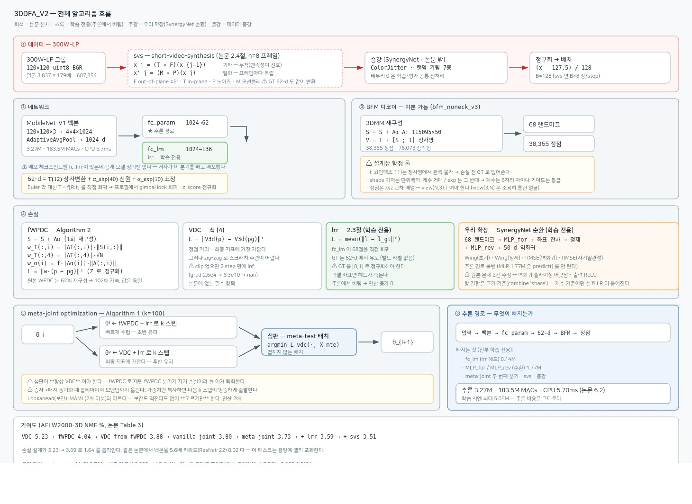
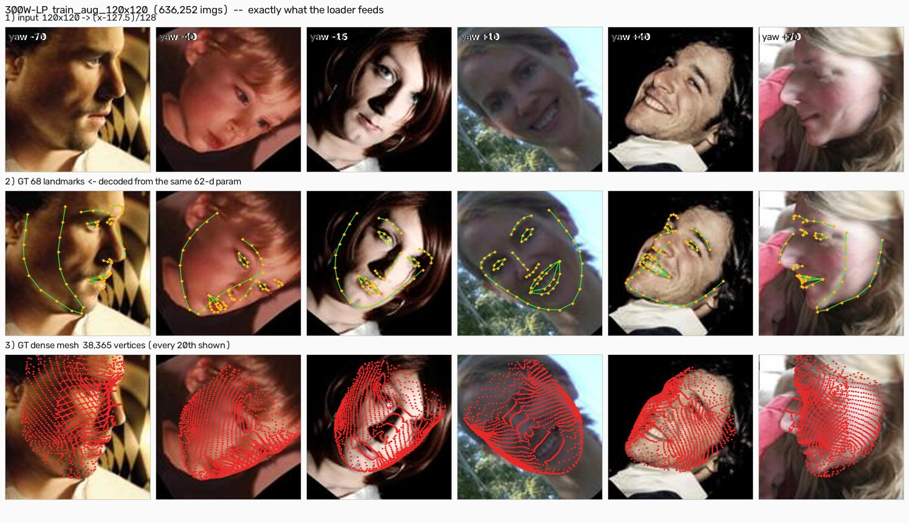
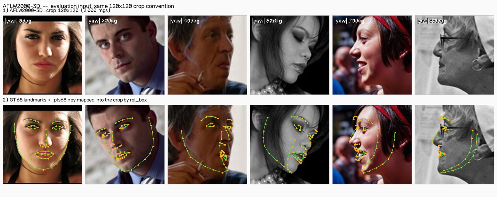
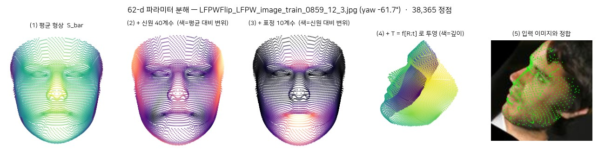
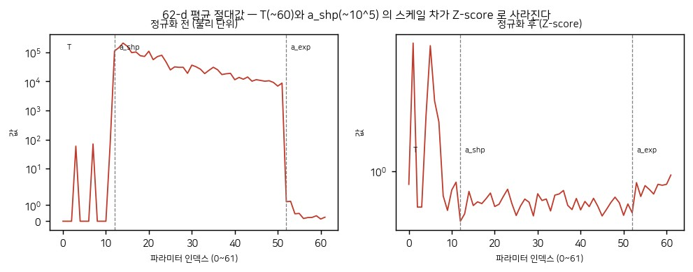
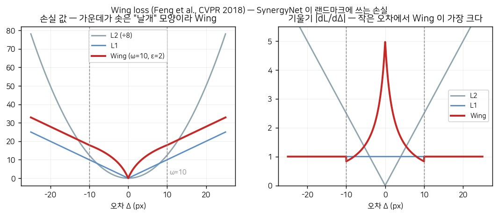

# 3DDFA_V2 알고리즘 상세

[Towards Fast, Accurate and Stable 3D Dense Face Alignment](https://guojianzhu.com/assets/pdfs/3162.pdf)
(Guo, Zhu, Yang, Yang, Lei, Li — ECCV 2020) 의 알고리즘을 파라미터 단위까지 푼 문서.

원문·supplementary·전작(3DDFA v1, TPAMI) PDF: `/ai_data_new_ssd/DEV/fr/3d_aligments/papers/`
구현·실험 기록: [FA3D.md](FA3D.md)

> 이 문서의 수치는 **논문 인용값**과 **우리가 300W-LP 636,252장에서 직접 잰 값**이
> 섞여 있다. 실측값은 그때마다 표시했다.

---

## 목차

0. [전체 흐름 한눈에](#0-전체-흐름-한눈에)

1. [무엇을 푸는 문제인가](#1-무엇을-푸는-문제인가)
2. [3DMM — 회귀 대상 62-d 파라미터](#2-3dmm--회귀-대상-62-d-파라미터) · [실제 데이터 그림](#28-실제-학습-데이터--그림으로)
3. [손실 함수 — VDC · WPDC · fWPDC · lrr](#3-손실-함수)
4. [meta-joint optimization](#4-meta-joint-optimization--algorithm-1)
5. [3D aided short-video-synthesis](#5-3d-aided-short-video-synthesis)
6. [네트워크 구조](#6-네트워크-구조)
7. [학습 하이퍼파라미터](#7-학습-하이퍼파라미터)
8. [평가 지표](#8-평가-지표)
9. [논문 수치 정리](#9-논문-수치-정리)
10. [SynergyNet 과의 비교](#10-synergynet-과의-비교--직계-후속)

---

## 0. 전체 흐름 한눈에



회색 = 논문 본체 · 초록 = 학습 전용(추론에서 버림) · 주황 = 우리 확장(SynergyNet 순환) · 빨강 = 데이터 증강.
원본 SVG: [`docs/FA3D/architecture.svg`](../../docs/FA3D/architecture.svg)

각 모듈의 상세는 아래 절에 있다 — ② §6 · ③ §2 · ④ §3 · ⑤ §4 · svs §5.

---

## 1. 무엇을 푸는 문제인가

**3D 밀집 얼굴 정렬(3D dense face alignment)** — 단일 RGB 이미지 한 장에서 얼굴의
3D 형상 전체(수만 개 정점)와 그 자세를 복원한다. 68점 랜드마크만 찾는 2D 정렬과
달리 **보이지 않는 부분(self-occluded)까지** 낸다.

### 두 가지 접근

| | 밀집 정점 직접 회귀 | **3DMM 파라미터 회귀** ← 이 논문 |
|---|---|---|
| 대표 | PRNet, VRN | 3DDFA, 3DDFA_V2 |
| 출력 | 20,000+ 좌표를 FCN 으로 | 62개 계수 |
| 백본 | hourglass 계열 (무겁다) | MobileNet 급으로 충분 |
| 문제 | 해상도가 feature map 크기에 묶임, deconv 로 인한 checkerboard artifact | **파라미터마다 중요도가 달라 회귀가 어렵다** |

논문이 밀집 회귀를 채택하지 않은 근거는 본문에 있다 — PRNet 채널을 77.5% 쳐내
CPU 실시간을 맞췄더니 오차가 **44.8% 증가**했다 (3.62 → 5.24).

### 파라미터 회귀의 난점

62개 파라미터가 얼굴 형상에 미치는 영향이 **제각각이다.**
회전 행렬 원소 하나가 틀리면 얼굴 전체가 돌아가지만, 40번째 shape 계수가 틀리면
거의 티가 안 난다. 그런데 단순 L2 로 학습하면 둘을 똑같이 취급한다.
→ **학습 중에 각 파라미터를 중요도에 따라 동적으로 재가중해야 한다.**

기존 해법은 cascade(단계를 쌓아 점진적으로 갱신)인데 단계 수에 비례해 연산이 는다.
이 논문은 cascade 없이 **손실 설계**로 푼다.

### 세 가지 기여

| 기여 | 약칭 | 효과 (AFLW2000-3D NME) |
|---|---|---|
| meta-joint optimization | **M** | 4.04 → 3.73 |
| landmark-regression regularization | **R** | 3.73 → 3.59 |
| 3D aided short-video-synthesis | **S** | 3.59 → 3.51 |

---

## 2. 3DMM — 회귀 대상 62-d 파라미터

### 2.1 3D Morphable Model 이란

Basel Face Model(BFM 2009) — 200명의 3D 스캔에 PCA 를 돌려 얻은 선형 모델이다.
"모든 얼굴은 평균 얼굴 + 주성분들의 선형결합"이라고 가정한다.

```
S = S̄ + A_id·α_id + A_exp·α_exp                                   (논문 식 1)
```

| 기호 | 뜻 | 형태 | 출처 |
|---|---|---|---|
| `S` | 복원된 3D 얼굴 메시 (정점 좌표) | 3×N | 계산 결과 |
| `S̄` | **평균 얼굴** — 200명의 평균 형상 | 3×N | BFM 고정 상수 |
| `A_id` | **신원(identity) 기저** — 사람마다 다른 골격 | 3N×40 | BFM PCA 고유벡터 |
| `α_id` | 신원 계수 — "이 사람은 평균에서 얼마나 벗어났나" | 40 | **회귀 대상** |
| `A_exp` | **표정 기저** — 입 벌림·눈 감음 등 | 3N×10 | FaceWarehouse 유래 |
| `α_exp` | 표정 계수 | 10 | **회귀 대상** |

`N` = 정점 수. 우리가 쓰는 `bfm_noneck_v3.pkl` 은 **N = 38,365** (삼각형 76,073개).
원본 BFM(53,215 정점)에서 목 부분을 제거하고 재색인한 것이다.
*(실측: v1 basis 와 V2 basis 로 같은 파라미터를 디코딩하면 68 랜드마크 차이가
0.0021 px — 파라미터 공간이 동일함을 확인했다.)*

> **왜 40 / 10 인가** — 원래 α_id ∈ R^199, α_exp ∈ R^29 다. PCA 뒷부분 주성분은
> 고유값이 작아 형상에 거의 기여하지 않는다. supplementary Fig.2 의 199×29 heatmap
> 에서 [40, 10] 지점의 NME 증가가 약 **0.4%** 로 허용 가능하다고 판단했다.
> 대신 정점 재구성이 5배 빨라진다 (`A` 가 3N×228 → 3N×50).

### 2.2 투영 모델 — 3D 얼굴을 이미지에 놓기

```
V2d(p) = f · Pr · R · (S̄ + A_id·α_id + A_exp·α_exp) + t2d          (논문 식 2)
```

| 기호 | 뜻 | 자유도 |
|---|---|---|
| `f` | **스케일** — 얼굴이 이미지에서 얼마나 큰가 | 1 |
| `R` | **회전 행렬** — 머리 자세 (pitch/yaw/roll) | 3 |
| `Pr` | 정사영 행렬 `[[1,0,0],[0,1,0]]` — z 를 버린다 | 0 (상수) |
| `t2d` | **2D 이동** — 얼굴 중심의 이미지 좌표 | 2 |

**왜 원근(perspective)이 아니라 정사영(orthographic)인가** — 얼굴은 카메라까지의
거리에 비해 깊이 방향 두께가 작다(약 1/10). 이 조건에서 원근 효과는 무시할 만하고,
정사영은 **선형**이라 미분·최적화가 훨씬 쉽다. 3DMM 피팅의 표준 관행이다.

### 2.3 ⚠ 왜 Euler 각을 직접 회귀하지 않는가 — gimbal lock

식 2 대로면 회귀 대상은 `[f, pitch, yaw, roll, t2d, α_id, α_exp]` 다.
그런데 Euler 각에는 **gimbal lock** 문제가 있다.

yaw 가 ±90°(완전 프로필)에 가까워지면 pitch 축과 roll 축이 정렬되어
**자유도가 하나 사라진다.** 같은 3D 자세가 (pitch=10°, roll=0°) 로도,
(pitch=0°, roll=10°) 로도 표현된다.

회귀기 입장에서는 **같은 입력 이미지에 정답 라벨이 여러 개**인 상황이다.
학습이 두 답 사이에서 진동하고, 대각(large-pose) 성능이 무너진다.
그런데 300W-LP 는 애초에 large-pose 를 위해 만든 데이터셋이라 이게 치명적이다.

**해법**: 상사변환 행렬을 **통째로** 회귀한다.

```
T = f·[R ; t3d] ∈ R^{3×4},   t3d = [t2d ; 0]

V2d(p) = Pr · T · [S̄ + Aα ; 1]                                    (논문 식 3)
```

`A = [A_id, A_exp]`, `α = [α_id, α_exp]` 로 합쳤다.
12개 원소를 자유롭게 회귀하므로 표현이 유일하고, gimbal lock 이 없다.

> 대가: T[:, :3] 이 정확히 `f·R`(스케일된 직교행렬) 이라는 제약을 네트워크가
> 명시적으로 지키지는 않는다. 데이터에서 배울 뿐이다.
> *(실측: 300W-LP GT 는 `‖T[:,:3]/f · (T[:,:3]/f)ᵀ − I‖ = 0.00000` 으로 정확한 회전행렬)*

### 2.4 최종 62-d 파라미터 — 인덱스별 의미

```
p ∈ R^62 = [ T(12) , α_shp(40) , α_exp(10) ]
```

`T` 는 **row-major** 로 펴진다 (`param[:12].reshape(3,4)`):

| 인덱스 | 원소 | 의미 | 실측 통계 (300W-LP 636,252장, 물리 단위) |
|---|---|---|---|
| 0,1,2 | T[0,0..2] | 회전·스케일 1행 → **투영 후 x 성분** | 평균 ~0 (회전이 상쇄) |
| **3** | T[0,3] | **t_x** — 얼굴 중심의 x (120px 크롭 기준) | 평균 **60.6**, 범위 [4.3, 121.8] |
| 4,5,6 | T[1,0..2] | 회전·스케일 2행 → 투영 후 y 성분 | 평균 ~0 |
| **7** | T[1,3] | **t_y** — 얼굴 중심의 y | 평균 **70.4**, 범위 [7.9, 118.0] |
| 8,9,10 | T[2,0..2] | 회전·스케일 3행 → **깊이(z) 성분** | 평균 ~0 |
| **11** | T[2,3] | **t_z** — ⚠ **관측 불가능** (2.7절) | 평균 −76.6 |
| 12–51 | α_shp[0..39] | 신원 계수 (PCA 순서 = 중요도 순) | σ 범위 [12,641, 574,351] |
| 52–61 | α_exp[0..9] | 표정 계수 | σ 범위 [0.162, 1.596] |

스케일 `f` 는 별도 파라미터가 아니라 `T[:, :3]` 에 녹아 있다.
`‖f·R‖_F = f·‖R‖_F = f·√3` 이므로 `f = ‖T[:,:3]‖_F / √3` 로 뽑는다.

> **실측: f 평균 = 0.00057356**, 범위 [0.00042, 0.00094].
> 평균 얼굴 폭이 BFM 단위로 약 154,664 이므로 `f·154664 ≈ 88.7 px` —
> 120×120 크롭에서 얼굴이 약 89px 를 차지한다. 크롭 규약과 일치한다.

### 2.5 ⚠ shape / exp 기저의 규약이 다르다

**이게 fWPDC 를 이해하는 열쇠다.** 실측:

| | `‖A(:,i)‖` (기저 열 노름) | `σ(α_i)` (계수 표준편차) | 곱 = 실제 정점 기여도 |
|---|---|---|---|
| **shape** (i=0..39) | 0.487 ~ 0.880 (**거의 단위벡터**) | 12,641 ~ 574,351 (**거대**) | 9,722 ~ 400,205 |
| **exp** (i=40..49) | 163,575 ~ 321,998 (**거대**) | 0.162 ~ 1.596 (**O(1)**) | 48,986 ~ 323,731 |

BFM 의 shape 기저는 **정규화된 고유벡터**라 크기가 α 에 실려 있고,
FaceWarehouse 유래의 exp 기저는 **정규화되지 않아** 크기가 기저에 실려 있다.
계수만 보면 6자리 차이인데, **실제 정점 기여도는 같은 자릿수다.**

→ 순진하게 `‖p − pg‖²` 를 쓰면 α_shp 오차가 α_exp 오차를 100만 배 압도한다.
→ 그래서 (a) Z-score 정규화가 필요하고, (b) fWPDC 가 `‖A(:,i)‖` 로 가중한다.

### 2.6 Z-score 정규화

```
p̂ = (p − μ_p) / σ_p          μ_p, σ_p ∈ R^62
```

T(∼60)와 α_shp(∼10^5)의 크기 차가 수천 배라 그대로 두면 손실이 α 에만 지배된다.
네트워크는 정규화된 `p̂` 를 출력하고, 손실 계산 시 역정규화한다.

*(실측 V2 통계: `std[3] = 26.55`(t_x), `std[12] = 575,421`(α_shp[0]),
`std[52] = 1.587`(α_exp[0]))*

> **어느 통계를 쓸 것인가** — 3DDFA v1 의 `param_whitening.pkl` 과 3DDFA_V2 의
> `param_mean_std_62d_120x120.pkl` 은 값이 다르다(같은 파라미터 공간, 다른 분할에서
> 계산). 배포 모델은 V2 통계로 학습됐다 — v1 통계로 디코딩하면 NME 가
> 3.683 → **23.541** 로 무너진다. Z-score 는 출력층의 아핀 재파라미터화일 뿐이라
> 학습 난이도에는 영향이 없지만, **학습과 추론이 같은 통계를 써야 한다.**

### 2.7 ⚠ t_z(인덱스 11)는 관측 불가능하다

정사영은 z 를 버린다 (`Pr = [[1,0,0],[0,1,0]]`). 따라서 얼굴을 z 방향으로 아무리
밀어도 **이미지에 아무 변화가 없다.** t_z 는 이미지로부터 결정할 수 없는 자유 파라미터다.

손실 계산 전에 예측 t_z 를 GT 로 덮어쓰지 않으면, 학습 신호가 존재하지 않는
차원의 오차가 그대로 손실에 섞여 노이즈만 키운다.

```python
offset = torch.cat((offset[:, :2], offset_gt[:, 2:]), dim=1)   # losses._sync_tz
```

*3DDFA v1 은 WPDC 가중치에서 `weights[:, 11] = 0` 으로 죽이는 방식으로 처리했다.*


### 2.8 실제 학습 데이터 — 그림으로

예시용으로 따로 만든 그림이 아니라 **`DDFADataset` 이 실제로 읽는 파일과 파라미터를
그대로 디코딩한 것**이다. 파라미터 그림 재생성: `python scripts/FA3D/make_doc_figures.py`

**학습 입력** — 300W-LP 를 face profiling 으로 증강해 yaw 를 −90°~+90° 로 펼친
120×120 크롭 636,252장. 2·3행은 **같은 62-d 파라미터에서 디코딩한 것**이다 —
랜드마크도 메시도 파일로 저장돼 있지 않다. lrr 과 synergy 가 별도 라벨 없이
돌아가는 이유가 이것이다.



**평가 입력** — AFLW2000-3D 2,000장. 같은 120×120 크롭 규약이고, GT 68점은
`pts68.npy`(원본 이미지 좌표)를 `roi_box` 로 크롭 좌표에 매핑한 것이다.
저장된 `roi_box` 가 3DDFA_V2 의 `parse_roi_box_from_landmark` 와 0.58px(0.2%)
차이라 학습·평가 크롭 규약이 어긋나지 않는다.



**62-d 가 어떻게 얼굴이 되는가.** (2)(3) 의 색은 앞 단계 대비 변위 크기다 —
신원 40계수는 광대·턱선(바깥쪽)을, 표정 10계수는 입·턱(아래쪽)을 주로 움직인다.



**Z-score 정규화가 왜 필요한가.** 왼쪽이 물리 단위(로그 축), 오른쪽이 정규화 후다.
T(∼60)와 α_shp(∼10⁵)의 스케일 차가 사라져야 손실이 한쪽에 지배되지 않는다 (§2.6).



### 2.9 실제 값 — 샘플 하나

`train_aug_120x120.list.train` 첫 줄, `idx 0`:

```
파일       LFPWFlip_LFPW_image_train_0859_12_3.jpg   (3,061 B, 120×120×3 uint8 BGR)
리스트     636,252 줄 (val 은 51,602 줄)
```

**GT 파라미터의 세 가지 얼굴** — 같은 값이 세 표현을 오간다:

```
① 저장된 상태 (v1 통계로 whitening 됨) — param_all_norm.pkl 에 들어 있는 값
   [-0.850  0.966 -1.433  1.356 -0.876  0.220  1.274 -1.320  1.375  0.617 -1.100  0.974
     0.530  0.092 -0.264 -0.634 ... ]

② 역정규화한 물리값 — svs 가 회전 행렬을 곱하는 공간
   [ 0.0002  0.0003 -0.0005  87.60  -0.0002  0.0005  0.0002  49.99
     0.0005  0.0001  0.0002 -58.82 | 6888.4  69574.8 -51574.2 -237092.9 ... ]
        └──────── T = f[R;t] ────────┘  └──── α_shp (스케일이 10⁵) ────┘
     t_x = 87.60 · t_y = 49.99 · t_z = −58.82 (관측 불가, §2.7)

③ V2 통계로 재정규화 — **네트워크가 실제로 맞히는 값** (§7 데이터 절)
   [-1.085  4.325 -1.036  1.033 -1.775 -2.221  3.478 -3.478  1.153  0.408 -0.576  0.377
     0.614  0.494 -0.381 -0.869 ... ]
```

**이미지 텐서**:

```
uint8 BGR (120,120,3)  ──(x − 127.5)/128──>  float32 (3,120,120), 범위 [-0.996, 0.996]
```

ImageNet 통계가 아니라 **단순 [-1,1) 스케일**이다 (§7).

---

## 3. 손실 함수

### 3.1 VDC — Vertex Distance Cost (논문 식 4)

```
L_vdc = ‖ V3d(p) − V3d(pg) ‖²

V3d(p) = T · [S̄ + Aα ; 1]                                        (논문 식 5)
```

`pg` = ground truth 파라미터, `V3d(·)` = 3D 재구성 함수.

**직관**: "복원된 얼굴이 정답 얼굴과 얼마나 다른가"를 **정점 거리로 직접** 잰다.
최종 지표(NME = 랜드마크 거리)와 가장 정렬돼 있다.

**문제**: 최적화가 어렵다.

### 3.2 zig-zagging 이란 무엇인가

VDC 는 **파라미터 공간**에서 gradient descent 를 하는데 손실은 **정점 공간**에서 잰다.
두 공간을 잇는 야코비안 `∂V3d/∂p` 의 조건수(condition number)가 매우 나쁘다 —
어떤 파라미터는 정점을 크게 움직이고(회전) 어떤 건 거의 안 움직인다(고차 shape 계수).

이런 지형에서 gradient 는 **긴 골짜기를 가로질러 진동**한다. 골짜기를 따라 내려가는
게 아니라 벽을 튕기며 좁게 왔다갔다 한다(zig-zag). 학습률을 키우면 발산하고
줄이면 진행이 없다. 3DDFA-TPAMI [55] 가 이 현상을 보고했다.

논문 Fig.3: VDC 스크래치 학습은 정점 오차 15 이상에서 정체하고, 최종 NME 5.23.

> **⚠ 실측 — 논문이 안 쓴 것**: 랜덤 초기화에서 VDC 를 SGD(lr 0.02)로 밟으면
> **2 스텝 만에 inf** 다. 정점 오차 ~700px², grad norm 2.6e4 로 시작해
> 1스텝 후 1.2e10, 2스텝에 발산. `clip_grad=1.0` 없이는 VDC 분기 자체가 성립하지 않는다.

### 3.3 WPDC — Weighted Parameter Distance Cost (논문 식 6, 7)

VDC 의 반대 전략: **파라미터 공간에서** 손실을 재되, 각 파라미터에 중요도를 곱한다.

```
L_wpdc = ‖ w · (p − pg) ‖²                                        (식 6)

w = (w_1, ..., w_n),   n = 62
w_i = ‖ V3d(p_de,i) − V3d(pg) ‖ / Z                               (식 7)
p_de,i = (pg_1, pg_2, ..., p_i, ..., pg_n)
Z = max(w)
```

**`p_de,i` (degraded parameter) 가 핵심 아이디어다.**
"i번째 파라미터만 예측값, 나머지는 전부 정답"인 가짜 파라미터를 만든다.
이걸 복원한 얼굴과 정답 얼굴의 거리 = **"이 파라미터 하나 때문에 얼굴이 얼마나 망가지나"**.

- 회전 원소가 틀렸다 → 얼굴 전체가 돌아감 → `w_i` 큼 → 강하게 벌줌
- α_shp[39] 가 틀렸다 → 거의 변화 없음 → `w_i` 작음 → 느슨하게

`Z` 로 나눠 `w ∈ (0, 1]` 로 만든다 (샘플별 최대값 기준).

**장점**: 파라미터 공간 회귀라 gradient 지형이 순하다. 수렴이 빠르다 (NME 4.04).
**단점**: 후반에 정체한다 — 파라미터 오차를 줄이는 게 정점 오차 최소화와 완전히
같지는 않기 때문이다.

**⚠ 실측된 부작용 — 이 가중치가 identity 를 통째로 누른다.**

"거의 변화 없음 → 느슨하게" 가 shape 40 개 전체에 해당한다. 각 블록을 1 std 틀렸을
때의 정점 이동을 재보면:

| 틀린 블록 | 정점 이동 |
|---|---|
| pose 1 std | **37.26 px** |
| shape 1 std | **1.13 px** |
| exp 1 std | 0.59 px |

**33배**다. shape 40 개를 전부 포기하고 평균 얼굴을 내도 벌점이 1px 남짓이라,
제곱오차 최소해(조건부 평균)를 따라 모델이 평균 얼굴에 눌러앉는다. 실제로 우리
학습 결과는 배포 가중치의 40% 진폭밖에 안 쓴다 (shape std 13,370 vs 33,773).

이건 구현 버그가 아니라 **식 (7) 명세 그대로의 동작**이다. 대응은
[FA3D.md §3.8](FA3D.md#38-identityshape-40-d가-평균으로-붕괴한다--정점-손실의-구조적-부작용)
— 주손실은 fWPDC 로 두고 눌린 블록만 미는 `ParamLoss` 를 보조항으로 얹었다
(3.874 → **3.776**).

**치명적 단점**: **느리다.** `w_i` 하나 계산에 전 정점(38,365개) 재구성이 필요하고,
그걸 **n = 62번** 반복한다. 논문 실측 batch 128 기준 **41.7ms/step**.
학습 전체의 병목이 된다.

### 3.4 fWPDC — Algorithm 2 ★ 이 논문의 핵심 트릭

**관찰**: 가중치 계산을 `T` 항과 `α` 항으로 **분해**하면 정점 재구성이 1회로 줄어든다.

```
입력: A = [A_id, A_exp] ∈ R^{3N×50},  S̄ ∈ R^{3×N}
      p = [T ∈ R^{3×4}, α ∈ R^50],  pg = [Tg, αg],  스케일 f

1)  S = S̄ + Aα ∈ R^{3×N}                       ← 투영 없이 딱 1회 재구성
2)  for i = 1,2,3:
        w_T(:,i) = |T(:,i) − Tg(:,i)| · ‖S(i,:)‖
3)  w_T(:,4) = |T(:,4) − Tg(:,4)| · √N
4)  for i = 1..50:
        w_α(i) = f · |α(i) − αg(i)| · ‖A(:,i)‖
5)  Z = max(w_T, w_α);   w_T /= Z;  w_α /= Z
6)  L_fwpdc = ‖w_T·(T − Tg)‖² + ‖w_α·(α − αg)‖²
```

#### 왜 정확히 같은 값인가 — 유도 (논문은 결과만 쓴다)

**(a) T 의 회전·스케일 열 (i = 1,2,3)**

`T[j,i]` 하나만 `Tg[j,i]` → `T[j,i]` 로 바꾸면, 정점 k 의 좌표 변화는

```
ΔV[j,k] = (T[j,i] − Tg[j,i]) · S[i,k]        (다른 성분은 변화 없음)
```

전 정점에 대한 Frobenius 노름:

```
‖ΔV‖_F = |T[j,i] − Tg[j,i]| · sqrt( Σ_k S[i,k]² ) = |ΔT[j,i]| · ‖S(i,:)‖
```

**정확하다.** `S(i,:)` 는 형상 행렬 S 의 **i번째 행**(길이 N).
즉 **T 의 열 i 가 S 의 행 i 와 짝**이다.

> ⚠ 이 축을 헷갈리기 쉽다. 구현에서 `s_norm.unsqueeze(-1)`(행 축 브로드캐스트)로
> 잘못 쓰면 원본 WPDC 와의 상관이 1.0 → **0.94** 로 떨어진다. 값이 그럴듯해서
> 눈으로는 못 잡는다. `unsqueeze(1)` 이 맞다.

**(b) T 의 이동 열 (i = 4)**

`t[j]` 는 **모든 정점에 균일하게** 더해진다. `S` 대신 길이 N 의 1 벡터가 곱해지는 셈:

```
‖ΔV‖_F = |Δt[j]| · ‖1_N‖ = |Δt[j]| · √N
```

*(논문 표기는 `√(N/3)` 인데, 거기서 N 은 3N(총 원소 수)을 뜻한다. 정점 수로 쓰면 √N.)*

**(c) α 항**

`α(i)` 하나를 바꾸면 형상이 `A(:,i)·Δα(i)` 만큼 변하고, 여기에 T 의 회전부 `f·R` 가 곱해진다.
`R` 은 회전행렬이라 **노름을 보존**하므로:

```
‖ f·R · reshape(A(:,i)·Δα(i)) ‖_F = f · |Δα(i)| · ‖A(:,i)‖
```

**정확하다.** `‖A(:,i)‖` 는 상수라 미리 계산해 둘 수 있다 (`BFM.A_norm`).

여기서 2.5절의 규약 비대칭이 흡수된다 — shape 는 `‖A‖≈0.7`·`|Δα|`가 크고,
exp 는 `‖A‖≈2×10^5`·`|Δα|`가 작아서 곱이 같은 자릿수가 된다.

#### 검증 결과 (실측)

원본 WPDC 를 참조 구현(62회 재구성)으로 함께 두고 대조했다.

| 실제 300W-LP GT 기준 | |
|---|---|
| 가중치 상관계수 | **1.0000000** |
| 가중치 최대 절대차 | 5e-6 |
| 손실 값 차이 | **0.000%** |

| batch 128 | 시간 |
|---|---|
| fWPDC (우리 구현) | **2.73 ms** |
| WPDC (참조 구현) | 278.40 ms |
| 논문 보고 | 3.6 ms / 41.7 ms |

논문의 "preserving the same outputs" 주장이 확인된다.

> **스케일 f 는 GT 에서 뽑는다** (`‖Tg[:,:3]‖_F/√3`). 예측에서 뽑으면 가중치가
> 예측에 끌려다니며 자기강화된다 — 스케일을 과소추정한 모델은 α 가중치가 작아져
> α 를 안 고치게 되고, 그러면 스케일이 더 틀어진다.

### 3.5 3DDFA v1 구현과의 차이

v1 의 `wpdc_loss.py` 는 논문 Algorithm 2 와 **다르다** — 근사다.

| 항목 | v1 | 논문 Algorithm 2 (여기) |
|---|---|---|
| 정점 | `resample_num=132` 랜덤 서브샘플 | 전체 38,365 (분해했으므로 1회면 충분) |
| 스케일 `f` | 상수 `0.00057339936` **하드코딩** | `‖Tg[:,:3]‖_F/√3` 로 샘플마다 계산 |
| t_z 가중치 | `weights[:,11] = 0` | 정식 계산 + 손실 전 t_z 동기화 |

> **v1 의 `magic_number = 0.00057339936` 정체**:
> 300W-LP 학습셋 636,252장의 **평균 스케일 f** 다.
> *(실측 평균 0.00057356106 — 차이 1.6e-7)*
> 샘플마다 f 가 [0.00042, 0.00094] 로 2.2배 범위인데 평균으로 고정한 것이다.

### 3.6 lrr — Landmark-regression Regularization (논문 2.3절)

```
L_lrr = (1/N) Σ_{i=1}^{N} ‖ l_i − l^g_i ‖²,      N = 136 (68점 × 2)
```

글로벌 풀링 뒤에 **별도 FC 레이어**를 하나 더 달아 68점 2D 랜드마크를 직접 회귀한다.

**기존 방식과의 차이** — 3D 재구성 문헌([15][14][43][42][19])은 랜드마크를
**정칙화 항**으로 쓴다: 예측 파라미터에서 랜드마크를 투영해 GT 와 비교
(`landmark-regularization`, 논문 Table 3 의 `lmk.`). 추가 파라미터가 없다.

이 논문은 랜드마크를 **별도 태스크**로 만든다. 추가 FC(136×1024 = 139K 파라미터)가
생기는 대신, 백본이 "랜드마크를 예측할 수 있는 표현"을 갖도록 강제된다.
**태스크 수준(task-level) 정칙화**다.

논문 Table 3: `Meta-joint w/ lmk. 3.71` vs `Meta-joint w/ lrr. **3.59**`.

**추론에서는 이 분기를 버린다** → 연산 증가 0.

> ⚠ 배포 저장소의 로더가 바로 이 `fc_lm[136,1024]` 를 버린다 —
> 체크포인트에는 남아 있는데 모델 정의에 자리가 없다.

**GT 68점을 어떻게 얻나** — 별도 라벨이 필요 없다. 62-d GT 를 **sparse 재구성**하면
된다(`bfm.landmarks()`). 300W-LP 의 랜드마크 자체가 3DMM 에서 유래했으므로 정확히
같은 값이고, 무엇보다 모델 출력과 **같은 좌표 규약**을 쓰게 된다.

```
pts3d = R · (S̄_kp + A_kp·α) + t          # keypoints 204 = 68점 × xyz
x = pts3d[0] − 1                          # MATLAB 1-based → Python 0-based
y = size − pts3d[1]                       # 이미지 y축은 아래로 증가
```

*(실측: 이 규약(`x−1`, `size−y`)이 v1 규약(`size+1−y`)보다 낫다 — NME 3.683 vs 3.845)*

### 3.7 스케일 밸런싱 (Algorithm 1 의 손실 결합)

```
L = L_main + ( |l_main| / |l_lrr| ) · L_lrr
```

`L_main` 은 fWPDC(∼0.9) 또는 VDC(∼400), `L_lrr` 은 픽셀² 단위(∼4000).
절대 크기가 3~4자릿수 다르다.

비율로 맞추면 lrr 이 main 과 **정확히 같은 크기**로 기여한다 —
**수동 튜닝 하이퍼파라미터가 없다.** 비율은 `detach()` 하므로 gradient 는
두 손실 각각에서만 온다(비율 자체를 미분하면 안 된다).

---

## 4. meta-joint optimization — Algorithm 1

### 4.1 왜 필요한가 — 논문 Fig.3 의 관찰

| 학습 방식 | 최종 NME |
|---|---|
| VDC 스크래치 | 5.23 |
| fWPDC 스크래치 | 4.04 |
| **fWPDC 로 학습 후 VDC 로 파인튜닝** | **3.88** |

세 번째 줄이 실마리다. 결론:

> **"스크래치에서 VDC 는 수렴이 어렵고, 후반에 네트워크는 fWPDC 로 충분히 학습되지 않는다."**

즉 학습 단계에 따라 좋은 손실이 다르다. 초기엔 fWPDC, 후기엔 VDC.
그럼 전환 시점을 어떻게 정하나?

### 4.2 vanilla-joint 의 한계

가장 단순한 결합 — β 로 고정 가중:

```
L_vanilla = β·L_fwpdc + (1−β)·( |l_fwpdc| / |l_vdc| )·L_vdc
```

*(VDC 를 fWPDC 스케일로 맞춘 뒤 섞는다. 3.7절과 같은 아이디어.)*

논문 Fig.6: β 를 0.1~0.9 로 쓸어도 3.73~3.88 사이, 최선이 **3.80**.
수동 β 에 의존하는데 이득이 크지 않다. 게다가 β 는 학습 내내 고정이라
"초기엔 fWPDC, 후기엔 VDC" 라는 관찰을 반영하지 못한다.

### 4.3 알고리즘 — k 스텝 앞을 보고 고른다

```
입력: 학습 데이터 X = {(x_l, p_l)},  학습률 α,  look-ahead 스텝 k,
      svs 프레임 수 n,  배치 크기 B

for i in max_iterations:
    ① 샘플링
       X_mtr = k개 배치 (meta-train)
       X_mte = 겹치지 않는 1개 배치 (meta-test)

    ② 분기 — 같은 지점 θ_i 에서 둘로 복제
       θᶠ ← θ_i,   θᵛ ← θ_i

    ③ meta-train — 각자 k 스텝 전진 (같은 배치를 각자 소비)
       for j = 1..k:
           θᶠ ← θᶠ − α·∇[ L_fwpdc(θᶠ, X_mtr^j) + (|l_fwpdc|/|l_lrr|)·L_lrr ]
           θᵛ ← θᵛ − α·∇[ L_vdc  (θᵛ, X_mtr^j) + (|l_vdc| /|l_lrr|)·L_lrr ]

    ④ meta-test — 심판
       θ_{i+1} ← argmin( L_vdc(θᶠ, X_mte),  L_vdc(θᵛ, X_mte) )
```

| 기호 | 뜻 | 값 |
|---|---|---|
| `k` | look-ahead 스텝 수 — 얼마나 멀리 보고 판단할지 | **100** (supp C) |
| `B` | 배치 크기 | **128** |
| `X_mtr` | meta-train 배치 묶음 — 두 분기가 각자 학습 | k개 |
| `X_mte` | meta-test 배치 — **평가 전용**, 학습에 안 씀 | 1개 |
| `θᶠ, θᵛ` | fWPDC 분기 / VDC 분기의 가중치 | 각각 3.27M |

논문 Fig.6 의 k 스윕: 5~900 에서 3.73~3.88, 최선이 **k = 100**.
k 가 너무 작으면 판단이 노이즈에 흔들리고, 너무 크면 전환이 굼떠진다.

### 4.4 ⚠ 심판이 항상 VDC 인 이유

④ 에서 **두 분기 모두 VDC 로 평가**한다. fWPDC 로 재면 어떻게 될까?

fWPDC 분기는 자기가 최적화한 손실로 평가받으므로 **항상 이긴다.**
그러면 VDC 분기는 영원히 선택되지 않고, meta-joint 가 fWPDC 단독 학습으로 퇴화한다.

VDC 는 정점 오차 = 최종 지표(NME)에 가장 가까운 대리 지표다.
"어느 쪽이 실제로 더 좋은 얼굴을 만드는가"를 묻는 공정한 심판이 된다.

> 구현 주의: 심판 VDC 는 정점 서브샘플링 없이 **전체 38,365 정점**을 써야 한다.
> 라운드마다 다른 정점을 뽑으면 점수가 흔들려 선택이 무의미해진다.

> 구현 주의: NaN 은 어떤 비교에도 False 라 `min()` 이 엉뚱한 쪽을 고른다.
> 심판 점수의 NaN 은 `inf` 로 바꿔 확실히 지게 한다.

### 4.5 Lookahead·MAML 과 무엇이 다른가

논문은 Lookahead[52]와 MAML[18]에서 착안했다고 쓰지만 **메커니즘이 다르다**.

| | 하는 일 | 비용 |
|---|---|---|
| **Lookahead** | 빠른 가중치를 k 스텝 굴린 뒤 느린 가중치와 **보간** (`θ_slow += β(θ_fast − θ_slow)`) | 1× |
| **MAML** | meta-test 손실을 meta-train 갱신을 **관통해 역전파** (2차 미분) | 2차 미분 메모리 |
| **meta-joint** | k 스텝 굴린 두 후보 중 하나를 **고른다** (선택만) | 2× forward/backward |

보간도 없고 2차 미분도 없다. **argmin 하나뿐이다.**
그래서 구현이 단순하고 메모리가 늘지 않는다.

### 4.6 비용

분기 두 개를 굴리므로 **연산이 2배**다. 다만 θ 는 라운드마다 k 스텝씩 전진하므로
**optimizer step 수 대비로는 그대로**다. 즉 같은 스텝 수에 시간이 2배 든다.

> **구현 주의 — 옵티마이저 상태도 옮겨야 한다.**
> 승자 → 패자 동기화 때 가중치만 복사하면 패자에 낡은 SGD 모멘텀이 남아
> 다음 k 스텝이 엉뚱한 방향으로 출발한다. `optimizer.state_dict()` 까지 복사한다.

---

## 5. 3D aided short-video-synthesis

*(논문 2.4절. **구현 완료** — 배선·최적화·GT 동기 갱신 유도는
[FA3D.md §8](FA3D.md#8-short-video-synthesis--구현-완료).)*

### 5.1 문제 — 비디오 안정성

비디오에 돌리면 인접 프레임 간 예측이 **랜덤하게 떨린다(jittering)**.
얼굴은 거의 안 움직였는데 복원된 3D 얼굴이 튄다.

2D 정렬에서는 temporal filtering 같은 후처리로 완화하지만, 정밀도가 떨어지고
프레임 지연이 생긴다. 비디오 기반 학습이 정답인데 — **3D 밀집 정렬용 공개 비디오
DB 가 없다.**

### 5.2 해법 — 정지 이미지 1장을 8프레임 영상으로

미니배치 안에서 각 정지 이미지를 n = 8 프레임짜리 **합성 짧은 영상**으로 만든다.
비디오의 공통 패턴 네 가지를 모델링한다:

```
x_j  = (T ∘ F)(x_{j−1})        기하 변환 — 프레임마다 누적
x'_j = (M ∘ P)(x_j)            열화(degradation) — 프레임마다 독립
```

| 변환 | 수식 | 파라미터 | 논문 설정 (supp C) |
|---|---|---|---|
| **P** 노이즈 | `P(x) = x + N(0, σ²I)` | σ = 노이즈 세기 | 그림 예시 σ=3 |
| **M** 모션블러 | `M(x) = K ∗ x` | K = 컨볼루션 커널 | 커널 크기 5 |
| **T** in-plane | 상사변환 (아래) | Δs, Δθ, Δt1, Δt2 | Δs∈[0.95,1.05], Δθ∈[−3°,3°], Δt∈[−5,5]px |
| **F** out-of-plane | face profiling | Δφ(yaw), Δγ(pitch) | Δφ, Δγ ∈ [−5°,5°] |

**T (in-plane)** — 논문 식 8:

```
T(·) = Δs · [[ cos(Δθ), −sin(Δθ), Δt1 ],
             [ sin(Δθ),  cos(Δθ), Δt2 ]]
```

| 파라미터 | 뜻 | 물리적 의미 |
|---|---|---|
| `Δs` | 스케일 섭동 | 카메라가 다가오거나 멀어짐 |
| `Δθ` | 회전 섭동 | 고개를 갸웃(roll) |
| `Δt1, Δt2` | 이동 섭동 | 얼굴이 화면에서 이동 |

**F (out-of-plane)** — face profiling[54]. 3DDFA v1 이 large-pose 학습 데이터를
만들려고 제안한 기법이다. 3D 메시를 복원해 **yaw/pitch 를 실제로 돌린 뒤 다시
렌더**한다. 여기서는 프레임마다 Δφ, Δγ 만큼 **점진적으로 각도를 키워** 고개를
돌리는 동작을 만든다.

> ⚠ T 와 F 는 이미지만 바꾸는 게 아니다. **GT 파라미터 T 도 같이 변환해야 한다.**
> 이미지를 돌렸는데 라벨을 그대로 두면 학습이 망가진다. 여기가 구현 난이도의 대부분이다.

> F 는 3DDFA v1 저자가 **Matlab 으로만** 공개했다.
> Python 포팅은 [hhj1897/face_pose_augmentation](https://github.com/hhj1897/face_pose_augmentation).

### 5.3 효과

| | AFLW2000-3D | Menpo-3D (NME / 안정성) |
|---|---|---|
| Meta-joint + lrr, svs 없음 | 3.59 | 1.86 / 0.52 |
| + 랜덤 회전(rnd.) | — | 1.76 / 0.50 |
| **+ svs** | **3.51** | **1.71 / 0.48** |

논문 Table 4 는 "미니배치 안에서 **랜덤하게** 회전을 주는 것(rnd.)"과
"**점진적·연속적으로** 짧은 영상을 만드는 것(svs)"을 구분한다.
svs 가 더 낫다 — 인접 프레임 간의 **연속성** 자체가 학습 신호이기 때문이다.

---

## 6. 네트워크 구조

### 6.1 백본 — MobileNet-V1

```
입력 120×120×3
conv1 (3×3, s2) + BN + ReLU                         → 60×60×32
dw2_1  (32→64)      dw2_2  (64→128,  s2)            → 30×30×128
dw3_1 (128→128)     dw3_2 (128→256,  s2)            → 15×15×256
dw4_1 (256→256)     dw4_2 (256→512,  s2)            →  8×8×512
dw5_1..dw5_5 (512→512) ×5
dw5_6 (512→1024, s2)                                →  4×4×1024
dw6  (1024→1024)
AdaptiveAvgPool(1) → 1024-d
```

`DepthWiseBlock` = depthwise conv(3×3, groups=in) + BN + ReLU + pointwise conv(1×1) + BN + ReLU.
표준 MobileNet-V1 의 depthwise separable convolution.

**3.27M 파라미터 / 183.5M MACs / CPU 6.2ms** (논문 값).
*(우리 실측: 177M MACs, CPU 1스레드 5.70ms — 논문과 일치)*

`widen_factor` 로 채널을 줄일 수 있다 (×0.5 → 0.85M / 46M MACs / 2.90ms 실측).

### 6.2 ⚠ 이중 헤드

```
                          ┌─→ fc_param [1024 → 62]   ← 추론 경로
글로벌 풀링 (1024-d) ─────┤
                          └─→ fc_lm    [1024 → 136]  ← 학습 전용 (lrr)
```

`fc_lm` 은 **추론에서 버린다** — 연산 증가 0.

배포 체크포인트에는 두 헤드가 다 들어 있지만, 공개 모델 정의에는 `fc` 하나뿐이고
로더가 `fc_param → fc` 로 이름만 바꾼 뒤 `fc_lm` 을 버린다
(`utils/tddfa_util.py:38-40`). 재구현에서는 되살렸다.

### 6.3 다른 백본 (supplementary Table 1)

| 백본 | NME | Params | MACs | CPU |
|---|---|---|---|---|
| ResNet-22 | 3.49 | 18.45M | 2663M | 67.5ms |
| **MobileNet-V1** | **3.51** | 3.27M | 183.5M | 6.2ms |
| MobileNet ×0.75 | 3.62 | 1.86M | 105.9M | 4.2ms |
| MobileNet-V3 ×0.5 | 3.61 | 1.65M | **27.4M** | 3.4ms |
| PRNet | 3.62 | 13.4M | 6190M | 175ms |
| PRNet ×0.25 | 4.77 | 0.84M | 434M | 48.7ms |

**파라미터 5.6배·MACs 14.5배를 써도 0.02 밖에 못 얻는다** (MobileNet → ResNet-22).
이 태스크는 용량에 빨리 포화한다 — 병목은 백본이 아니라 최적화다.
논문 기여가 전부 손실 쪽인 이유다.

---

## 7. 학습 하이퍼파라미터

supplementary C 에 있는 것 전부:

| 항목 | 값 | 의미 |
|---|---|---|
| 입력 크기 | 120×120 | 얼굴 크롭 후 리사이즈 |
| 정규화 | `(x − 127.5) / 128` | **ImageNet 통계가 아니다.** [-1, 1) 로 단순 스케일 |
| 옵티마이저 | SGD | Adam 계열이 아니다 |
| batch size B | 128 | |
| momentum | 0.9 | |
| weight decay | 5e-4 | |
| **k** (meta-joint) | **100** | look-ahead 스텝 |
| **n** (svs) | **8** | 합성 프레임 수 |
| Δs | [0.95, 1.05] | in-plane 스케일 섭동 |
| Δθ | [−3°, 3°] | in-plane 회전 섭동 |
| Δt1, Δt2 | [−5, 5] px | in-plane 이동 섭동 |
| Δφ, Δγ | [−5°, 5°] | out-of-plane yaw/pitch 섭동 |

> **논문이 안 밝힌 것**: 학습률, epoch 수, LR 스케줄, gradient clipping.
> 우리는 `lr0=0.02` / cosine → 1e-4 / 50 epoch / `clip_grad=1.0` 으로 시작한다.
> clipping 은 3.2절 이유로 **필수**다.

### 학습 데이터 — 300W-LP

300W(AFW + LFPW + HELEN + IBUG + XM2VTS)에 face profiling 을 적용해
**122,450장**을 만든 데이터셋. 3DDFA v1 이 배포한 전처리본은 여기에 추가 증강을
얹어 120×120 크롭으로 **636,252장(train) + 51,602장(val)** 이다.

> **알려진 한계** (논문 FQA): 300W-LP 에 **눈 감은 이미지가 거의 없다.**
> 눈을 감으면 랜드마크가 부정확하다. webcam 데모의 눈 부분도 마찬가지다.


### 실제 입력 — 있는 그대로

위 표의 규약이 실제로 어떤 바이트가 되는지. 아래 값은 전부 이 저장소의
`DDFADataset` · `BFM` · `ParamNorm` 을 **학습과 같은 경로로 호출해** 뽑은 것이다.


*① 로더가 넣는 120×120 크롭 그대로 ② 같은 샘플의 62-d GT 를 디코딩한 68 랜드마크
③ 같은 파라미터의 dense 38,365 정점. 세 줄이 전부 **한 벡터에서** 나온다 —
따로 저장된 랜드마크 GT 는 없다.*

**디렉토리**

```
3DDFA/
├── train_aug_120x120/                    687,854 장 (train 636,252 + val 51,602)
├── train.configs/
│   ├── train_aug_120x120.list.train      636,252 줄
│   ├── train_aug_120x120.list.val         51,602 줄
│   ├── param_all_norm.pkl                (636252, 62) float32  ← GT. v1 통계로 whitening 됨
│   ├── param_all_norm_val.pkl            ( 51602, 62) float32
│   └── param_whitening.pkl               {'param_mean','param_std'} 각 (62,)   v1 통계
├── bfm/
│   ├── bfm_noneck_v3.pkl                 u · w_shp · w_exp · keypoints (38,365 정점)
│   └── param_mean_std_62d_120x120.pkl    {'mean','std'} 각 (62,)               V2 통계
└── test.data/
    ├── AFLW2000-3D_crop/ + .list          2,000 장
    └── AFLW_GT_crop/     + .list         21,080 장
```

#### ① 파일 목록 — 앞 4줄 그대로

```
LFPWFlip_LFPW_image_train_0859_12_3.jpg
LFPWFlip_LFPW_image_train_0859_12_2.jpg
LFPWFlip_LFPW_image_train_0859_12_1.jpg
LFPWFlip_LFPW_image_train_0859_13_3.jpg
```

파일명에 라벨이 없다. **GT 는 이 리스트의 줄 번호로만 파라미터 배열과 짝지어진다** —
로더가 `len(lines) == params.shape[0]` 을 먼저 확인하는 이유다.

접두사를 세면 train 636,252 장의 구성이 그대로 나온다.

| 원본 | 원본분 | `*Flip` | 소계 |
|---|---|---|---|
| HELEN | 194,448 | 194,448 | 388,896 |
| LFPW | 86,364 | 86,364 | 172,728 |
| AFW | 27,112 | 27,112 | 54,224 |
| IBUG | 10,202 | 10,202 | 20,404 |
| **합계** | 318,126 | 318,126 | **636,252** |

> ⚠ **XM2VTS 가 없다.** 300W-LP 원 구성에는 들어가지만 v1 배포 전처리본의
> train/val 리스트에는 네 셋뿐이다(val 51,602 장도 같은 비율). 좌우반전본이 원본과
> **정확히 1:1** 이므로 실효 신원 수는 장수의 절반이다.

#### ② 이미지 한 장

```python
img = cv2.imread("train_aug_120x120/LFPWFlip_LFPW_image_train_0859_12_3.jpg", cv2.IMREAD_COLOR)
# (120, 120, 3)  uint8  BGR   파일 3,061 B   값 0 ~ 255

x = torch.from_numpy(img.transpose(2, 0, 1)).float().sub_(127.5).div_(128.0)
# x : [3, 120, 120]  float32   min −0.9961   max 0.9961
```

⚠ **BGR 그대로 들어간다.** RGB 변환이 없다 — 학습·평가·추론이 전부 `cv2.imread` 라
일관되고 배포 가중치도 이 규약으로 학습됐다. 한 경로만 RGB 로 바꾸면 대조가 깨진다.

#### ③ 62-d GT 한 벡터

같은 샘플의 GT. 로더가 v1 통계로 역정규화한 뒤 V2 통계로 다시 정규화해 내보낸다(2.6절).

```
p  (V2 Z-score — 모델이 실제로 맞히는 값)
[-1.0852  4.3248 -1.0357  1.0333 -1.7747 -2.2207  3.4776 -3.4782  1.1528  0.4082 -0.5762  0.3774
  0.6143  0.4936 -0.3809 -0.8694 -0.8694  0.1980  0.6978  0.1750  0.3222 -0.1416 ... ]

p  (역정규화 = 물리 단위)
[ 0.0002  0.0003 -0.0005  87.6026  -0.0002  0.0005  0.0002  49.9914  0.0005  0.0001  0.0002 -58.8207
  6888.44   69574.83  -51574.25  -237092.9  -126919.23 ...        ← α_shp (40)
  -0.4281   -0.3383   -0.0505   -0.0444   0.0508 ...              ← α_exp (10) ]

T = p[:12].reshape(3, 4)
[[ 1.579257e-04   2.916521e-04  -4.637247e-04    87.60258 ]
 [-2.191597e-04   4.759424e-04   2.246994e-04    49.99136 ]
 [ 5.020663e-04   1.160167e-04   2.439500e-04   -58.82066 ]]

f = ‖T[:,:3]‖_F / √3 = 0.00057012        t = (x 87.60, y 49.99, z −58.82)
```

2.4절의 실측 통계(f 평균 0.00057356, t_x 평균 60.6)와 같은 자릿수다.
α_shp 는 10⁴~10⁵, α_exp 는 O(1) — **6자리 차이**가 한 벡터 안에 그대로 있다(2.5절).
그림 두 번째 줄의 68 랜드마크가 이 벡터를 `BFM.landmarks()` 에 넣은 결과다.

#### ④ 배치 하나 (B=128)

```
images  [128, 3, 120, 120]  float32   mean −0.3795  std 0.5612   min −0.9961  max 0.9961
params  [128, 62]           float32   mean −0.0005  std 1.4725
```

params 의 std 가 1 이 아니다. GT 는 v1 통계로 정규화돼 있던 것을 V2 통계로 갈아끼운
값이고, 두 통계는 **서로 다른 분할에서 계산**됐기 때문이다(2.6절). 통계를 잘못 쓰면
디코딩이 무너지므로(NME 3.683 → 23.541) 재정규화가 맞는지는 배포 가중치 대조로 확인한다.

#### ⑤ 평가 입력도 같은 규약이다


| 파일 | shape | dtype | 쓰임 |
|---|---|---|---|
| `AFLW2000-3D_crop/` + `.list` | 2,000 장 (120×120) | uint8 | 입력 |
| `AFLW2000-3D.pts68.npy` | (2000, 3, 68) | float32 | GT 68점 — **원본 이미지 좌표** |
| `AFLW2000-3D-Reannotated.pts68.npy` | (2000, 2, 68) | float32 | 재주석본 |
| `AFLW2000-3D_crop.roi_box.npy` | (2000, 4) | float32 | 크롭 박스 |
| `AFLW2000-3D.pose.npy` | (2000,) | float32 | yaw — 구간 분할용 |
| `AFLW_GT_crop/` + `.list` | 21,080 장 | uint8 | 입력 |
| `AFLW_GT_pts68.npy` / `AFLW_GT_pts21.npy` | (21080, 2, 68) / (21080, 2, 21) | float32 | GT |
| `AFLW_GT_crop_roi_box.npy` | (21080, 4) | uint16 | 크롭 박스 |
| `AFLW_GT_crop_yaws.npy` | (21080,) | float32 | yaw |

> ⚠ **`pose.npy` 는 라디안이 아니라 도(degree)다.** `|yaw| ≤ 30` 이 **1,312 / 2,000** 으로
> 8.3절의 정면 비중과 정확히 맞는다. 라디안으로 오해해 변환하면 전부 정면 구간으로
> 몰려 구간 평균이 통째로 틀어진다.
>
> 값 범위는 **[−351.2, 187.8]** 로 ±90 을 넘는 항목이 있다(원본 주석의 각도 랩어라운드).
> 3DDFA 벤치마크 코드도 `|yaw|` 로 그대로 나누므로 우리도 같게 둔다.

모델 예측은 120×120 크롭 좌표로 나온다. `roi_box` 로 **원본 좌표로 되돌린 뒤** GT 와
비교한다(`metrics.to_original`). 되돌림을 빼먹으면 NME 가 크롭 크기에 비례해 왜곡된다.

---

## 8. 평가 지표

### 8.1 NME (Normalized Mean Error)

```
NME = ( 1/K · Σ_{k=1}^{K} ‖ p_k − g_k ‖₂ ) / d
```

`p_k` = 예측 k번째 랜드마크, `g_k` = GT, `d` = 정규화 상수.

### 8.2 ⚠ 정규화 상수 `d` 의 선택

```
d = sqrt( (max_x − min_x) · (max_y − min_y) )       ← GT 랜드마크의 bbox
```

**눈 사이 거리(interocular distance)를 쓰지 않는 이유**: 대각(yaw→90°)에서 두 눈이
투영상 겹쳐 `d → 0` 이 되고 NME 가 발산한다. 300W-LP/AFLW2000-3D 는 large-pose 가
핵심이라 bbox 기반이어야 한다.

*(Florence 는 예외 — 3D 복원 평가라 outer interocular distance 로 정규화한다.)*

### 8.3 ⚠ yaw 구간 평균 — 다른 논문과 비교할 때 반드시 확인

3DDFA 계열이 보고하는 값은 **yaw 3구간 평균의 평균**이다:

```
NME = ( NME[0°,30°] + NME[30°,60°] + NME[60°,90°] ) / 3
```

AFLW2000-3D 2,000장의 yaw 분포는 **[1312, 383, 305]** — 정면이 66%다.
전체 단순평균을 내면 정면이 지배해 large-pose 오차가 묻힌다.

*(실측 — 같은 예측(3DDFA_V2 mb1 배포 가중치)의 두 집계:)*

| | yaw 구간평균 | 전체 단순평균 |
|---|---|---|
| AFLW2000-3D | **3.683** | 3.255 |

**0.43 차이.** 다른 계열 논문(예: heatmap 방식 저장소들)이 단순평균을 보고하는
경우가 있어, 확인 없이 비교하면 순위가 뒤집힌다.

### 8.4 AFLW 21점 프로토콜

AFLW 는 21점만 주석돼 있고, 68점의 **부분집합이 아니다.**
68점 예측을 21점으로 매핑할 때 눈·입은 여러 점의 **평균**을 쓴다
(예: 21점의 8번 = 68점의 37~42번 평균 = 왼쪽 눈 중심).
미주석 점(`-1`)은 오차 계산에서 제외한다.

### 8.5 안정성 (Menpo-3D)

```
Δp = p_t − p_{t−1}      (GT 오프셋)
Δq = q_t − q_{t−1}      (예측 오프셋)
Stability = ‖Δp − Δq‖ / bbox 크기
```

"프레임 간 **변화량**이 정답의 변화량과 얼마나 일치하는가."
절대 위치가 아니라 **움직임**을 재므로 jittering 을 직접 잡아낸다.

---

## 9. 논문 수치 정리

### Table 1 — AFLW2000-3D / AFLW NME (%)

| Method | AFLW2000 [0,30] | [30,60] | [60,90] | Mean | AFLW Mean |
|---|---|---|---|---|---|
| 3DDFA [54] | 3.78 | 4.54 | 7.93 | 5.42 | 5.60 |
| 3DDFA-TPAMI [55] | 2.84 | 3.57 | 4.96 | 3.79 | 4.55 |
| PRNet [17] | 2.75 | 3.51 | 4.61 | 3.62 | 4.77 |
| MobileNet (M+R) | 2.75 | 3.49 | 4.53 | 3.59 | 4.50 |
| **MobileNet (M+R+S)** | **2.63** | **3.42** | **4.48** | **3.51** | **4.43** |

### Table 3 — Ablation (AFLW2000-3D / AFLW)

| 구분 | Method | AFLW2000 | AFLW |
|---|---|---|---|
| Baseline | VDC | 5.23 | 6.37 |
| | fWPDC | 4.04 | 5.10 |
| | VDC from fWPDC | 3.88 | 4.83 |
| Joint 옵션 | Vanilla-joint | 3.80 | 4.80 |
| | **Meta-joint** | **3.73** | **4.64** |
| 2D 랜드마크 활용 | VDC w/ lrr. | 3.92 | 4.92 |
| | fWPDC w/ lrr. | 3.89 | 4.84 |
| | Meta-joint w/ lmk. | 3.71 | 4.80 |
| | **Meta-joint w/ lrr.** | **3.59** | **4.50** |

**읽는 법**: 손실 설계가 5.23 → 3.59 로 **1.64** 를 움직인다.
같은 표에서 백본을 5.6배 키워도 0.02 다 (6.3절). 이 논문의 무게중심이 어디인지 보인다.

### Table 4 — 안정성 (Menpo-3D, NME / Stability)

| Method | Menpo-3D |
|---|---|
| fWPDC w/o svs. | 1.96 / 0.54 |
| fWPDC w/ svs. | 1.84 / 0.51 |
| Meta-joint+lrr. w/o svs. | 1.86 / 0.52 |
| Meta-joint+lrr. w/ rnd. | 1.76 / 0.50 |
| **Meta-joint+lrr. w/ svs.** | **1.71 / 0.48** |

### 속도 (논문 / 실측)

| | 논문 (i5-8259U) | 우리 실측 (서버 CPU 1스레드) |
|---|---|---|
| MobileNet 파라미터 회귀 | 6.2ms | **5.70ms** |
| MobileNet ×0.5 | 3.4ms* | **2.90ms** |
| 밀집 정점 재구성 | 1ms | — |
| 전체 파이프라인 (검출 포함, 720p) | 19.2ms (1코어) / 7.2ms (멀티코어) | — |

*논문 값은 MobileNet-V3 ×0.5 기준.

---

## 10. SynergyNet 과의 비교 — 직계 후속

[Synergy between 3DMM and 3D Landmarks for Accurate 3D Facial Geometry](https://arxiv.org/abs/2110.09772)
(Wu, Xu, Neumann — USC, 3DV 2021). 3DDFA_V2 를 직접 baseline 으로 삼은 다음 논문이며,
**회귀 대상·입력 크기·학습 데이터가 전부 같다.** 따라서 숫자를 그대로 비교할 수 있다.

> 아래 파라미터 수는 실제 저장소(`choyingw/SynergyNet`)의 모듈을 빌드해 센 값이고,
> 성능은 DSFNet(CVPR 2023) Table 1–3 과 각 원논문에서 가져왔다.

### 10.1 같은 것 / 다른 것

| | 3DDFA_V2 (ECCV 2020) | SynergyNet (3DV 2021) |
|---|---|---|
| 회귀 대상 | **62-d** = T(12)+shape(40)+exp(10) | **동일** |
| 입력 | **120×120**, `(x−127.5)/128` | **동일** |
| 학습 데이터 | 300W-LP 636,252장 | **동일** (`train_aug_120x120`) |
| BFM 정점 | 38,365 (`bfm_noneck_v3`) | 53,215 (3DDFA v1 원본) |
| 백본 | MobileNet-V1 | MobileNet-V2 (resnet50/ghostnet/resnest 선택 가능) |
| **파라미터 손실** | **fWPDC** — 정점 기여도로 62-d 를 재가중 | **ParamLoss** — 단순 MSE 의 제곱근 |
| **랜드마크 손실** | L2 (lrr) | **WingLoss** — 작은 오차를 로그로 확대 |
| 정점 손실 | **VDC** (38,365 정점) | 없음 (68점만) |
| **손실 결합** | **meta-joint** — k=100 앞을 보고 fWPDC/VDC 를 동적 선택 | 5개 항 **고정 가중** |
| 학습 전용 분기 | `fc_lm` (136-d FC 1장) | `MLP_for` + `MLP_rev` (PointNet 계열) |
| 자기일관성 | 없음 | **`loss_Param_S1S2`** — 역회귀 결과를 순방향과 맞춤 |
| 비디오 안정성 | **short-video-synthesis** (n=8 프레임 합성) | 없음 |
| NaN 대응 | 논문에 없음 (우리는 `clip_grad` + 비유한 손실 스킵) | **`SGD_NanHandler`** — grad 에 NaN 이 하나라도 있으면 그 스텝을 통째로 버림 |
| 옵티마이저 | SGD · batch 128 · momentum 0.9 · wd 5e-4 | SGD · batch **1024** · lr **0.08** · 80 epoch · milestone 48/64 · warmup 5 |
| **학습 코드** | ❌ **미공개** (이 문서가 재구현하는 이유) | ✅ 공개 (3090 1장 · 19GB · 약 6시간) |

> **NaN 대응이 양쪽에서 독립적으로 등장한다는 게 신호다.** 우리가 §3.2 에서 관찰한
> "VDC 가 2 스텝 만에 inf" 는 이 태스크의 구조적 문제이지 우리 구현 실수가 아니다.
> SynergyNet 저자도 표준 SGD 를 상속받아 NaN 스킵 로직을 따로 만들어 넣었다.

### 10.2 구조 — 무엇이 추가됐나

3DDFA_V2 는 랜드마크를 **보조 감독으로 쓰고 버린다**. SynergyNet 은 그 랜드마크를
**다시 파라미터로 되돌려** 순환을 닫는다.

```
                      ┌─────────── 3DDFA_V2 (여기까지) ───────────┐
입력 120×120 → 백본 ──┼─→ fc_param  → 62-d ─→ 68 랜드마크 재구성  │
                      └─→ fc_lm     → 136-d (L2 감독 후 폐기)     │
                      └──────────────────────────────────────────┘

                      ┌─────────── SynergyNet 추가분 ────────────┐
        avgpool 특징 ─┤                                          │
   68 랜드마크 ───────┴→ MLP_for  → 좌표 잔차 → 정제 랜드마크     │
                              └────→ MLP_rev → 50-d 3DMM 역회귀   │
                      └──────────────────────────────────────────┘
```

손실 5개 (계수는 저장소 `model_building.py` 실제 값):

```python
loss_LMK_f0       = 0.05  * Wing(초기 랜드마크,   GT 랜드마크)
loss_Param_In     = 0.02  * L2  (62-d 예측,       GT 62-d)
loss_LMK_pointNet = 0.05  * Wing(정제 랜드마크,   GT 랜드마크)
loss_Param_S2     = 0.02  * L2  (역회귀 50-d,     GT 50-d)
loss_Param_S1S2   = 0.001 * L2  (역회귀 50-d,     순방향 50-d)   ← 자기일관성
```

**Wing 손실이 뭔가** — 이름은 그래프 모양에서 왔다. 원점 근처에서 로그 곡선이 양쪽으로
날개(wing)처럼 펼쳐진다.



$$
\mathrm{Wing}(x)=\begin{cases} w\ln(1+|x|/\epsilon) & |x|<w \\ |x|-C & \text{그 외}\end{cases}
$$

L1/L2 는 오차가 작아질수록 기울기가 줄어(L2) 미세 조정이 멈춘다. Wing 은 $|x|<w$ 구간에서
로그를 써 **작은 오차의 기울기를 오히려 키운다** — 이미 잘 맞은 점을 더 밀어붙인다.
$|x|\ge w$ 밖은 L1 이라 큰 이상치가 학습을 지배하지 못한다. $C$ 는 두 구간을 잇는 상수다.


### 10.3 파라미터 수 (실측)

| | 3DDFA_V2 (우리 구현) | SynergyNet |
|---|---|---|
| 백본 | MobileNet-V1 **3.271M** | MobileNet-V2 **2.303M** |
| 학습 전용 모듈 | `fc_lm` 0.139M | `MLP_for` 1.557M + `MLP_rev` 0.215M |
| 학습 시 전체 | **3.410M** | **4.075M** |
| **추론 경로** | **3.271M** | **2.303M** |

**추론 경로가 SynergyNet 쪽이 30% 작다.** 학습 전용 분기(MLP 두 개, 1.77M)는
`forward_test()` 가 타지 않는다 — 우리 `fc_lm` 과 같은 설계다.

### 10.4 성능

| 지표 | 3DDFA_V2 | SynergyNet | 차이 |
|---|---|---|---|
| **AFLW2000-3D 68점** [0°,30°] | **2.63** | 2.65 | −0.02 (V2 우세) |
| [30°,60°] | 3.42 | **3.30** | +0.12 |
| [60°,90°] | 4.48 | **4.27** | **+0.21** |
| **Mean (논문 규약)** | 3.51 | **3.41** | **+0.10** |
| 밀집 정렬 (45K점) | 4.18 | **4.06** | +0.12 |
| **머리자세 MAE** Yaw | 4.06 | **3.42** | +0.64 |
| Pitch | 5.26 | **4.09** | **+1.17** |
| Roll | 3.48 | **2.55** | **+0.93** |
| **Mean** | 4.27 | **3.35** | **+0.92 (21%)** |
| 추론 경로 파라미터 | 3.271M | **2.303M** | −30% |
| CPU 지연 (배치1) | **6.2ms** (우리 실측 5.70ms) | 미보고 |
| GPU | 2.1ms | 3000fps @ RTX 2080 |

### 10.5 이 표에서 읽어야 할 것

**① 이득이 전부 대각(large pose)에서 나온다.**
정면 [0°,30°] 은 오히려 3DDFA_V2 가 근소하게 낫고(2.63 vs 2.65), [60°,90°] 에서
0.21 이 벌어져 평균 차이 0.10 을 만든다. 랜드마크↔파라미터 순환은 **파라미터 회귀가
모호한 구간**에서만 값을 한다 — 정면은 이미 잘 풀리는 문제라 순환이 개입할 여지가 없다.

**② 머리자세에서 격차가 훨씬 크다 (4.27 → 3.35, 21%).**
자세는 62-d 중 T(12) 가 결정한다. 역회귀 `MLP_rev` 가 T(12)·shape(40)·exp(10) 을
따로 뽑는 세 갈래 헤드(`conv6_1/6_2/6_3`)를 갖는데, 랜드마크 배치가 자세를 강하게
구속하므로 T 쪽 감독이 특히 강화된다. 랜드마크 NME 보다 자세 MAE 가 더 크게 개선된
이유다.

**③ 손실 설계 철학이 정반대다.**
3DDFA_V2 는 **손실을 정교하게** 만든다(fWPDC 의 정점 기여도 가중, meta-joint 의 동적
선택). SynergyNet 은 손실은 **단순 MSE** 로 두고 **구조를 추가**한다(순환 경로).
같은 62-d 문제를 서로 다른 축에서 공격한 것이다.

**④ 그래서 합칠 수 있다.**
두 기법은 겹치지 않는다 — fWPDC/meta-joint 는 "62-d 를 어떻게 벌줄까",
순환 구조는 "62-d 를 어떻게 다시 다듬을까"다. SynergyNet 이 단순 MSE 로 3.41 을
냈다는 것은, 그 자리에 fWPDC 를 넣으면 더 갈 여지가 있다는 뜻이기도 하다.
다만 **검증되지 않은 가정**이다 — meta-joint 의 분기 선택이 순환 손실과 어떻게
상호작용할지는 돌려봐야 안다.

### 10.6 우리 구현

순환 구조는 **이식 완료**했다 (`pierrotfr/FA3D/models/synergy.py`).
배선·비용·설계 결정은 [FA3D.md §7](FA3D.md#7-synergynet-순환-구조--이식-완료),
원본 구현에서 찾은 문제 2건은 [FA3D.md §3.5](FA3D.md#35-synergynet-원본-구현의-문제-두-건).

요약: (a) 역회귀 손실의 슬라이싱이 `input[:, :50]` vs `target[:, 12:62]` 로 어긋나
T 를 shape 에 맞대고 있고, (b) 잔차·역회귀 출력에 ReLU 가 걸려 값이 항상 ≥0 이다.
우리는 둘 다 바로잡은 것을 기본값으로, `synergy_compat=True` 로 원본을 재현한다.
**논문의 3.41 은 어긋난 상태의 수치**라 고친 쪽이 반드시 낫다는 보장은 없다.

### 10.7 재현 가능성

| 항목 | 상태 |
|---|---|
| 학습 코드 (`main_train.py`, `loss_definition.py`) | ✅ 저장소에 있음 |
| 학습 이미지 `train_aug_120x120` | ✅ 우리가 이미 보유 (687,854장) |
| 3DMM basis 6종 (`u_shp`/`u_exp`/`w_shp_sim`/`w_exp_sim`/`keypoints_sim`/`param_whitening`) | ✅ 3DDFA v1 `train.configs` 에서 대체 가능 |
| AFLW2000-3D 평가 GT | ✅ 보유 |
| 사전학습 가중치 (2026-02 재업로드) | ✅ 다운로드 확인 (`best.pth.tar` 75MB) |
| `3dmm_data` / `aux_data` 원본 Google Drive | ❌ **링크 사망** ("Cannot retrieve the public link") |
| `param_all_norm_v201.pkl` (학습 GT) | ❌ 위 링크 안에 있음 — v1 `param_all_norm.pkl` 로 대체 가능한지 미검증 |
| `tri.mat` / `BFM_UV.npy` | ❌ 렌더링·UV 전용, 68점 평가에는 불필요 |


---

## 참고 문헌 (논문 번호 기준)

- [54] Zhu et al., *Face Alignment Across Large Poses: A 3D Solution*, CVPR 2016 — 3DDFA, WPDC, face profiling, 300W-LP
- [55] Zhu et al., *Face Alignment in Full Pose Range: A 3D Total Solution*, TPAMI 2019 — 3DDFA v1 확장, zig-zagging 분석
- [17] Feng et al., *Joint 3D Face Reconstruction and Dense Alignment with Position Map Regression Network*, ECCV 2018 — PRNet
- [5] Blanz & Vetter, *A Morphable Model For The Synthesis Of 3D Faces*, SIGGRAPH 1999 — 3DMM
- [52] Zhang et al., *Lookahead Optimizer*, NeurIPS 2019
- [18] Finn et al., *MAML*, ICML 2017
- [41] Wu, Xu & Neumann, *Synergy between 3DMM and 3D Landmarks for Accurate 3D Facial Geometry*, 3DV 2021 — SynergyNet (§10)
- Li et al., *DSFNet: Dual Space Fusion Network for Occlusion-Robust 3D Dense Face Alignment*, CVPR 2023 — §10.4 비교표 출처
