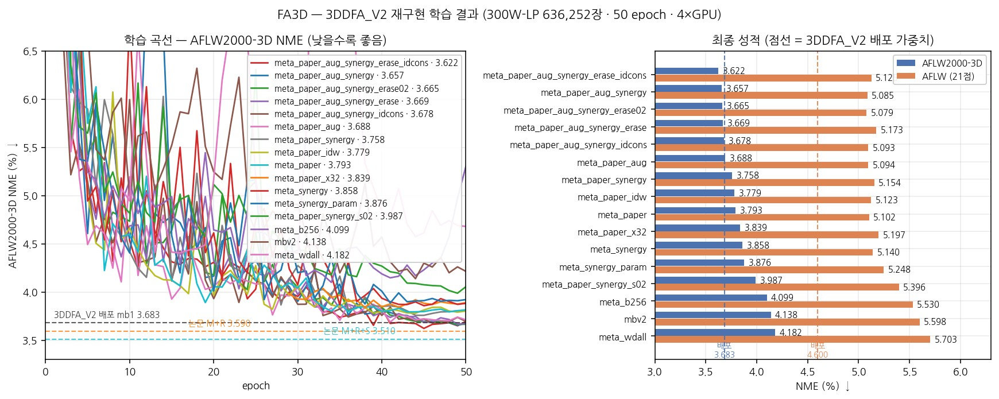
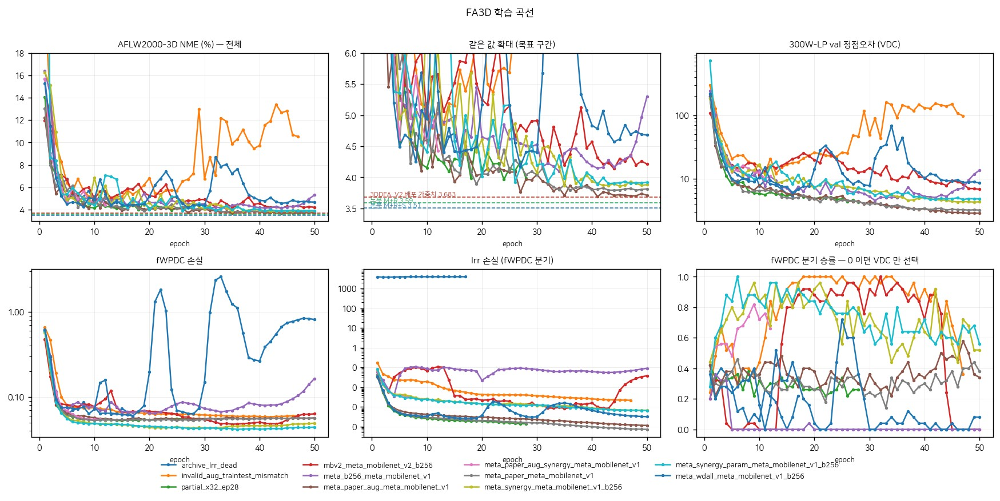
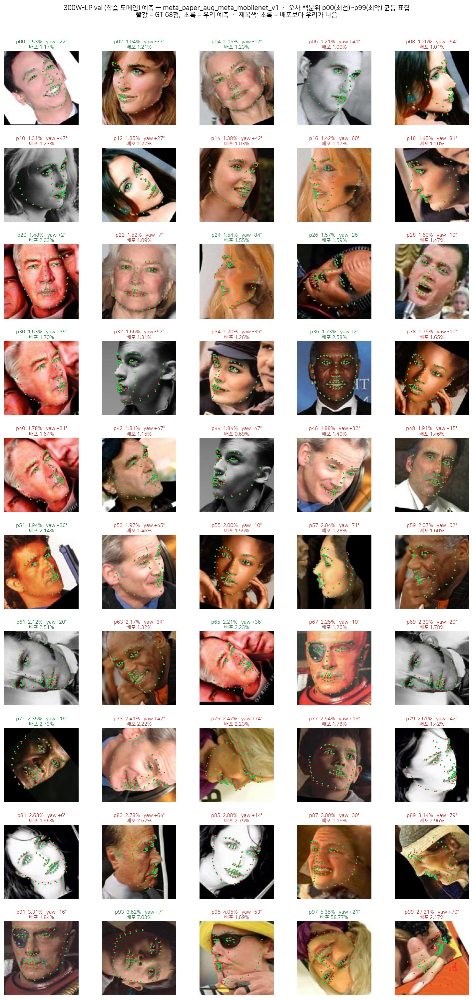
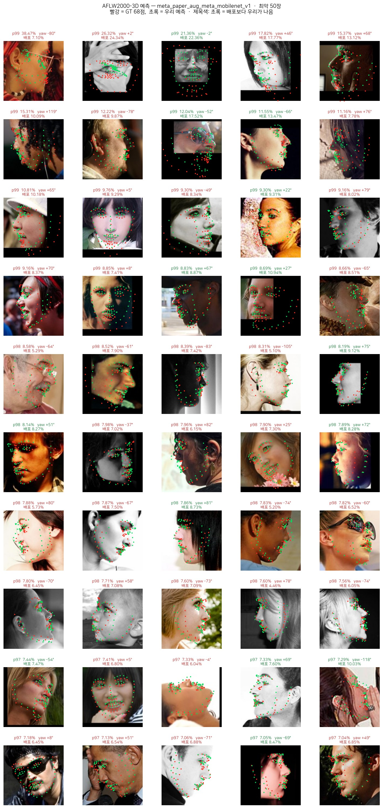
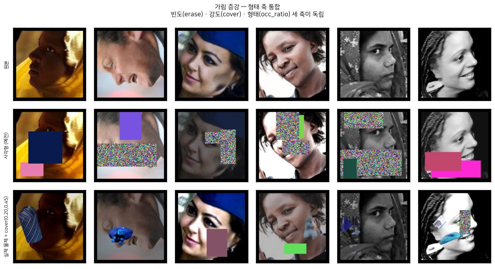
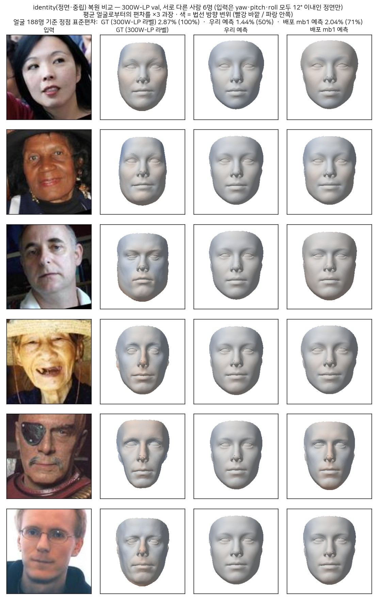

# FA3D — 3D 밀집 얼굴 정렬 (3DDFA_V2 학습부 재구현)

[Towards Fast, Accurate and Stable 3D Dense Face Alignment](https://guojianzhu.com/assets/pdfs/3162.pdf)
(ECCV 2020) 의 **학습부를 논문에서 직접 구현**한 기록. 저자 공개 저장소
[3DDFA_V2](https://github.com/cleardusk/3DDFA_V2) 는 추론 전용이다.

> ## 📐 알고리즘은 별도 문서로 — **[3DDFA_V2.md](3DDFA_V2.md)**
>
> 3DMM 파라미터의 의미, VDC/WPDC/fWPDC 유도, meta-joint optimization,
> short-video-synthesis, 평가 지표 정의를 파라미터 단위까지 풀어 뒀다.
> 이 문서는 **구현·실험 기록**만 다룬다.

논문 원문·supplementary·전작(3DDFA v1) PDF: `/ai_data_new_ssd/DEV/fr/3d_aligments/papers/`

---

<!-- FA3D-BEST:BEGIN -->
<!-- 이 블록은 scripts/FA3D/sync_tables.py 가 생성한다. 손으로 고치지 말 것. -->

## 현재 최고 레시피

**`meta_paper_aug_synergy_erase_idcons`** — erase + 자세 간 identity 일관성

| | AFLW2000-3D ↓ | AFLW (21점) ↓ |
|---|---:|---:|
| **이 런** | **3.622** | 5.125 |
| 🎯 3DDFA_V2 배포 mb1 | *3.683* | *4.600* |
| 논문 M+R | *3.590* | *4.500* |
| 논문 M+R+S | *3.510* | *4.430* |
| **차이 (배포 대비)** | **-0.061** ✅ | +0.525 |

### 이 성적을 낸 알고리즘 구성

> `runs/fa3d/meta_paper_aug_synergy_erase_idcons_meta_mobilenet_v1/train.log` 의 **실제 실행 config** 에서 생성한다.

| 요소 | 구성 |
|---|---|
| 백본 | `mobilenet_v1` · 입력 120×120 · 출력 62-d (T 12 + shape 40 + exp 10) |
| 파라미터 손실 | **fWPDC** — 정점 기여도로 62-d 재가중 (논문 Algorithm 2) |
| 정점 손실 | **VDC** — 38,365 정점의 3D 거리 |
| 손실 선택 | **meta-joint** — k=100 앞을 보고 fWPDC/VDC 를 스텝마다 선택 |
| 랜드마크 정규화 | **lrr** 켬 (가중 1.0) |
| 순환 (SynergyNet) | **켬** — MLP_for(정제) + MLP_rev(역회귀) + Wing 손실 |
| svs | 끔 |
| 보조 손실 결합 | `share` · 보조 블록이 total 의 50% |
| 증강 | 색상 0.4 · 테두리 5px · 가림 1% |
| 표집 | 균등 |
| 최적화 | SGD · **전역 배치 128** · lr 0.02 → cosine ×0.01 · momentum 0.9 · wd 5e-4 (conv 한정) · 50 epoch |
| 안정화 | grad clip 1.0 + 비유한 손실 스킵 (논문에 없음 — §3.2) |

```bash
FA3D_PRESET=meta_paper_aug_synergy_erase_idcons accelerate launch --num_processes 4 --mixed_precision no train_fa3d.py
```

### ⚠ 같은 런의 형상(identity) 지표

NME 는 사실상 자세 지표라 위 표만으로는 3D 품질을 모른다 ([Phase 6](Exp/Phase_6_지표가_형상을_안_잰다.md)).

| | 방향 cos | 크기비 | 상대오차 | 설명 분산 |
|---|---:|---:|---:|---:|
| 평균 얼굴만 내기 (기준선) | 0.000 | 0.000 | **1.000** | 0% |
| 3DDFA_V2 배포 mb1 | +0.544 | 0.860 | **0.937** | 30% |
| **이 런** | — | — | — | — |

⚠ 이 런의 형상 지표를 아직 안 쟀다 — `python scripts/FA3D/shape_accuracy.py --ckpt runs/fa3d/meta_paper_aug_synergy_erase_idcons_meta_mobilenet_v1/best.pth` 를 돌리고 `sync_tables.py` 의 `SHAPE` 에 넣을 것.

```bash
python scripts/FA3D/shape_accuracy.py --ckpt runs/fa3d/meta_paper_aug_synergy_erase_idcons_meta_mobilenet_v1/best.pth
```

<!-- FA3D-BEST:END -->

## 1. 왜 재구현인가 — 공개 저장소에 없는 것

`train`/`loss`/`dataset`/`optimizer`/`backward` 를 전부 grep 해도 학습 코드가 **하나도 없다**.
그리고 그건 단순 누락이 아니다:

```
배포 체크포인트 weights/mb1_120x120.pth 안:
    module.fc_param.weight  [62, 1024]     ← 로더가 fc 로 이름 바꿔 싣는다
    module.fc_lm.weight     [136, 1024]    ← 로더가 그냥 버린다   (utils/tddfa_util.py:38-40)
```

`fc_lm` 은 논문 2.3절 landmark-regression regularization 의 보조 헤드(68점 × 2 = 136)다.
공개된 모델 정의(`models/mobilenet_v1.py`)에는 이 분기가 아예 없다.
**저자가 논문 기여 중 하나를 코드에서 빼고 배포했다.** meta-joint optimization 과
short-video-synthesis 도 마찬가지다.

전작 3DDFA(v1) 는 학습 코드를 공개했다 (`training/train.py`, `wpdc_loss.py`, `vdc_loss.py`).
텐서 처리 방식은 참조했지만 **수식은 v1 과 다르다**
([3DDFA_V2.md §3.5](3DDFA_V2.md#35-3ddfa-v1-구현과의-차이)).

---

## 2. 재현 기준선 — 논문 수치가 아니라 배포 가중치를 목표로

배포 가중치를 우리 평가 코드로 직접 잰 값 (`3d_aligments/eval/BASELINE.md`):

| | AFLW2000-3D | AFLW |
|---|---|---|
| **mb1 배포 가중치** | **3.683** | **4.600** |
| mb05 배포 가중치 | 3.798 | 4.738 |
| 논문 M+R | 3.59 | 4.50 |
| 논문 M+R+S | 3.51 | 4.43 |

두 벤치마크에서 오프셋이 **일관되게 +0.09~0.10** 이다. 파이프라인 오류가 아니라
배포 가중치가 논문 best 체크포인트가 아니라는 뜻이다. 오류가 아님을 확인한 4가지:

| 항목 | 결과 |
|---|---|
| 파라미터 공간 (v1 basis ↔ V2 `bfm_noneck_v3`) | 68 랜드마크 차이 **0.0021 px** → 동일 |
| whitening 통계 | V2 → 3.683 / v1 → **23.541** → V2 가 맞음 |
| 크롭 규약 | 저장 roi_box vs `parse_roi_box_from_landmark` **0.58 px (0.2%)** |
| y 좌표 변환 | V2 방식(`x−1`, `size−y`) 3.683 < v1 방식(`size+1−y`) 3.845 |

**따라서 3.68 근처면 파이프라인 정상, 3.59 이하면 논문 M+R 수준이다.**

> **NME 집계 규약 주의** — 3DDFA 계열은 **yaw 3구간 평균의 평균**을 보고한다.
> 같은 예측이 구간평균 3.683 / 단순평균 3.255 로 갈린다 (0.43 차이).
> 자세한 건 [3DDFA_V2.md §8.3](3DDFA_V2.md#83--yaw-구간-평균--다른-논문과-비교할-때-반드시-확인).
> `metrics.summarize()` 가 `NME`(구간평균)와 `NME_all`(단순평균)을 둘 다 낸다.
> 모델 선택은 `NME` 로 한다.

---

## 3. 구현하면서 실제로 잡은 것

논문만 읽고는 안 보이는, 코드를 돌려야 나오는 것들.

### 3.1 fWPDC 축 버그 — 상관 0.94

`w_T(:,i) = |ΔT(:,i)| · ‖S(i,:)‖` 에서 **T 의 열 i 가 S 의 행 i 와 짝**이다.
`s_norm.unsqueeze(-1)`(행 축 브로드캐스트)로 쓰면 원본 WPDC 와의 상관이
1.0 → **0.94** 로 떨어진다. `unsqueeze(1)` 이 맞다.

값이 그럴듯해서 눈으로는 못 잡는다. **참조 구현과 대조해야만 보인다.**
`tests/FA3D/test_losses.py::test_fwpdc_weight_axis` 가 회귀로 고정한다.

수정 후 검증 (실제 300W-LP GT 기준):

| | |
|---|---|
| 가중치 상관계수 | **1.0000000** |
| 가중치 최대 절대차 | 5e-6 |
| 손실 값 차이 | **0.000%** |

| batch 128 | 시간 |
|---|---|
| fWPDC (우리) | **2.73 ms** |
| WPDC (참조 구현) | 278.40 ms |
| 논문 보고 | 3.6 ms / 41.7 ms |

논문의 "preserving the same outputs" 주장 확인.

### 3.2 ⚠ 논문에 없는 필수 항목 — gradient clipping

VDC 를 스크래치로 돌리면 **2 스텝 만에 inf** 가 된다:

```
VDC step 0: loss 6.98e+02  grad_norm 2.59e+04
VDC step 1: loss 1.23e+10  grad_norm 6.31e+10
VDC step 2: loss inf       grad_norm nan
```

랜덤 초기화의 정점 오차가 ~700px² 이고, 3DMM 디코더(`A` 가 115,095×50)를 거치며
gradient 가 증폭된다. 논문은 언급이 없지만 `clip_grad=1.0` 없이는 VDC 분기가
성립하지 않는다.

추가 가드 두 개:
- 비유한 손실이 나온 스텝은 아예 밟지 않는다 (NaN 가중치는 한 번 생기면 영구 오염)
- 심판 점수의 NaN 은 `inf` 로 바꾼다 (NaN 은 어떤 비교에도 False 라 `min()` 이 엉뚱한 쪽을 고른다)

### 3.3 v1 의 `magic_number` 정체

3DDFA v1 `wpdc_loss.py` 의 `magic_number = 0.00057339936` 은
**300W-LP 학습셋 636,252장의 평균 스케일 f** 다.

*(실측 평균 0.00057356106 — 차이 1.6e-7)*

샘플마다 f 가 [0.00042, 0.00094] 로 2.2배 범위인데 평균으로 고정한 근사다.
논문 Algorithm 2 는 `f = ‖Tg[:,:3]‖_F/√3` 로 샘플마다 계산한다.

### 3.4 shape / exp 기저의 규약 비대칭

| | `‖A(:,i)‖` | `σ(α_i)` | 곱 = 실제 정점 기여도 |
|---|---|---|---|
| shape (i=0..39) | 0.487 ~ 0.880 | 12,641 ~ 574,351 | 9,722 ~ 400,205 |
| exp (i=40..49) | 163,575 ~ 321,998 | 0.162 ~ 1.596 | 48,986 ~ 323,731 |

계수만 보면 6자리 차이인데 실제 기여도는 같은 자릿수다.
fWPDC 의 `‖A(:,i)‖` 항이 이걸 흡수한다
([3DDFA_V2.md §2.5](3DDFA_V2.md#25--shape--exp-기저의-규약이-다르다)).

### 3.5 SynergyNet 원본 구현의 문제 두 건

순환 구조를 이식하면서 `choyingw/SynergyNet` 코드에서 찾은 것. **공개된 3.41 은 이
상태로 얻은 값이다.**

**① 역회귀 손실의 슬라이싱이 어긋나 있다.**

`loss_definition.py` 의 `ParamLoss(mode='only_3dmm')` 는

```python
loss = self.criterion(input[:, :50], target[:, 12:62]).mean(1)
```

`MLP_rev` 출력은 `[T(12) | shape(40) | exp(10)]` 이므로
`input[:, :50]` = `[T(12) | shape(38)]` 이다. 이걸 GT 의 `[shape(40) | exp(10)]` 에
맞댄다 — **T 를 shape 에, shape 를 exp 에 비교한다.** 의도는 분명히 "50-d 3DMM 끼리"
인데 `[12:62]` 여야 할 자리가 `[:50]` 이다.

**② 잔차와 역회귀 출력에 ReLU 가 걸려 있다.**

```python
out = F.relu(self.bn9(self.conv9(out)))      # MLP_for 의 좌표 잔차
out_rot = F.relu(self.bn6_1(...))            # MLP_rev 의 T/shape/exp
```

잔차가 항상 ≥ 0 이라 랜드마크가 **+x·+y·+z 방향으로만** 움직인다. 3DMM 계수도
평균 얼굴로부터의 편차라 음수가 정상인데 전부 ≥ 0 으로 잘린다.

**우리 구현은 둘 다 바로잡는 것을 기본값으로 두고**, `synergy_compat=True` 로
원본을 재현할 수 있게 했다. 고친 쪽이 반드시 낫다는 보장은 없다 — 논문 수치가
어긋난 상태의 것이므로 **대조 실험 대상**이다 (`mbv2_synergy` vs `mbv2_synergy_compat`).
`tests/FA3D/test_synergy.py` 가 두 모드가 실제로 다른 값을 내는지 고정한다.

### 3.6 meta-joint 구현 주의

- 승자 → 패자 동기화 때 **옵티마이저 모멘텀까지** 옮겨야 한다.
  가중치만 복사하면 패자의 낡은 모멘텀이 남아 다음 k 스텝이 엉뚱하게 출발한다.
- 심판 VDC 는 정점 서브샘플링 없이 **전체 38,365 정점**을 써야 한다.
  라운드마다 다른 정점을 뽑으면 점수가 흔들려 선택이 무의미해진다.

### 3.7 lrr 헤드가 9만 step 동안 죽어 있었다

`fc_lm` 출력이 [0.09, 0.60] 에 머물렀다 — GT 는 [12.8, 105.1]. 손실 4,248 이 내내
평평했고 best NME 4.403 에서 멈췄다 (`runs/fa3d/_archive_lrr_dead/`).

**원인은 논문 식 그 자체다.** `balanced()` 의 비율이 `|l_main| / |l_aux|` 라 보조항
오차가 클수록 gradient 가 **작아진다.** 목표에서 먼 헤드일수록 덜 배우는 구조다.
손실 *값*은 균형이 맞는데 학습이 안 된다.

좌표 정규화로는 안 고쳐진다 — `d/dp[(|main|/|aux|)·aux]` 에서 s² 와 1/s² 가 상쇄돼
gradient 가 스케일에 **불변**이기 때문이다.

수정 두 가지:

1. **GT 를 [0,1] 로 나눈다** — 손실을 나누는 게 아니라 GT 를 나눠야 헤드 출력에
   대한 gradient 가 산다 (`fc_param` 이 받는 3e-4 와 같은 자릿수).
2. `aux_mode='fixed'` 를 기본으로. `'ratio'`(논문 식)는 재현 대조용으로만 남긴다.

검증: 400 step 만에 헤드 출력이 [-0.02, 1.46] 로 GT 범위 [0.06, 0.92] 에 붙었다.
회귀 테스트 `tests/FA3D/test_losses.py::test_lrr_gradient_health`.

### 3.8 identity(shape 40-d)가 평균으로 붕괴한다 — 정점 손실의 구조적 부작용

본 학습 4개를 끝내고도 배포 가중치(3.683)에 0.19 뒤졌다. 원인을 부위별로 쪼갰다.

**① 격차는 자세와 무관하고, 윤곽선은 오히려 우리가 낫다** (AFLW2000-3D, 우리−배포)

| 부위 | [0,30] | [30,60] | [60,90] | 전체 |
|---|---|---|---|---|
| **턱선** | −0.13 | −0.33 | −0.10 | **−0.17 (우리 우세)** |
| 눈썹 | +0.44 | +0.39 | +0.44 | +0.43 |
| 눈 | +0.39 | +0.27 | +0.28 | +0.35 |
| 코 | +0.29 | +0.40 | +0.47 | +0.34 |
| 입 | +0.21 | +0.15 | +0.35 | +0.22 |

large-pose 문제가 아니다. 자세와 크기가 만드는 윤곽선은 이기고, **identity 가
만드는 이목구비에서만** 진다.

**② 예측 shape 계수의 진폭이 배포의 40% 다** (같은 2000장, 블록별 std 평균)

| | pose(12) | shape(40) | exp(10) |
|---|---|---|---|
| `meta_synergy` | 3.89 | **13,370** | 0.293 |
| 배포 mb1 | 2.39 | **33,773** | 0.362 |
| 300W-LP GT | 4.36 | 75,744 | 0.559 |

300W-LP val 에서 정답 대비 기울기를 재면 우리 1~5번 성분 0.40 / 6~40번 **0.04**,
배포는 0.58 / 0.12 다. 6번 이후 35개 성분의 상관이 0.06 — **사실상 평균 얼굴을
그려 놓고 각도와 크기만 맞추고 있다.**

**③ 왜 그런가 — 정점 저울이 33배 기울어 있다**

각 블록을 1 std 틀렸을 때 정점이 움직이는 거리(실측):

| 틀린 블록 | 정점 이동 |
|---|---|
| pose 1 std | **37.26 px** |
| shape 1 std | **1.13 px** |
| exp 1 std | 0.59 px |

정점 거리로 재는 손실(fWPDC·VDC) 위에서는 shape 40 개를 전부 포기하고 평균 얼굴을
내도 벌점이 1px 남짓이다. 제곱오차 최소해가 조건부 평균이므로, **모델은 주어진
목표를 정확히 달성한 것이다** — 목표가 잘못 걸려 있었다.

그리고 이건 WPDC 의 **설계 의도 그대로**다 ([3DDFA_V2.md §3.3](3DDFA_V2.md#33-wpdc--weighted-parameter-distance-cost-논문-식-6-7)):
"α_shp[39] 가 틀렸다 → 거의 변화 없음 → `w_i` 작음 → 느슨하게".

**④ 처방 — `ParamLoss` (`param_weight`)**

정규화(z-score) 공간에서 shape+exp 를 직접 회귀한다. 이 저울 위에서는 pose 1 std 나
shape 1 std 나 벌점이 같아 33배 불이익이 사라진다.

계보: 3DDFA v1 의 **PDC** = SynergyNet 의 **`ParamLoss`**(RMSE, 주손실로 3.41).
3DDFA_V2 가 "파라미터를 동등하게 보는 건 불합리하다"며 버린 것을, **주손실은 fWPDC
로 두고 눌린 블록만 미는 counterweight** 로 되살렸다. scope 제한(shape+exp)과
보조항 사용은 논문에 없는 우리 선택이다.

**⑤ 결과 — 진단대로 움직였다** (`meta_synergy` → `meta_synergy_param`, 단일 축)

| | shape std | 턱선 | 눈썹 | 코 | 눈 | 입 | NME |
|---|---|---|---|---|---|---|---|
| `meta_synergy` | 13,370 | 5.00 | 3.93 | 2.29 | 2.77 | 2.81 | 3.874 |
| **`meta_synergy_param`** | **21,514** | 5.03 | **3.77** | **2.15** | **2.63** | **2.72** | **3.776** |
| 배포 mb1 | 33,773 | 5.17 | 3.51 | 1.95 | 2.42 | 2.59 | 3.683 |

shape 진폭이 배포 쪽으로 61% 이동했고, **예측한 대로 이목구비 4부위가 전부 줄고
턱선만 그대로다**(+0.03). 재주석 셋에서 3.281 → **3.044**(−0.237)로 더 크게 준다.

**⑥ 다만 param 손실 단독으로는 안 된다** — `meta` → `meta_param` 은 4.099 → 4.127 로
오히려 +0.028 이다. synergy 순환과 **함께일 때만** 효과가 났다.

이유는 identity 를 실제로 얼마나 배웠는지로 갈린다. 300W-LP val 에서 shape+exp 를
정규화 공간 RMSE 로 재면 (1.000 = 평균 얼굴을 그대로 내는 것):

| 모델 | shape+exp RMSE | AFLW2000-3D |
|---|---|---|
| `meta_param` | 0.7487 | 4.127 |
| `meta` | — | 4.099 |
| `meta_synergy` | 0.7097 | 3.874 |
| **`meta_synergy_param`** | **0.6755** | **3.776** |
| 배포 mb1 | **0.6560** | **3.683** |

**identity 정확도가 NME 순위를 그대로 예측한다** — 배포 가중치까지 포함해 단조다.
그리고 순환(synergy)이 param 손실보다 identity 를 더 많이 끌어올린다(0.7487 vs
0.7097). 둘을 합쳤을 때 배포와의 격차가 0.02 까지 좁혀진다.

⚠ 배포 모델은 300W-LP 전체로 학습됐을 가능성이 높아 val 이 홀드아웃이 아닐 수
있다. 배포 수치는 낙관적으로 볼 것. 우리 모델끼리의 비교는 공정하다.

---

## 4. 데이터

3DDFA **v1** 이 배포한 전처리본을 쓴다. v1 basis 와 V2 `bfm_noneck_v3` 의 파라미터
공간이 동일함을 확인했으므로 GT 변환이 필요 없다 (정점 수만 53,215 vs 38,365 —
목 정점 제거 + 재색인).

```
/ai_data_new_ssd/datasets/fr/3DDFA/
├── train_aug_120x120/   687,854장 (2.8G) = train 636,252 + val 51,602
├── train.configs/       param_all_norm.pkl · param_whitening.pkl · 3DMM basis
├── test.data/           AFLW2000-3D_crop 2,000 + AFLW_GT_crop 21,080
├── test.configs/        GT 랜드마크 / pose / roi_box
└── bfm/                 bfm_noneck_v3.pkl · param_mean_std_62d_120x120.pkl
```

GT 는 v1 통계로 whitening 되어 있어 **V2 통계로 재정규화**한다 (`src_stats`→`dst_stats`).
Z-score 는 출력층의 아핀 재파라미터화일 뿐이라 학습 난이도에는 영향이 없고,
결과 모델이 3DDFA_V2 추론 코드에 그대로 꽂힌다.

전처리는 3DDFA 계열 공통 `(x − 127.5) / 128` — ImageNet 통계가 **아니다**.

---

## 5. 백본 — 논문은 2017년 구조를 스크래치로 쓴다

레버가 세 개인데 논문은 두 개만 건드렸다.

| 레버 | 논문 근거 | 여지 |
|---|---|---|
| (a) **구조** (MobileNetV1 → 최신) | supp Table 1 | 정확도는 거의 소진 (~0.02) |
| (b) **사전학습** (스크래치 → 전이) | **논문에 없음** | **미측정** |
| (c) **손실/최적화** | Table 3 | 논문 기여 전부가 여기 (1.64) |

(a) 의 근거는 [3DDFA_V2.md §6.3](3DDFA_V2.md#63-다른-백본-supplementary-table-1) —
파라미터 5.6배·MACs 14.5배를 써도 0.02 밖에 못 얻는다.
→ 백본 교체의 목표는 정확도가 아니라 **같은 정확도를 더 싸게**다.

### 5.1 실측 지연시간 — `scripts/FA3D/bench_backbone.py`

배치 1, 추론 경로만(lrr 헤드 제외), 120×120 입력:

| 백본 | Params | MACs | **CPU 1스레드** | CPU 4스레드 | GPU b1 | GPU b128 처리량 |
|---|---|---|---|---|---|---|
| mobilenet_v1 (논문) | 3.27M | 177M | **5.70ms** | 6.02ms | 1.64ms | 13,969 img/s |
| yolo26_n | 1.37M | 61M | **4.05ms** (×0.71) | 4.20ms | 3.60ms (×2.20) | 36,964 |
| pierrotxv2_n | 1.27M | 79M | **4.07ms** (×0.71) | 3.89ms | 2.35ms (×1.44) | 33,705 |
| mobilenet_v1_x05 | 0.85M | 46M | **2.90ms** (×0.51) | 3.49ms | 1.60ms | 37,495 |

측정 신뢰성: mobilenet_v1 이 5.70ms, 논문 보고치가 6.2ms(i5-8259U) — 일치한다.

**읽을 때 주의할 세 가지:**

1. **MACs ×0.34 인데 CPU 는 ×0.71 뿐.** MobileNetV1 의 depthwise conv 는 arithmetic
   intensity 가 낮아 메모리 대역폭에 묶인다 — MACs 가 "값을 덜 한다". 반대로 YOLO
   블록은 레이어가 많아 메모리 트래픽이 크다.
   **파라미터·MACs 는 지연시간의 대리 지표가 못 된다.**
2. **GPU 배치1 에서는 오히려 느리다** (×2.20, ×1.44). 레이어 수가 많아 커널 런치
   오버헤드가 지배한다. 반대로 배치 128 에서는 2.6배 빠르다 —
   **학습은 빨라지고 GPU 단일 추론은 느려진다.**
3. **논문 자체 경량 변종이 이미 더 빠르다.** `mobilenet_v1_x05` 가 2.90ms(×0.51)로
   YOLO 계열보다 빠르고 배포 가중치 NME 도 3.798 (mb1 대비 +0.115).
   **"속도만" 목표라면 백본 교체 없이도 절반이 나온다.**

→ 그래서 YOLO 계열의 차별점은 속도 자체보다 **속도 + obj365 사전학습**이다.

### 5.2 사전학습 — 논문이 답을 안 준 축

옆 랩 [Pierrot_3D_Lab](https://github.com/Pierrot-vision/Pierrot-3D-Lab/blob/main/LAB/Pose.md) 의 검출 백본:

| 백본 | 파라미터 | 사전학습 |
|---|---|---|
| MobileNet-V1 (논문) | 3.27M | **없음 (스크래치)** |
| YOLO26-n 백본 | 1.37M | obj365 (오피셜 전이) |
| PierrotXv2-n-accuracy 백본 | 1.27M | obj365 ep150 (자체 학습, COCO pose AP 0.543) |

검출 체크포인트에서 `backbone.*` 만 떼어 싣는다 — **missing 0 · unexpected 0** 로
완전 전이 확인. 넥/헤드는 버린다: 출력이 전역 62-d 회귀라 다중 해상도 PAN 은
풀링 뒤 의미가 없다.

**P3/P4/P5 를 모두 전역 풀링해 concat** 한다 (128+128+256 = 512).
T(12) 는 얼굴 전체의 위치·크기라 저해상도 P5 가 적합하고, 표정 계수(10)는 눈·입의
국소 변형이라 P3 의 세밀함이 필요하다. P5 만 쓰면 표정 쪽이 뭉개진다.

> **⚠ 백본이 stride 32 라 입력을 128 로 리사이즈한다.**
> **GT 좌표계는 image_size(120) 그대로다** — 이미지를 늘려도 3DMM 파라미터는
> 변하지 않으므로 라벨을 건드리면 안 된다. `bfm.landmarks(size=120)` 유지.

> **⚠ 검출 사전학습이 3DMM 회귀에 유리하다는 보장은 없다.** 검출은
> "어디에 무엇이 있는가", 여기는 "이 얼굴의 계수는 얼마인가"로 요구하는 표현이 다르다.
> 저수준 특징은 공유되지만 실측 대상이지 전제가 아니다.
> 그래서 `*_scratch` 대조군을 같이 둔다 — 없으면 "사전학습 덕분"인지
> "구조 덕분"인지 갈라낼 수 없다.

회귀 헤드는 `std=0.01` 로 작게 초기화한다. VDC 는 정점 오차가 파라미터에 제곱으로
들어가 초기값이 크면 첫 스텝에 발산한다.

---

## 6. 관련 연구 비교 — 왜 이 논문인가

`/ai_data_new_ssd/DEV/fr/3d_aligments/` 에 함께 받아 둔 두 저장소와의 차이.

| | 3DDFA_V2 (이 연구) | PRNet (ECCV 2018) | deep-face-alignment |
|---|---|---|---|
| 출력 | 3DMM 62-d → 38,365 정점 | UV position map 256×256 → 43,867 정점 | 68점 **heatmap** (2D 좌표만) |
| 3D 밀집 복원 | ✅ | ✅ | ❌ (68점 뿐) |
| 프레임워크 | PyTorch | TensorFlow 1.x (`tf.contrib`) | **MXNet + Python 2.7** |
| **학습 코드** | ❌ 없음 (그래서 재구현) | ❌ **없음** (`is_training=False` 하드코딩) | ✅ 있음 |
| 배포 가중치 | ✅ | ⚠ `.index` 만 있고 `.data` 누락 → **추론도 불가** | ✅ |
| Params / MACs | 3.27M / 183.5M | 13.4M / 6190M | ~9M (37MB) |
| CPU 지연 | 6.2ms | 175ms (**28배**) | — |
| AFLW2000-3D | 3.51 | 3.62 | **3.005** ← ⚠ 규약 다름 |

### ⚠ deep-face-alignment 의 3.005 는 직접 비교 대상이 아니다

`metric.py::calculate_nme` 를 읽으면 정규화 상수는 같은데(GT bbox 의 √(w·h)),
집계가 **전체 단순평균**이다 (`test_rec_nme.py` 마지막 줄 `np.mean(nme)`).
3DDFA 계열의 yaw 3구간 평균이 아니다.

같은 기준으로 맞추면:

| | yaw 구간평균 (3DDFA 규약) | 전체 단순평균 |
|---|---|---|
| 3DDFA_V2 mb1 (배포) | 3.683 | **3.255** |
| deep-face-alignment HG2(d=3)-CAB-3D | — | **3.005** |

3.51 vs 3.005 (0.5 차이)가 아니라 **3.255 vs 3.005 (0.25)** 이 정확한 비교다.
그리고 그 대가로 파라미터 ~3배, heatmap argmax(64×64 양자화), 그리고
**3D 정점을 아예 못 낸다.**

### PRNet — 학습 코드도 가중치도 없다

`predictor.py` 에 resfcn256(encoder-decoder, 10 res block + 17 transposed conv)
정의만 있고 손실·데이터셋·옵티마이저가 전무하다. `__call__(x, is_training=False)`
로 추론 경로가 고정돼 있다. `Data/net-data/` 에는 `.index`(20KB)만 있고
실제 가중치 `.data-00000-of-00001` 은 별도 다운로드다.

3DDFA_V2 논문이 PRNet 을 주 비교 대상으로 삼은 이유가 여기 있다 — 정확도는
비슷한데(3.62 vs 3.51) **연산량이 34배, CPU 지연이 28배**다.

**결론**: 학습 가능성 + 3D 밀집 복원 + CPU 실시간을 동시에 만족하는 건 3DDFA_V2 뿐이다.
deep-face-alignment 는 학습 코드가 있지만 68점 2D 만 내고 MXNet/Py2.7 이라
현재 환경에서 되살리는 비용이 재구현보다 크다.

---

## 7. SynergyNet 순환 구조 — 이식 완료

알고리즘 설명은 [3DDFA_V2.md §10](3DDFA_V2.md#10-synergynet-과의-비교--직계-후속).
여기는 우리 코드에 어떻게 붙였는지만 적는다.

```
백본 → 62-d ─┬─→ fc_lm → 136-d          (lrr, 3DDFA_V2)
             │
             └─→ BFM 디코더 → 68 랜드마크 [B,3,68]      ← 미분 가능
                      ↓
                 LandmarkRefiner (MLP_for)  → 좌표 잔차 → 정제 랜드마크
                      ↓
                 LandmarkToParam (MLP_rev)  → 62-d 역회귀
```

**설계 결정 3가지:**

**① 순환을 백본 `forward()` **안에서** 돈다.** 밖에서 `model.synergy(...)` 를 따로
부르면 DDP 가 그 파라미터를 unused 로 잡아 gradient 동기화가 깨진다.
그래서 `SynergyHead` 가 BFM 디코더와 `ParamNorm` 을 자식 모듈로 소유한다.

**② BFM 상수가 체크포인트에 새지 않는다.** `BFM` 의 buffer 가 `persistent=False` 라
24MB basis 가 `state_dict()` 에 안 들어간다. `test_bfm_not_in_checkpoint` 가 고정한다.

**③ 보조항 스케일 정규화.** 원본은 5개 항에 절대 가중치(0.05/0.02/0.05/0.02/0.001)를
쓴다. 그런데 원본 주손실은 62-d RMSE(∼O(1))인 반면 우리 주손실은 fWPDC(∼0.9)
또는 VDC(∼400)다 — 분기마다 전혀 다른 학습이 된다.
각 항을 주손실 크기로 맞춘 뒤 **원본의 상대 비중**을 곱한다
(`lmk 2.5 · lmk_ref 2.5 · param_rev 1.0 · cycle 0.05`, `Param_In` 을 1 로 놓은 값).
`normalize_aux=True` 면 전체 합을 주손실 크기로 되돌려 항 수가 달라져도 실효 LR 이
유지된다.

### 파라미터 회계 (실측)

| | 전체 | **추론 경로** | 체크포인트 |
|---|---|---|---|
| mobilenet_v1 | 3.41M | **3.27M** | 3.43M |
| mobilenet_v1 + synergy | 5.05M | **3.27M** | 5.08M |
| mobilenet_v2 | 2.48M | **2.30M** | 2.51M |
| mobilenet_v2 + synergy | 4.25M | **2.30M** | 4.29M |

**추론 경로는 변하지 않는다** — MLP 두 개(1.77M)는 `predict()` 가 타지 않는다.
lrr 헤드와 같은 설계다.

### 학습 비용

| | MACs (배치1 forward) |
|---|---|
| MobileNetV1 백본+헤드 | 177.6M |
| LandmarkRefiner (MLP_for) | 105.4M ← 백본의 59% |
| LandmarkToParam (MLP_rev) | 10.1M |
| **학습 시 합계** | **293.1M (+65%)** |

`MLP_for` 가 무거운 이유는 concat 채널이 2418(점별 64 + 전역 1024 + 백본 풀링 1280
+ shape 40 + exp 10)이라서다. meta-joint 2배와 겹치면 **스텝당 3.3배**가 된다.

---

## 8. short-video-synthesis — 구현 완료

알고리즘은 [3DDFA_V2.md §5](3DDFA_V2.md#5-3d-aided-short-video-synthesis).
여기는 구현에서 실제로 결정하고 잰 것만.

```
x_j  = (T ∘ F)(x_{j−1})     기하 — 누적 (연속성이 학습 신호다)
x'_j = (M ∘ P)(x_j)         열화 — 프레임마다 독립 (실제 노이즈는 프레임 간 무상관)
```

### 8.1 핵심은 이미지가 아니라 GT 다

이미지를 3° 돌렸는데 라벨을 그대로 두면 **"3° 돌아간 얼굴의 정답은 원래 각도"**
라고 가르치는 셈이다. 눈으로는 절대 못 잡는다 — 그래서 두 변환의 수식을 유도해
테스트로 고정했다.

**in-plane (T)** — 이미지 좌표가 `(x,y) → (a·x+b·y+tx, c·x+d·y+ty)` 로 가고
`x = V[0]−1`, `y = size−V[1]` 이므로 카메라 좌표계에서는

```
V'[0] =  a·V[0] − b·V[1] + (−a + b·size + tx + 1)
V'[1] = −c·V[0] + d·V[1] + (size + c − d·size − ty)
V'[2] =  Δs·V[2]
```

`M3·V + t3` 꼴이라 `R_new = M3·R_`, `offset_new = M3·offset + t3`.
y 축이 뒤집혀 있어 **in-plane 회전의 부호가 카메라 좌표계에서 반대**가 된다.

*(실측 정합: 랜드마크 최대 오차 0.00002 px)*

**out-of-plane (F)** — face profiling 의 소각도 판. 원본은 ±90° 까지 만드느라
배경 앵커·가림 처리가 복잡한데 svs 는 ±5° 라 변위가 몇 px 이고 자기가림이 거의 없다.
메시 대응만으로 충분하다.

*(실측 정합: 메시 좌표 오차 0.0000, α 변화 0.0)*

### 8.2 ⚠ 회전 기준계 — `model` vs `camera`

| | 수식 | Δφ=4° 요청 시 실제 yaw 변화 |
|---|---|---|
| **`model`** (기본) | `R_new = R_ · ΔR` | **+4.00 / +3.99 / +3.90** |
| `camera` | `R_new = ΔR · R_` | +3.70 / **+0.74** / +3.95 |

`camera` 는 이미 45° 돌아간 얼굴(가운데 샘플)에서 요청한 yaw 가 **pitch 로 샌다**
(yaw +0.74°, pitch +5.67°). 논문 표현이
*"progressively increase the yaw angle Δφ of the face"* 이므로 머리 자신의 축으로
도는 `model` 이 맞다.

```
V' = R_·(ΔR·(S − s_c) + s_c) + offset = (R_·ΔR)·S + (R_·(I−ΔR)·s_c + offset)
```

### 8.3 배경 처리 — 정규화 컨볼루션

변위장은 **얼굴에만** 정의된다. 배경을 그냥 두면 얼굴 경계에 계단이 생기고
네트워크가 그 계단을 배운다. 배경 변위를 0 으로 두고

```
disp = blur(변위 · mask) / blur(mask)
```

로 매끄럽게 감쇠시킨다(정규화 컨볼루션). `cv2.remap` 한 번으로 끝난다.

### 8.4 속도 — 5.2배 최적화

데이터로더 워커에서 도는 코드라 속도가 곧 학습 속도다.

| | 샘플당 (8프레임) | 프레임당 |
|---|---|---|
| 초안 | 118.5 ms | 14.8 ms |
| **최적화 후** | **22.9 ms** | **2.87 ms** |

세 군데를 고쳤다:

1. **`shape_np` 가 비연속 뷰를 반환**했다. `v.reshape(-1,3).T` 상태로 3×3 matmul 을
   돌리면 numpy 가 느린 경로를 타서 0.1ms 짜리가 2ms 가 된다 → `ascontiguousarray`
2. **38,365 정점을 다 변환한 뒤 `[::8]` 로 버렸다** → 미리 솎아서 넘긴다.
   α 는 프레임 내내 고정이므로 형상 `S` 도 영상 한 편에 한 번만 편다
   (`out_of_plane` 6.19ms → 1.09ms)
3. **5×5 모션블러 커널을 매 프레임 `warpAffine` 으로 회전**시켰다 — svs 전체의 30%
   가 여기서 나갔다(280회 호출) → 15° 단위 커널 뱅크 캐시

워커 12개 기준 **128장 배치 31ms** — GPU 스텝과 겹쳐 병목이 되지 않는다.

### 8.5 배치 구성

svs 는 정지 1장을 n 장으로 늘리므로 **실효 배치 = `batch_size` × `svs_frames`** 다.
논문 배치 128 을 맞추려면 `batch_size=16, svs_frames=8`. `config.py` 가 경고한다.

손실은 바뀌지 않는다 — 논문에도 시간축 손실 항이 없다. 미니배치가 **가까운 이웃
샘플들로 채워지는 것 자체**가 정칙화다. 그래서 논문 Table 4 에서 랜덤 회전(`rnd.`)
보다 연속 합성(`svs`)이 낫다.

## 9. 실험 계획

논문 Table 3 재현 + 백본 축.

**축 1 — 손실 (논문 Table 3 재현)**

| PRESET | optim | lrr | 논문 수치 | 우리 결과 |
|---|---|---|---|---|
| `vdc` | VDC | ✗ | 5.23 | — |
| `fwpdc` | fWPDC | ✗ | 4.04 | — |
| `fwpdc_lrr` | fWPDC | ✓ | 3.89 | — |
| `vanilla` | β 고정 | ✓ | 3.80 | — |
| `meta_nolrr` | meta | ✗ | 3.73 | — |
| **`meta`** ★ | meta | ✓ | **3.59** | — |

**축 2 — 백본** (전부 `meta` + lrr 고정)

| PRESET | 백본 | 추론 파라미터 | CPU t1 | 비고 |
|---|---|---|---|---|
| `meta` | MobileNet-V1 | 3.27M | 5.70ms | 논문 기본 |
| `mb05` | MobileNet-V1 ×0.5 | 0.85M | 2.90ms | 배포 가중치 3.798 |
| `mbv2` | MobileNet-V2 | 2.30M | 5.37ms | SynergyNet 백본 |
| `mbv2_single_head` | MobileNet-V2 | 2.30M | — | 헤드 3분할 기여 분리 |
| `mbv2_imagenet` | MobileNet-V2 | 2.30M | — | ImageNet 초기값 (논문 밖) |
| `pierrotx` / `pierrotx_scratch` | PierrotXv2-n | 1.27M | 4.05ms | det 사전학습 유무 |
| `yolo26` / `yolo26_scratch` | YOLO26-n | 1.37M | 4.07ms | det 사전학습 유무 |

**축 4 — 파라미터 공간 회귀** (§3.8, 신규)

| PRESET | 구성 | 목적 |
|---|---|---|
| `meta_param` | M+R + param | 순환 없이 param 단독 기여 |
| **`meta_synergy_param`** ★ | 최고 레시피 + param | **identity 붕괴 처방의 검증** |
| `meta_synergy_param3` | 위 + 가중치 3.0 | 가중치 민감도 |

**축 3 — synergy 순환** (§7)

| PRESET | 구성 | 목적 |
|---|---|---|
| `meta_synergy` | meta + lrr + 순환 (MobileNet-V1) | 순환 단독 기여 |
| **`mbv2_synergy`** ★ | meta + lrr + 순환 (MobileNet-V2) | **논문 조건에 가장 가까운 조합** |
| `mbv2_synergy_compat` | 위 + 원본 슬라이싱/ReLU | §3.5 의 수정이 실제로 나은지 |
| `synergy_only` | 순환만 (fWPDC·meta 없음) | SynergyNet 재현 대조 (3.41) |

> ⚠ 위 네 표는 **계획**이다. 실제로 돌린 런과 이름이 다를 수 있다 —
> 예컨대 축 2 의 `meta` 는 배치 기본값이 256 이던 시절에 돌아 `meta_b256` 으로 기록됐다.
> **무엇이 실제로 돌았고 어떤 결과가 나왔는지는 아래 [실험 정의와 결과](#실험-정의와-결과)** 를 본다.
> 그 절은 `runs/fa3d/<런>/train.log` 에서 자동 생성되므로 계획표처럼 낡을 수 없다.

### 학습 곡선



README 용 요약 (유효한 런만) — `python scripts/FA3D/readme_figure.py`



진단용 전체 곡선 — `python scripts/FA3D/plot_curves.py`.
폐기된 런(`_archive_lrr_dead` · `_invalid_aug_traintest_mismatch` · `_partial_x32_ep28`)까지
전부 그린다. 무엇이 왜 망가졌는지 비교하려고 남겨 둔 것이라 README 에는 싣지 않는다.

<!-- FA3D-TABLE:BEGIN -->
<!-- 이 블록은 scripts/FA3D/sync_tables.py 가 생성한다. 손으로 고치지 말 것. -->

### 실험 정의와 결과

> 아래는 `runs/fa3d/<런>/train.log` 에 남은 **실제 실행 config** 에서 생성한다.
> 프리셋 기본값은 나중에 바뀔 수 있으므로(`meta` 의 배치가 256→128 로 바뀌었다)
> `configs/args_fa3d.py` 가 아니라 그 런이 남긴 로그를 읽는다.
> README 의 평가 표도 같은 스크립트가 같이 갱신한다 — 둘은 어긋날 수 없다.

| 프리셋 | 논문 설정과 다른 점 | AFLW2000-3D | AFLW | shape std | ep |
|---|---|---|---|---|---|
| `meta_paper_aug_synergy_erase_idcons` | **순환(synergy) 켬** · **색상 증강 0.0 → 0.4** · **테두리 증강(px) 0 → 5** · **가림 증강 0.0 → 0.01** | 3.622 | 5.125 | — | 50 |
| `meta_paper_aug_synergy` | **순환(synergy) 켬** · **색상 증강 0.0 → 0.4** · **테두리 증강(px) 0 → 5** · **가림 증강 0.0 → 0.01** | 3.657 | 5.085 | — | 50 |
| `meta_paper_aug_synergy_erase02` | **순환(synergy) 켬** · **색상 증강 0.0 → 0.4** · **테두리 증강(px) 0 → 5** · **가림 증강 0.0 → 0.01** | 3.665 | 5.079 | — | 50 |
| `meta_paper_aug_synergy_erase` | **순환(synergy) 켬** · **색상 증강 0.0 → 0.4** · **테두리 증강(px) 0 → 5** · **가림 증강 0.0 → 0.01** | 3.669 | 5.173 | — | 50 |
| `meta_paper_aug_synergy_idcons` | **순환(synergy) 켬** · **색상 증강 0.0 → 0.4** · **테두리 증강(px) 0 → 5** · **가림 증강 0.0 → 0.01** | 3.678 | 5.093 | — | 50 |
| `meta_paper_aug` | **색상 증강 0.0 → 0.4** · **테두리 증강(px) 0 → 5** · **가림 증강 0.0 → 0.01** ᵃ | 3.688 | 5.094 | 0.588 | 50 |
| `meta_paper_synergy` | **순환(synergy) 켬** | 3.758 | 5.154 | — | 50 |
| `meta_paper_idw` | 없음 (논문 설정 그대로) | 3.779 | 5.123 | — | 50 |
| `meta_paper` | 없음 (논문 설정 그대로) ᵃ | 3.793 | 5.102 | 0.657 | 50 |
| `meta_paper_x32` | **얼굴당 표본 0 → 32** | 3.839 | 5.197 | — | 50 |
| `meta_synergy` | **배치 128 → 256** · **lr 0.02 → 0.04** · **순환(synergy) 켬** ᵃ | 3.858 | 5.140 | 1.254 | 50 |
| `meta_synergy_param` | **배치 128 → 256** · **lr 0.02 → 0.04** · **순환(synergy) 켬** · **param 손실 0.0 → 0.02** ᵃ | 3.876 | 5.248 | — | 50 |
| `meta_paper_synergy_s02` | **순환(synergy) 켬** | 3.987 | 5.396 | — | 50 |
| `meta_b256` | **배치 128 → 256** · **lr 0.02 → 0.04** ᵃ | 4.099 | 5.530 | — | 50 |
| `mbv2` | **배치 128 → 256** · **lr 0.02 → 0.04** · **백본 mobilenet_v1 → mobilenet_v2** ᵃ | 4.138 | 5.598 | — | 50 |
| `meta_wdall` | **배치 128 → 256** · **lr 0.02 → 0.04** · **weight decay 범위 conv → all** ᵃ | 4.182 | 5.703 | — | 50 |
| `meta_paper_aug_synergy_idcons_v` | **순환(synergy) 켬** · **색상 증강 0.0 → 0.4** · **테두리 증강(px) 0 → 5** · **가림 증강 0.0 → 0.01** | *진행 중* | — | — | — |
| `meta_paper_aug_synergy_occ` | **순환(synergy) 켬** · **색상 증강 0.0 → 0.4** · **테두리 증강(px) 0 → 5** · **가림 증강 0.0 → 0.01** | *진행 중* | — | — | — |
| *배포 mb1 (목표)* | — | *3.683* | *4.600* | *1.000* | — |

⚠ **배치가 다른 런을 나란히 읽지 말 것.** 배치·LR 축 하나만으로 −0.306 이 움직인다(`meta_b256`). 위 표의 `배치 128 → 256` 표시를 반드시 같이 본다.

ᵃ 그 런을 돌린 시점에 아직 코드에 없던 옵션이 있다 — **꺼진 상태와 같다.**

- `meta_paper_aug` — 당시 미도입: 얼굴당 표본
- `meta_paper` — 당시 미도입: 얼굴당 표본
- `meta_synergy` — 당시 미도입: 얼굴당 표본
- `meta_synergy_param` — 당시 미도입: weight decay 범위, 얼굴당 표본
- `meta_b256` — 당시 미도입: param 손실, weight decay 범위, 색상 증강, 테두리 증강(px), 가림 증강, 얼굴당 표본
- `mbv2` — 당시 미도입: param 손실, weight decay 범위, 색상 증강, 테두리 증강(px), 가림 증강, 얼굴당 표본
- `meta_wdall` — 당시 미도입: 얼굴당 표본

#### `meta_paper_aug_synergy_erase_idcons` — erase + 자세 간 identity 일관성

- **런 디렉터리** — `runs/fa3d/meta_paper_aug_synergy_erase_idcons_meta_mobilenet_v1`
- **논문 설정과 다른 점** — **순환(synergy) 켬** · **색상 증강 0.0 → 0.4** · **테두리 증강(px) 0 → 5** · **가림 증강 0.0 → 0.01**
- **왜 돌렸나** — AFLW 격차의 60%는 가림이지만 40%는 가림 없는 장면에서도 난다 — 21점 중 18점이 고르게 6~9% 열세라 얼굴 전체가 조금씩 다른 사람 쪽으로 밀린다. 300W-LP 는 같은 얼굴을 179 자세로 렌더링한 셋이라 '같은 사람이면 같은 shape' 은 공짜 제약인데 안 쓰고 있었다. 같은 얼굴 2장의 예측 shape 을 서로 맞춘다(GT 가 아니라 예측끼리 — GT 는 pose 마다 재피팅돼 잡음이 섞인다).
- **결과** — AFLW2000-3D **3.622** · AFLW 5.125 (50 epoch)
- **읽을 때** — 진행 중. ⚠ 기반이 `..._erase` 라 그 축의 -0.088 을 안고 있다 — 단독 기여는 `meta_paper_aug_synergy_idcons` 로 따로 잰다. 판정은 AFLW 가림 없는 7,028장의 격차와 형상 설명 분산으로 한다.

#### `meta_paper_aug_synergy` — 증강 + 순환 (논문 배치)

- **런 디렉터리** — `runs/fa3d/meta_paper_aug_synergy_meta_mobilenet_v1`
- **논문 설정과 다른 점** — **순환(synergy) 켬** · **색상 증강 0.0 → 0.4** · **테두리 증강(px) 0 → 5** · **가림 증강 0.0 → 0.01**
- **왜 돌렸나** — 지금까지 가장 좋았던 두 축(증강 · 순환)을 같은 배치에서 합친다. 증강은 AFLW2000-3D 를, 순환은 AFLW 를 고친다는 관측(§9)이 근거다.
- **결과** — AFLW2000-3D **3.657** · AFLW 5.085 (50 epoch)
- **읽을 때** — **최고 성적이자 배포 가중치를 처음 넘긴 런** (3.657 vs 3.683). 두 축이 실제로 직교했다. 형상 지표에서도 방향 cos 이 가장 좋다(+0.511, 설명 분산 26%) — 다만 크기를 과하게 내(1.114) 상대오차는 1.091 로 배포(0.937)에 진다. ⚠ 중반 ep19~30 에 대조군에 뒤졌다가 후반에 뒤집었다 — 중간 판정 금물.

#### `meta_paper_aug_synergy_erase02` — 가림 증강 확률 0.5 -> 0.2

- **런 디렉터리** — `runs/fa3d/meta_paper_aug_synergy_erase02_meta_mobilenet_v1`
- **논문 설정과 다른 점** — **순환(synergy) 켬** · **색상 증강 0.0 → 0.4** · **테두리 증강(px) 0 → 5** · **가림 증강 0.0 → 0.01**
- **왜 돌렸나** — p=0.5 가 깨끗한 얼굴까지 -0.085 깎았다. 확률이 과했는지 용량 반응으로 본다.
- **결과** — AFLW2000-3D **3.665** · AFLW 5.079 (50 epoch)
- **읽을 때** — ⚠ **잡음 수준.** AFLW 5.079 로 대조군(5.085)을 -0.006 앞서지만, 나빠진 3,308장과 좋아진 3,054장이 통계적으로 구별되지 않는다(주석 14.2 vs 14.1 · yaw 43도 vs 43도). 실패(>10%) 장수도 392 vs 393 으로 같다. **가림 축은 p=0.2 에서도 실효가 없다.**

#### `meta_paper_aug_synergy_erase` — 현재 최고 레시피 + random erasing 가림

- **런 디렉터리** — `runs/fa3d/meta_paper_aug_synergy_erase_meta_mobilenet_v1`
- **논문 설정과 다른 점** — **순환(synergy) 켬** · **색상 증강 0.0 → 0.4** · **테두리 증강(px) 0 → 5** · **가림 증강 0.0 → 0.01**
- **왜 돌렸나** — AFLW 격차의 주원인이 **가림**으로 확정됐다(Phase 8) — 가림 정도에 따라 격차가 6.8배 벌어진다(주석점 19~21개 +0.191 → 0~9개 +1.295). 그런데 기존 `aug_occlude` 는 빈도(1%)로도 형태(50~75%를 검게)로도 실제 가림(중앙값 19%, 임의 내용)을 못 겨냥한다. 새 축 `aug_erase` 로 형태를 맞춘다.
- **결과** — AFLW2000-3D **3.669** · AFLW 5.173 (50 epoch)
- **읽을 때** — ❌ **순증이 아니다.** 표적인 심한 가림(0~9점)만 +1.295 → +1.155 로 좋아지고 (+0.140), 나머지 세 구간이 전부 나빠졌다(10~14점 -0.118 · 15~18점 -0.082 · 19~21점 -0.085). 심한 가림은 1,056장(5%)인데 나머지가 20,024장(95%)이라 AFLW 총점은 5.085 → 5.173 으로 악화. **깨끗한 얼굴까지 나빠진 건 증강이 과했다는 신호** — 확률 0.5 를 0.2 로 낮춘 `..._erase02` 로 용량 반응을 본다.

#### `meta_paper_aug_synergy_idcons` — 자세 간 identity 일관성 (단독)

- **런 디렉터리** — `runs/fa3d/meta_paper_aug_synergy_idcons_meta_mobilenet_v1`
- **논문 설정과 다른 점** — **순환(synergy) 켬** · **색상 증강 0.0 → 0.4** · **테두리 증강(px) 0 → 5** · **가림 증강 0.0 → 0.01**
- **왜 돌렸나** — 300W-LP 는 같은 얼굴을 179 자세로 렌더링한 셋이라 '같은 사람이면 같은 shape' 은 공짜 제약이다. 같은 얼굴 2장의 예측 shape 을 서로 맞춘다.
- **결과** — AFLW2000-3D **3.678** · AFLW 5.093 (50 epoch)
- **읽을 때** — ❌ **축퇴했다.** 손실이 ep1 0.00155 -> ep50 0.00010 으로 떨어지며 형상 설명분산이 26% -> **8%** 로 무너졌다 — 모델이 **모든 얼굴에 같은 shape 을 내서** 제약을 만족시켰다. identity 를 살리려던 축이 identity 를 없앴다. NME 도 3.678 로 대조군(3.657)에 진다. 처방은 붕괴 방지 항(`..._idcons_v`).

#### `meta_paper_aug` — 논문 설정 + 색상·테두리·가림 증강

- **런 디렉터리** — `runs/fa3d/meta_paper_aug_meta_mobilenet_v1`
- **논문 설정과 다른 점** — **색상 증강 0.0 → 0.4** · **테두리 증강(px) 0 → 5** · **가림 증강 0.0 → 0.01**  
  (당시 코드에 없던 옵션 — 꺼진 상태와 같다: 얼굴당 표본)
- **왜 돌렸나** — 300W-LP 는 얼굴 3,837개를 179배 부풀린 셋이라 시각적 다양성이 없다. 증강으로 그 부족분을 메울 수 있는지 본다.
- **결과** — AFLW2000-3D **3.688** · AFLW 5.094 (50 epoch)
- **읽을 때** — **현재 최고.** AFLW2000-3D 를 배포 가중치 수준(+0.005)까지 끌어올렸다. 평가 시에도 같은 `border` 를 줘야 한다 — 안 주면 3.948 로 잘못 측정된다.

#### `meta_paper_synergy` — 순환 단독 (논문 배치)

- **런 디렉터리** — `runs/fa3d/meta_paper_synergy_meta_mobilenet_v1`
- **논문 설정과 다른 점** — **순환(synergy) 켬**
- **왜 돌렸나** — 순환 효과를 지금까지 b256 에서만 쟀다. 배치 효과를 분리해 b128 에서 다시 잰다.
- **결과** — AFLW2000-3D **3.758** · AFLW 5.154 (50 epoch)
- **읽을 때** — `meta_paper`(3.793) 대비 −0.035. **순환 단독 효과는 b128 에서 작다.** b256 에서 관측한 −0.241(4.099→3.858)의 상당 부분이 배치 효과였다.

#### `meta_paper_idw` — identity 재가중 (얼굴 단위 ‖shape‖ 가중)

- **런 디렉터리** — `runs/fa3d/meta_paper_idw_meta_mobilenet_v1`
- **논문 설정과 다른 점** — 없음 (논문 설정 그대로)
- **왜 돌렸나** — 모델이 평균 얼굴로 붕괴한다(§3.8). 실측으로 '평균 얼굴에서 먼 얼굴일수록 오차가 크다'(얼굴 단위 Pearson +0.484). 그런 얼굴을 더 자주 보여 준다. 얼굴 평균으로 가중해 pose 분포는 보존된다.
- **결과** — AFLW2000-3D **3.779** · AFLW 5.123 (50 epoch)
- **읽을 때** — ⚠ **NME 로 판정하면 안 된다** — 3.793 → 3.779 로 거의 안 움직인다(예상대로). 형상 상대오차는 **1.075 → 1.019** 로 개선됐으나 목표 1.0 미만엔 미달. 게다가 방향(cos +0.434→+0.447)은 거의 그대로고 **크기를 줄여서**(0.877→0.788) 얻은 개선이다 — 'identity 를 더 잘 낸다'가 아니라 '덜 자신 있게 낸다' 쪽이다.

#### `meta_paper` — 논문 설정 그대로 (M+R)

- **런 디렉터리** — `runs/fa3d/meta_paper_meta_mobilenet_v1`
- **논문 설정과 다른 점** — 없음 (논문 설정 그대로)  
  (당시 코드에 없던 옵션 — 꺼진 상태와 같다: 얼굴당 표본)
- **왜 돌렸나** — 논문 Table 3 의 M+R(meta-joint + lrr) 조건을 그대로 재현한 기준선.
- **결과** — AFLW2000-3D **3.793** · AFLW 5.102 (50 epoch)
- **읽을 때** — 우리 실험 전체의 대조군. 다른 런은 전부 이 값과 비교해서 읽는다.

#### `meta_paper_x32` — 얼굴당 증강 32장 (데이터 5.6배 축소)

- **런 디렉터리** — `runs/fa3d/meta_paper_x32_meta_mobilenet_v1`
- **논문 설정과 다른 점** — **얼굴당 표본 0 → 32**
- **왜 돌렸나** — 우리 636,252장은 얼굴 3,837개를 179배 부풀린 것이고 공식 300W-LP 는 31.9배다. 얼굴은 하나도 안 버리고 배수만 32 로 줄인다. step/epoch 을 4970 으로 고정해 '데이터 양'과 '학습 길이'를 분리한다. **논문 M+R 재현 격차(+0.203)의 남은 후보.**
- **결과** — AFLW2000-3D **3.839** · AFLW 5.197 (50 epoch)
- **읽을 때** — 28/50 에서 중단됐다가 `latest.pth` 로 재개. 중단 시점에 `meta_paper` 대비 3.984 vs 4.042 로 앞서 있었다.

#### `meta_synergy` — SynergyNet 순환 구조 (B=256)

- **런 디렉터리** — `runs/fa3d/meta_synergy_meta_mobilenet_v1_b256`
- **논문 설정과 다른 점** — **배치 128 → 256** · **lr 0.02 → 0.04** · **순환(synergy) 켬**  
  (당시 코드에 없던 옵션 — 꺼진 상태와 같다: 얼굴당 표본)
- **왜 돌렸나** — 파라미터→랜드마크→파라미터 순환으로 붕괴한 identity(shape) 를 되살릴 수 있는지.
- **결과** — AFLW2000-3D **3.858** · AFLW 5.140 (50 epoch)
- **읽을 때** — shape std 1.254 로 **배포(1.000)를 넘겼다** — 순환이 identity 를 실제로 살린다. 다만 B=256 이라 위 두 런과 직접 비교는 안 된다.

#### `meta_synergy_param` — 순환 + 파라미터 공간 손실 (B=256)

- **런 디렉터리** — `runs/fa3d/meta_synergy_param_meta_mobilenet_v1_b256`
- **논문 설정과 다른 점** — **배치 128 → 256** · **lr 0.02 → 0.04** · **순환(synergy) 켬** · **param 손실 0.0 → 0.02**  
  (당시 코드에 없던 옵션 — 꺼진 상태와 같다: weight decay 범위, 얼굴당 표본)
- **왜 돌렸나** — 순환 위에 param 손실을 더하면 identity 가 더 살아나는지.
- **결과** — AFLW2000-3D **3.876** · AFLW 5.248 (50 epoch)
- **읽을 때** — 순환 단독보다 나빠졌다(3.876 vs 3.858). param 손실은 도움이 안 됐다.

#### `meta_paper_synergy_s02` — 순환, 보조 손실 몫 0.5 → 0.2

- **런 디렉터리** — `runs/fa3d/meta_paper_synergy_s02_meta_mobilenet_v1`
- **논문 설정과 다른 점** — **순환(synergy) 켬**
- **왜 돌렸나** — `meta_paper_aug_synergy` 에서 보조항이 gradient 절반을 고정으로 가져가 meta-joint 심판이 fWPDC 로 기울고(win 0.39→0.76) VDC 가 굶는 것을 관측했다. 보조 몫을 낮추면 그 구간을 건너뛸 수 있다는 가설.
- **결과** — AFLW2000-3D **3.987** · AFLW 5.396 (50 epoch)
- **읽을 때** — ❌ **가설이 틀렸다.** `meta_paper_synergy`(3.758) 대비 **+0.229 악화**(3.987). Wing 랜드마크 손실은 낭비가 아니라 실제로 필요했고, 후반의 불균형은 저절로 풀리는 과도기였다(win 이 ep43 에 0.46 으로 복귀). **처방이 불필요했다.**

#### `meta_b256` — 논문 설정, 배치만 256

- **런 디렉터리** — `runs/fa3d/meta_b256_meta_mobilenet_v1`
- **논문 설정과 다른 점** — **배치 128 → 256** · **lr 0.02 → 0.04**  
  (당시 코드에 없던 옵션 — 꺼진 상태와 같다: param 손실, weight decay 범위, 색상 증강, 테두리 증강(px), 가림 증강, 얼굴당 표본)
- **왜 돌렸나** — 배치·LR 축 하나만으로 성능이 얼마나 움직이는지 격리 측정.
- **결과** — AFLW2000-3D **4.099** · AFLW 5.530 (50 epoch)
- **읽을 때** — **−0.306.** 배치 축 하나가 손실 설계 차이보다 크다. 그래서 배치가 다른 런을 한 표에 섞어 읽으면 안 된다.

#### `mbv2` — 백본만 MobileNetV2 (B=256)

- **런 디렉터리** — `runs/fa3d/mbv2_meta_mobilenet_v2_b256`
- **논문 설정과 다른 점** — **배치 128 → 256** · **lr 0.02 → 0.04** · **백본 mobilenet_v1 → mobilenet_v2**  
  (당시 코드에 없던 옵션 — 꺼진 상태와 같다: param 손실, weight decay 범위, 색상 증강, 테두리 증강(px), 가림 증강, 얼굴당 표본)
- **왜 돌렸나** — 2017년 백본(V1)을 더 새 구조로 바꾸면 나아지는지.
- **결과** — AFLW2000-3D **4.138** · AFLW 5.598 (50 epoch)
- **읽을 때** — 같은 배치의 `meta_b256`(4.099)보다 나쁘다(4.138). **백본 교체는 답이 아니었다.**

#### `meta_wdall` — weight decay 를 전 파라미터에 (B=256)

- **런 디렉터리** — `runs/fa3d/meta_wdall_meta_mobilenet_v1_b256`
- **논문 설정과 다른 점** — **배치 128 → 256** · **lr 0.02 → 0.04** · **weight decay 범위 conv → all**  
  (당시 코드에 없던 옵션 — 꺼진 상태와 같다: 얼굴당 표본)
- **왜 돌렸나** — 논문은 conv 에만 wd 를 건다. 전부 걸면 어떻게 되는지.
- **결과** — AFLW2000-3D **4.182** · AFLW 5.703 (50 epoch)
- **읽을 때** — 같은 배치 대비 −0.083 악화. **논문의 conv 한정이 맞다.**

#### `meta_paper_aug_synergy_idcons_v` — identity 일관성 + 붕괴 방지 (VICReg variance)

- **런 디렉터리** — `runs/fa3d/meta_paper_aug_synergy_idcons_v_meta_mobilenet_v1`
- **논문 설정과 다른 점** — **순환(synergy) 켬** · **색상 증강 0.0 → 0.4** · **테두리 증강(px) 0 → 5** · **가림 증강 0.0 → 0.01**
- **왜 돌렸나** — `idcons` 단독은 모든 얼굴에 같은 shape 을 내서 제약을 만족시키는 축퇴에 빠졌다. 배치 안 차원별 std 가 1(=GT 의 z-score std) 아래로 못 내려가게 hinge 를 건다. 가중은 실측으로 잡았다 — w=1 에서 idvar 10.7% · idcons 8.7% · lmk 13.2%x2.
- **결과** — 학습 진행 중. 중간값은 확정된 결과가 아니므로 문서에 적지 않는다 — `python scripts/FA3D/collect_results.py` 로 현재 값을 본다.
- **읽을 때** — 진행 중. ⚠ 판정은 형상 설명분산이 26%(대조군) 위로 오르는지로 한다.

#### `meta_paper_aug_synergy_occ` — 가림 축 통합 — 빈도·강도·형태를 AFLW 실측에 맞춤

- **런 디렉터리** — `runs/fa3d/meta_paper_aug_synergy_occ_meta_mobilenet_v1`
- **논문 설정과 다른 점** — **순환(synergy) 켬** · **색상 증강 0.0 → 0.4** · **테두리 증강(px) 0 → 5** · **가림 증강 0.0 → 0.01**
- **왜 돌렸나** — 사각형 가림은 두 번 다 실패했다(p=0.5 AFLW +0.088 악화 · p=0.2 잡음). 강도는 실제보다 셌고 빈도만 모자랐는데도 빈도를 올리면 나빠졌다 — **형태가 틀렸다**는 유일한 설명이다. 세 축을 분리해 AFLW 실측에 맞춘다: 빈도 0.9(AFLW 0.91) · 강도 cover(0.20,0.45)(AFLW 중앙 23.8%) · 형태 COCO 인스턴스 2,122개 중 80%.
- **결과** — 학습 진행 중. 중간값은 확정된 결과가 아니므로 문서에 적지 않는다 — `python scripts/FA3D/collect_results.py` 로 현재 값을 본다.
- **읽을 때** — 진행 중. ⚠ 판정은 AFLW2000-3D 총점이 아니라 **가림 구간별 격차** — 특히 기여가 가장 큰 10~14점 구간(6,869장, +0.187)과 p=0.5 가 망가뜨린 19~21점 구간이다.


> 순서는 `runs/fa3d/_queue.txt` 가 정한다 — 돌고 있는 중에도 `bash scripts/FA3D/queue_add.sh <preset> --top` 으로 바꿀 수 있다.

<!-- FA3D-TABLE:END -->

### 축별 기여 — 어느 배치에서 쟀는지 함께 본다

| 축 | 배치 | AFLW2000-3D | AFLW |
|---|---|---|---|
| **배치·LR** (b256/0.04 → b128/0.02) | — | **−0.306** | **−0.428** |
| **증강** (color·가림·테두리) | b128 | **−0.105** | −0.007 |
| synergy 순환 | **b256** | −0.242 | **−0.390** |
| 백본 V1 → V2 | b256 | +0.039 | +0.068 |
| wd 전체 적용 | b256 | +0.082 | +0.173 |
| + param | b256 | +0.018 | +0.108 |

⚠ **순환 효과는 b256 안에서만 통제된 값이다.** 배치 축이 이미 −0.306 을 먹었으므로
b128 에서도 같은 크기일지는 **미확인**이다 — `meta_paper_synergy`(큐 대기)가 답한다.
이 값을 b128 로 외삽해 "AFLW 4.70 이 될 것" 이라 계산하면 안 된다.

### 예측 결과 눈으로 보기

`python scripts/FA3D/pred_grid.py [--mode worst] [--set train]`
빨강 = GT 68점 · 초록 = 우리 예측(`meta_paper_aug`) · 제목색 초록 = 배포보다 우리가 나음

**AFLW2000-3D 평가셋** — 오차 백분위 p00(최선)~p99(최악) 균등 표집


p00~p50(전체의 절반)은 육안으로 오차가 안 보인다. p60 부터 턱선에서 초록이
**얼굴 안쪽으로 몰리는 게** 보이기 시작한다 — "평균 얼굴에 가깝게 예측" 이
눈에 보이는 형태다. 전체 2,000장 중 **855장(43%)에서 배포보다 낫다.**

**300W-LP val (학습 도메인)** — 같은 모델, 같은 표집 방식



학습 분포에서는 p90 까지도 거의 겹친다 (Phase 4 의 "학습 도메인에선 우리가 이긴다"
와 일치). **다만 배포보다 나은 샘플은 29% 뿐** — 평균은 우리가 이겨도(2.187 vs 2.142
… 이 4,000장 표본에서는 근소 열세) 분포가 다르다.

**최악 50장** — `--mode worst`



### 3D 로 본 예측 — z 를 눈으로 확인한다


`pred_grid.py` 는 68점을 이미지에 찍을 뿐이라 **z 를 못 본다.** 3DDFA_V2 가 2D 정렬과
다른 점이 정확히 그 z 인데, 2D 격자로는 "제대로 된 3D 를 냈는지" 를 판정할 수 없다.
그래서 같은 예측을 **새 시점에서 다시 렌더**한다 (`scripts/FA3D/pred_3d.py`).

|yaw| 3°~80° 전 구간에서 형상이 무너지지 않는다. NME 9.30%·8.66% 인 표본도
**형상은 멀쩡하고 자세만 어긋난다** — 오차가 3D 붕괴가 아니라 자세 추정에서 온다.

**렌더러 구현에서 잡은 것 3건** (전부 그림이 조용히 틀리는 종류다):

1. **`bfm_noneck_v3.pkl` 안의 `tri` 를 쓰면 안 된다.** 인덱스 최대가 46,851 로 이 파일의
   정점 수 38,365 를 넘는다 — 목을 제거하기 **전** 기저(53,215)의 삼각형이 그대로
   남아 있다. 오피셜도 별도 `configs/tri.pkl` 을 쓴다. 지금은 `bfm/tri.pkl` 로 복사해
   두고, 인덱스가 정점 수를 넘으면 즉시 죽도록 검사를 넣었다.
2. **법선이 통째로 안쪽을 향했다** — 얼굴이 새까맣게 렌더됐다. 삼각형 감김 방향을
   신뢰하지 않고, 앞면 평균 z 가 음수면 전체를 뒤집는다.
3. **`AFLW2000-3D.pose.npy` 는 이미 degree 다** (radian 아님). `np.degrees` 를 또 걸어
   68° 가 3,904° 가 됐고, 표본 선택과 제목이 통째로 틀렸다.

### AFLW 격차의 정체 — 자세가 아니라 가림

전체 기록은 [Exp/Phase 8](Exp/Phase_8_AFLW_가림.md). AFLW 21,080장 전수 비교
(`meta_paper_aug_synergy` vs 배포 mb1).

**가림 정도에 따라 격차가 6.8배 벌어진다.** 가림의 대리 지표는 주석된 점 수다 —
AFLW 는 가려진 점을 `-1` 로 표시한다.

| 주석된 점 수 | 장수 | 우리 | 배포 | 차이 |
|---|---:|---:|---:|---:|
| 0~9 (심한 가림) | 1,056 | 7.049 | 5.754 | **+1.295** |
| 10~14 | 6,869 | 5.317 | 4.742 | +0.575 |
| 15~18 | 6,127 | 4.408 | 4.081 | +0.327 |
| 19~21 (거의 다 보임) | 7,028 | 4.444 | 4.253 | **+0.191** |

⚠ **가림과 자세는 강하게 얽혀 있다**(상관 −0.771). 교차해서 갈랐다 —
yaw 를 고정하고 가림만 보면 **모든 자세 구간에서** 격차가 2~13배 커진다
([0,30] 3.2× · [30,60] 1.8× · [60,90] 13×). 반대로 가림을 고정하고 자세만 보면
단조롭지 않다. **가림이 원인이고 자세는 얽혀 있을 뿐이다.**

기각된 후보: **크롭 규약**(GT 68점이 크롭 밖으로 나가는 표본 0장, 얼굴/크롭 비
중앙값 0.70 으로 일정). 최악 표본이 초근접으로 보이는 것은 원본 얼굴이 작아
업스케일된 것이다.

예상 못 한 것: **|yaw| > 90° 가 805장(3.8%)** 있다. 3DMM 은 원리상 뒤통수를 표현할
수 없다. 여기서 격차가 +0.990 으로 두 배가 된다.

### 가림은 격차의 몇 %인가 — 60% (나머지 40%는 identity)

반사실 검정 ([Phase 9](Exp/Phase_9_identity_일관성.md)). 가림 구간의 열세를
"안 가려진 구간(+0.191)" 수준으로 낮추면:

```
우리 AFLW   5.085 → 4.795      격차 +0.485 → +0.194
가림이 설명하는 몫  60%
```

**구간 기여는 심한 가림보다 중간 가림이 크다** — 구간 격차는 0~9점이 2.3배지만
장수가 6.5배 적다.

| 유효점 | 장수 | 비중 | 구간 격차 | 전체 기여 |
|---|---:|---:|---:|---:|
| 0~9 | 1,056 | 5.0% | +1.295 | +0.065 |
| **10~14** | **6,869** | **32.6%** | +0.575 | **+0.187** |
| 15~18 | 6,127 | 29.1% | +0.327 | +0.095 |
| 19~21 | 7,028 | 33.3% | +0.191 | +0.064 |

**나머지 40%** — 가림이 전혀 없는 7,028장에서도 **21점 중 18점이 고르게 5.7~9.5% 열세**다.
부위 문제도 자세 문제도 아니고, 얼굴을 통째로 조금씩 다른 사람 쪽으로 미는 형태다.
→ identity (§ 아래 `id_group`).

⚠ Phase 8 에서 후보로 들었던 **주석 규약 천장(2.717)은 기각**된다 — 두 모델에 공통이라
모델 간 차이를 설명하지 못한다.

### 자세 간 identity 일관성 — `id_group`

300W-LP 는 같은 얼굴 3,549개를 179 자세로 렌더링한 셋이다. **같은 사람이면 shape 40-d 가
같아야 한다** — 데이터에 이미 있는 공짜 제약인데 179장을 독립 샘플로 학습해 안 쓰고 있었다.
선례는 [32] *Multi-Occlusion Per Identity* (WACV 2022) 를 **자세 축**으로 옮긴 것이다.

⚠ **GT 를 target 으로 쓰지 않고 예측끼리 맞춘다.** 300W-LP 는 pose 마다 3DMM 을 다시
피팅해 얼굴 안 분산이 전체의 8.6% 다 — identity 가 아니라 피팅 잡음이다.

⚠⚠ **가중은 실측으로 잡아야 한다.** `idcons` 원값 0.008 vs `lmk` 항 21 이라, 가중 1.0 이면
기여가 **0.2%** 로 사실상 꺼진 것과 같다 (Phase 5 의 `cycle 0.0%` 와 같은 함정).
실측 — w=30: 4.6% · **w=100: 11.5%** · w=300: 24.0%. **100 을 쓴다.**

### ❌ 폐기 — 형상 출력 축소 계수

Phase 7 이 "가장 싼 처방" 이라 한 것이다 (방향 cos +0.511 은 좋은데 크기 1.114 가 과하니
스칼라 k 만 곱하면 상대오차가 1.091 → 0.86). **재학습 없이 재 보니 전 지표에서 단조 악화다.**

| k | AFLW2000-3D | AFLW |
|---:|---:|---:|
| **1.00** | **3.657** | **5.085** |
| 0.50 | 3.713 | 5.148 |
| 0.00 (평균얼굴) | 3.860 | 5.271 |

형상 상대오차와 랜드마크 오차는 **같은 것을 재지 않는다.** 이론값으로 처방을 세우기 전에
재 봤어야 했다.

### 가림 증강 — 기존 축이 실제 가림을 못 겨냥한다



`aug_occlude`(SynergyNet 이식본)는 **빈도로도 형태로도** 어긋나 있었다.

| | 우리 `aug_occlude` | AFLW 실제 |
|---|---|---|
| 빈도 | 1% — 표본당 50 epoch 에 **0.5회** (61% 는 한 번도 안 겪는다) | 장면의 **91%** 에 가림이 있다 |
| 면적 | 7종 전부 **50~75%** 를 날린다 | 중앙값 **19%** (1~15% 가 34.5% 로 최빈) |
| 위치·크기 | 사분면/반쪽 고정 7종 | 임의 |
| 내용 | 검정 | 손·머리카락·안경·마이크 — **검정이 아니다** |

**최소 절반을 날리는 건 가림이 아니라 자르기다.**

→ 새 축 **`aug_erase`**(random erasing)를 추가했다. 기존 `_occlude` 는 귀인을 위해
**지우지 않고 남겨 둔다.**

| 파라미터 | 값 | 근거 |
|---|---|---|
| `aug_erase` | 0.5 | AFLW 는 91% 장면에 가림이 있다 |
| `aug_erase_area` | (0.02, 0.35) 로그균등 | **실측으로 맞춤** — 덮이는 면적 중앙값 19.4% vs AFLW 19.0% |
| `aug_erase_boxes` | (1, 3) | 손·안경·머리카락이 동시에 |
| `aug_erase_fill` | `random` (단색/노이즈 반반) | 실제 가림은 검정이 아니다 |

⚠ 면적 대응은 **어림잡이다.** AFLW 의 19.0% 는 주석점 기준이고 이쪽은 픽셀 면적이라,
다른 양의 중앙값을 맞춘 것이다.

### 추론 단계에서 고칠 수 있는 것은 다 해봤다 — 8개 축 기각

전체 기록은 [Exp/Phase 10](Exp/Phase_10_추론축_소진.md).

| 후보 | 판정 | 근거 |
|---|---|---|
| 가림 증강 `aug_erase` p=0.5 | ❌ | AFLW +0.088 악화 · 형상 26%→23% |
| 가림 증강 p=0.2 | ⚠ | −0.006 — 잡음 수준 |
| identity 일관성 `idcons` | ❌ | 형상 설명분산 26% → **8%** 붕괴 |
| 형상 축소 계수 | ❌ | 전 지표 단조 악화 (k=0 이 최악) |
| 저해상도 크롭 | ❌ | 우리만 실패한 233장도 크롭 262px 정상 |
| 크롭 지터 부족 | ❌ | 학습셋 변동(std 0.047)이 평가셋(0.039)보다 크다 |
| 크롭 스케일 계통 편향 | ❌ | 최대 −0.013 · 두 셋의 최적 k 가 반대 |
| 주석 규약 천장 (Phase 4) | ❌ | 두 모델 공통 — 모델 간 차이를 설명 못 한다 |

**차이는 가중치 안에 있다.**

### ⚠ 덮여 있던 미해결 — 논문 M+R 재현이 안 됐다

```
논문 M+R (증강·순환 없음)    3.590
우리 meta_paper (같은 조건)   3.793      +0.203
```

현재 최고 3.657 은 **논문에 없는 두 축**(증강·순환)을 얹어서 온 자리다.
배포 가중치(3.683)만 기준으로 "넘었다" 고 말해 온 것이 이 격차를 덮었다.

남은 후보 둘 다 **아직 판정 못 했다** — `meta_paper_x32`(학습 데이터 5.6배 부풀림,
28/50 중단)와 `svs`(논문의 S, 두 번 중단). x32 를 먼저 완주시킨다.

### ⚠⚠ NME 가 재지 않는 것 — 우리 지표가 형상을 거의 안 잰다

`scripts/FA3D/shape_accuracy.py`. **이 절이 §2 의 "재현 목표" 를 다시 정의한다.**
국면 전체 기록은 [Exp/Phase 6](Exp/Phase_6_지표가_형상을_안_잰다.md).

AFLW2000-3D NME 는 68 랜드마크의 2D 거리다. 그 값이 무엇으로 움직이는지 분해하면:

| 300W-LP val 24,000장 | NME |
|---|---:|
| 전부 예측 | 2.185% |
| 자세만 GT (형상은 우리) | **1.573%** (−28%) |
| 형상만 GT (자세는 우리) | 2.157% (−1.3%) |
| **형상을 아예 안 냄** (평균 얼굴 + GT 자세) | **2.132%** |

**형상을 GT 로 완벽히 바꿔도 1.3% 뿐이고, 형상을 안 내고 평균 얼굴을 쓰면 오히려
낫다**(2.132 < 2.157). NME 는 사실상 **자세 지표**다.

그래서 형상은 따로 재야 한다 — GT identity 편차를 방향·크기로 얼마나 맞추나
(표정 제거, shape 40-d 만, 서로 다른 얼굴 188명):

| | 방향 cos | 크기비 | 상대오차 | 설명 분산 |
|---|---:|---:|---:|---:|
| 평균 얼굴만 내기 (기준선) | 0.000 | 0.000 | **1.000** | 0% |
| 3DDFA_V2 배포 mb1 | +0.544 | 0.860 | **0.937** | 30% |
| **우리 `meta_paper_aug`** | +0.434 | 0.877 | **1.075** | 19% |

**우리 1.075 — 평균 얼굴만 내는 것보다 나쁘다.** 방향은 맞는데(cos +0.43) 그 정확도에
비해 크기를 크게 내서(0.877) 틀린 방향으로 자신 있게 민다. 최적으로 축소해도
√(1−cos²) = 0.90 이라 10% 개선이 한계다.

⚠ **우리만의 결함이 아니다.** 배포도 30% 만 설명한다. 단일 이미지에서 40-d shape 를
회귀하는 문제가 원래 약하게 결정되고(weakly identified), **논문이 보고하는 NME 는
그걸 측정하지 않는다.** 논문 Table 의 3.51 도 같은 성질이다.

**따라서 §2 의 "배포 재현"(3.688 vs 3.683)은 자세를 재현했다는 뜻이다** — 3D 얼굴을
맞춘다는 뜻이 아니다. 3D 그림에서 사람마다 얼굴이 비슷해 보이는 게 정확히 이것이고,
**눈이 지표보다 정직했다.**

**후속 실험의 판정 기준을 바꾼다** — `meta_paper_idw` 는 NME 로는 개선이 안 보인다.
**상대오차 1.075 → 1.0 미만**이 목표다.

### identity 붕괴를 3D 로 확인 — GT vs 우리 vs 배포



위 그림의 "정면 복원" 이 사람마다 같아 보인다. 버그인지 판정하려면 **같은 렌더러로
GT 를 그려 보면 된다** — GT 도 같아 보이면 기저의 표현력 한계이고, GT 만 다르면
우리 모델이 평균 얼굴로 붕괴한 것이다.

⚠ **먼저: 있는 그대로 그리면 GT 조차 사람마다 같아 보인다.** BFM 의 shape 40-d 는
평균 얼굴에 얹는 작은 섭동이라(편차가 얼굴 크기의 4.5%), 질감 없이 음영만 준 중립
메쉬는 원래 구별이 안 된다. **그래서 편차만 떼어 ×3 과장하고 법선 방향 변위를 색으로
칠한다.** 색 스케일(`DEV_SCALE`)은 고정이어야 사람끼리·모델끼리 비교가 성립한다.

| 300W-LP val · 서로 다른 얼굴 188명 (표정 제거, shape 40-d 만) | 정점 표준편차 / 얼굴 크기 | GT 대비 |
|---|---:|---:|
| GT (300W-LP 라벨) | 2.87% | 100% |
| 3DDFA_V2 배포 mb1 | 2.04% | 71% |
| **우리 `meta_paper_aug`** | **1.44%** | **50%** |

**두 모델 다 identity 를 덜 낸다. 우리가 더 심하다.** §3.8 에서 파라미터 공간으로
관찰한 `shape std` 0.588 vs 1.000 이 실제 3D 정점에서 52% vs 71% 로 나타난다 —
**같은 현상을 두 다른 공간에서 독립으로 재현한 것**이라 측정 아티팩트가 아니다.

⚠⚠ **`alpha` 는 50-d = shape 40 + exp 10 이다.** 그대로 그리면 '중립' 이라 써 놓고
**표정을 그린다** — GT 얼굴들의 입이 벌어져 나와 "GT 라벨이 이상하다" 로 보였다.
identity 비교이므로 exp 를 0 으로 지워야 한다. 지우기 전 수치는 GT 4.49 / 배포 3.20 /
우리 2.32 로 **세 값이 모두 부풀려져 있었다**(비율 52%/71% 는 거의 같았지만 절대값이
틀렸다). 본 그림의 3~5열도 표정은 살리되 **과장·색칠은 identity 편차만** 쓴다 —
표정까지 3배로 키우면 벌어진 입이 세 배로 벌어져 얼굴이 기형처럼 보인다.

**표본 선택에서 잡은 것 3건** — 전부 그림이 조용히 거짓말하는 종류다:

1. **통계를 그림의 6명으로 냈다.** 그것도 ‖shape‖ 큰 순으로 고른 6명이라 편향까지
   있었다(GT 3.94%). 지금은 **서로 다른 얼굴 188명**으로 낸다.
2. **`|yaw|` 만 조였더니 roll 이 90° 인 표본이 뽑혔다** — 입력이 옆으로 누운 얼굴이라
   정면 복원과 대조가 안 된다. yaw·pitch·roll 을 **셋 다** 12° 로 조인다.
   (복원 결과 자체는 중립 자세라 자세와 무관하다 — 읽기 편하려고 거는 조건이다)
3. **‖shape‖ 최대로 고르면 3DMM 피팅이 터진 이상치가 뽑힌다** — GT 열이 얼굴이 아닌
   덩어리로 나왔다. 분포의 p50~p92 에서 고르게 뽑아 '개성 있지만 정상인' 얼굴을 쓴다.

### 실패 유형 (수치화)

| 집단 | n | \|yaw\| 평균 | >60° | >90° | 검은여백 | 우리 | 배포 |
|---|---|---|---|---|---|---|---|
| 전체 | 2,000 | 27.2° | 15% | 0% | 8.0% | 3.30 | 3.25 |
| **최악 50** | 50 | **58.3°** | **60%** | 6% | **19.4%** | 10.12 | 8.85 |
| 최악 200 | 200 | 53.2° | 50% | 2% | 14.1% | 6.72 | 6.32 |
| 상위 절반 | 1,000 | 18.2° | 5% | 0% | 6.3% | 2.37 | 2.39 |

**실패는 극단 자세에 몰린다** — 최악 50장의 |yaw| 평균이 58.3° 로 전체(27.2°)의 2배,
크롭이 원본 밖으로 나간 비율(검은 여백)도 19.4% 로 2.4배다.

**⚠ 그런데 그건 두 모델 공통이다.** 우리의 *상대적* 열세는 오히려 정면에 있다:

| \|yaw\| | n | 우리 | 배포 | 차이 |
|---|---|---|---|---|
| **[0, 30)** | 1,312 | 2.94 | 2.84 | **+0.10** |
| [30, 60) | 383 | 3.53 | 3.61 | **−0.08** ← 우리가 이김 |
| [60, 90) | 298 | 4.54 | 4.50 | +0.04 |
| [90, 180) | 5 | 7.99 | 6.58 | +1.41 (표본 5장) |

**대각(30~60°)에서는 우리가 이기고, 정면(0~30°)에서 진다.** large-pose 문제가 아니다.
그리고 크롭이 많이 잘린 샘플(검은 여백 10% 이상, 551장)에서도 우리가 낫다(−0.05).

→ 실패 유형은 "가림·극단자세" 로 보이지만 **그건 문제의 난이도**이고,
우리가 배포에 지는 지점은 **쉬운 정면 얼굴**이다. §3.8 의 identity 미학습과 방향이 맞는다.

### 현재 상태

**AFLW2000-3D 는 재현했다** (3.688 vs 배포 3.683).
**AFLW 는 0.494 남았다** (5.094 vs 4.600). 국면별 진단은
[Exp/Phase_5](Exp/Phase_5_증강과_svs.md) — 요약하면:

- 같은 2,000장에서 GT 만 바꾸면 격차가 **8.5배** (3DMM GT +0.050 → 사람 GT +0.424)
- 21점 전부 균일하게 ~11% 나쁘다 (특정 부위 문제 아님). **윤곽만 우리가 낫다**
- 편향은 두 모델이 공유 → 주석 규약 문제 아님. 격차는 **산포**에서 온다
- 증강은 shape 분산을 **누르고**(0.657→0.588) AFLW2000-3D 만 고친다.
  순환은 **올리고**(→1.254) AFLW 를 고친다 — 두 축이 반대 방향

### 이전 측정 (2026-08-29, 구배선 — 참고용)

| PRESET | 조합 | AFLW2000-3D | (re) | AFLW |
|---|---|---|---|---|
| `meta` | M+R (논문 3.59) | 4.099 | 3.501 | 5.530 |
| `mbv2` | M+R · V2 백본 | 4.138 | 3.819 | 5.598 |
| `meta_synergy` | + 순환 | 3.874 | 3.281 | 5.389 |
| `mbv2_synergy` | + 순환 · V2 백본 | 3.922 | 3.319 | 5.409 |
| `meta_param` | M+R + param | 4.127 | 3.473 | 5.563 |
| **`meta_synergy_param`** ★ | + 순환 + param (§3.8) | **3.776** | **3.044** | **5.264** |
| `meta_svs` | + svs | 중단 (ep28) | — | — |
| *배포 mb1 (목표)* | | *3.683* | — | *4.600* |

읽히는 것:

- **synergy 는 두 백본 모두에서 이득** (4.099→3.874, 4.138→3.922). 추론 비용 0 이다.
- **V2 백본은 손해** — 두 조건 모두 V1 이 우세. 파라미터는 1M 적으니 "같은 정확도를
  더 싸게" 축에서만 선택지다.
- **param 은 순환과 함께일 때만 이득** — `meta_synergy` 3.874 → 3.776 이지만
  `meta` 4.099 → 4.127 로 단독으로는 손해다 (§3.8 ⑥).
- **`meta_synergy_param` 이 현재 최고** (3.776 / 5.264). 진단→처방→검증이
  맞아떨어진 유일한 축이다.
- `meta_svs` 는 28 epoch 중 3번만 대조군을 앞서 중단했다
  (`runs/fa3d/meta_svs_.../WHY_STOPPED.md`). 논문상 S 의 기여가 0.08 로 작은 축이다.

⚠ **위 결과는 전부 `batch_size=256 / lr0=0.04`** 다 (논문은 128 / 0.02).
`run_queue.sh` 가 처리량을 위해 전 런에 동일하게 준 값이라 **축 비교는 성립하지만**,
배포 가중치와의 절대 격차에 이 설정이 얼마나 기여하는지는 아직 안 쟀다.

순서: **① `meta` 본 학습으로 파이프라인 검증 → ② 축 2·3 병렬 → ③ svs 추가**

①만 순차다. ②③은 서로 독립이라 GPU 를 나눠 동시에 돌릴 수 있다.

```bash
python train_fa3d.py                                        # PRESET=meta
FA3D_PRESET=fwpdc python train_fa3d.py
FA3D_PRESET=pierrotx accelerate launch --num_processes 4 train_fa3d.py

python eval/FA3D/evaluate.py --ckpt runs/fa3d/meta_meta_mobilenet_v1/best.pth --aflw
python scripts/FA3D/bench_backbone.py                       # 지연시간 실측
python -m pytest tests/FA3D/ -q                             # 회귀 테스트 6종
```

학습 설정은 [3DDFA_V2.md §7](3DDFA_V2.md#7-학습-하이퍼파라미터) 참조.
논문이 LR·epoch 을 안 밝혀 `lr0=0.02` / cosine → 1e-4 / 50 epoch 으로 시작한다.

---

## 10. 구조

태스크는 FAS 와 독립이다 — `pierrotfr/utils.py`(logger·LR 스케줄)만 공유하고
데이터·손실·엔진·평가는 각자 갖는다.

```
train_fa3d.py                    진입점
configs/args_fa3d.py             ★ 하이퍼파라미터 단일 소스 (PARAMS + PRESETS)
pierrotfr/FA3D/
  bfm.py          3DMM 디코더(미분 가능) + ParamNorm
  data.py         300W-LP 데이터셋 (v1→V2 재정규화)
  losses.py       VDC · fWPDC(Algorithm 2) · lrr · WPDC(대조용)
  engine.py       meta-joint optimization (Algorithm 1)
  svs.py          short-video-synthesis (기하 변환 + GT 동기 갱신)
  metrics.py      AFLW2000-3D / AFLW NME (yaw 구간 규약)
  benchmark.py    평가셋 실행
  config.py       config 검증
  models/
    mobilenet_v1.py    논문 백본 + fc_lm 복원
    mobilenet_v2.py    SynergyNet 백본 (헤드 3분할 · ImageNet 옵션)
    synergy.py         MLP_for / MLP_rev 순환 블록
    yolo_backbone.py   Pierrot_3D_Lab 검출 백본 어댑터
eval/FA3D/evaluate.py            독립 평가
scripts/FA3D/bench_backbone.py   지연시간·MACs 실측
tests/FA3D/
  test_losses.py    손실 회귀 6종
  test_synergy.py   순환 회귀 7종
  test_svs.py       svs 회귀 9종 (GT 동기 검증 포함)
```

---

## 11. 현황

- [x] 데이터 확보 (687,854장 + 평가셋 2종)
- [x] baseline 측정 · 파이프라인 4항목 검증 (3.683 / 4.600)
- [x] BFM 미분 가능 디코더 · ParamNorm
- [x] fWPDC (WPDC 대조 상관 1.0000000 · 손실 차 0.000% · 102배 가속)
- [x] VDC · lrr · balanced 스케일링
- [x] meta-joint 학습 루프 (Algorithm 1) · gradient clipping
- [x] NME 평가 (yaw 구간 규약) · 독립 평가 스크립트
- [x] 백본 5종 (MobileNet V1/V1×0.5/V2 · YOLO26-n · PierrotXv2-n) + 지연시간 실측
- [x] **SynergyNet 순환 구조 이식** — 원본 문제 2건 수정 + compat 모드
- [x] **short-video-synthesis** — in-plane/out-of-plane + GT 동기 갱신 (5.2배 최적화)
- [x] 회귀 테스트 22종 · 전체 97개 통과
- [x] 알고리즘 문서 [3DDFA_V2.md](3DDFA_V2.md)
- [x] **본 학습 5종 완료** — 최고 `meta_synergy_param` **3.776 / 5.264** (§9 결과표)
- [x] 백본 축 (V1 우세) · synergy 축 (이득 0.22) 비교
- [x] **identity 붕괴 진단 → `ParamLoss` 처방 → 검증** (§3.8) — 3.874 → 3.776
- [ ] `param_weight` 민감도 (`meta_synergy_param3`) — 배포와의 identity 격차가
      0.6755 vs 0.6560 로 아직 남아 있다
- [ ] param 이 순환 없이는 손해인 이유 (§3.8 ⑥) — aux 비중 문제인지 확인
- [ ] **논문 설정 재현** (b128 / lr0 0.02) — 현재 전 런이 b256 / 0.04 다
- [ ] svs 축 재개 (param 축 정리 후)
