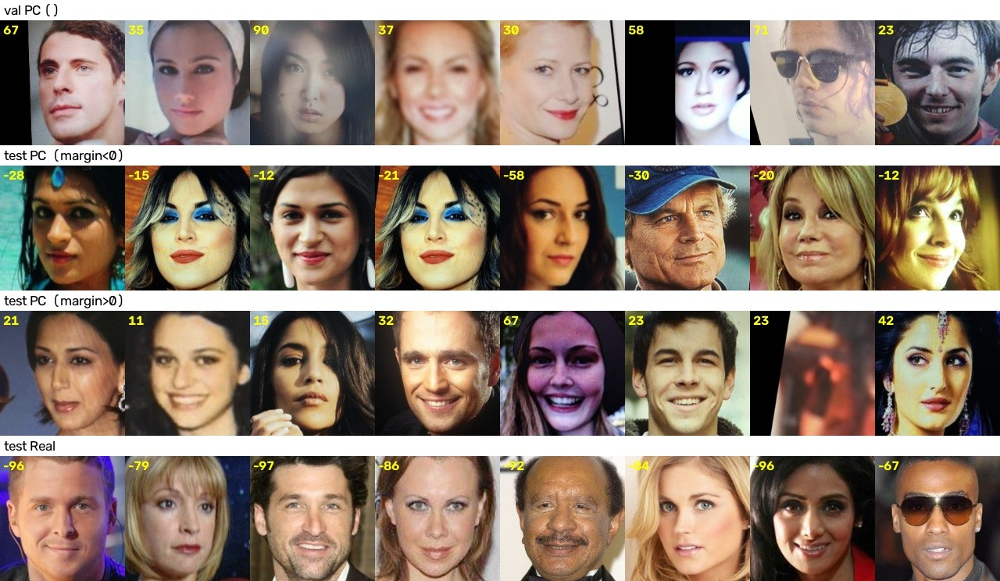

# Phase 1 — 첫 학습과 PC screen

**기간** 2026-09-18  **결과** InstructFLIP 공식 ACER **4.93** (AENet 1.63 에 못 미침) ·
val 기준 운영점 ACER **1.52** · 놓친 위조의 **75% 가 PC screen** 한 유형

---

## 문제

InstructFLIP 과 MiniFASNet 을 CelebA-Spoof 단독 프로토콜(train → 공식 test)로 처음 학습했다.
InstructFLIP 의 val 은 거의 완벽했는데 **test 에서 크게 무너졌다.**

| | ACER ↓ | APCER ↓ | BPCER ↓ | AUC ↑ |
|---|---|---|---|---|
| val (49,459장, train 에서 피험자 단위로 분리) | 0.17 | 0.26 | 0.08 | 100.00 |
| **test (67,170장, 공식 분할)** | **4.93** | **9.80** | 0.05 | 99.85 |
| AENet (논문, 같은 test 분할) | 1.63 | 2.29 | 0.96 | 99.89 |

진짜를 막는 쪽(BPCER)은 오히려 좋고, **위조를 통과시키는 쪽(APCER)만 4배 나쁘다.**

## 실험

| 런 | 모델 | 학습 | 소요 |
|---|---|---|---|
| `clip_instructflip_clip-vit-b16` | InstructFLIP · CLIP ViT-B/16 · 176M(추론) | 20 epoch × 12,800장, 실효배치 240, 4 GPU | 30분 |
| `minifasnet_minifasnet` | MiniFASNet V2 · 0.43M · 스크래치 | 20 epoch × 12,800장, 실효배치 256, 4 GPU | 4분 |

데이터: train 444,946 / val 49,459 (피험자 819명, train 과 겹치지 않음) / test 67,170.
정렬은 MTCNN 5점 랜드마크(8샤드 병렬, 누락 0장).

## 결과

### ① 운영점 — APCER 대부분은 임계값 위치 문제다

모델은 진짜 얼굴에 극단적으로 확신한다(live margin 중앙값 −83, 99% 가 −34 아래).
공식 규칙 "margin 0 (확률 0.5)" 은 live 분포에서 한참 떨어져 있어, live 는 거의 안 막고
경계에 걸친 위조를 대량 통과시킨다.

val 에서 **BPCER 가 1% 가 되는 임계값**(margin −33.33)을 정해 test 에 그대로 쓰면:

| | ACER | APCER | BPCER |
|---|---|---|---|
| 공식 0.5 | 4.93 | 9.80 | 0.05 |
| **val 기준 운영점** | **1.52** | **2.14** | 0.90 |
| AENet (논문, 0.5) | 1.63 | 2.29 | 0.96 |

live 분포가 val 과 test 에서 같아서(99% 지점 −32.1 vs −34.1) test BPCER 가 목표 1% 에
거의 정확히(0.90) 맞았다. **비슷한 BPCER 에서는 AENet 과 비슷하다.** 단 공식 비교는 0.5 규칙이다.

→ `metrics.compute(op_bpcer=, op_threshold=)` 로 구현. test 에는 **val 의 임계값을 그대로 넘긴다**
(test 로 다시 맞추면 누수). 공식 지표와 **나란히** 보고한다.

### ② 놓친 위조는 한 유형에 몰려 있다

| 유형 | test 오류 | val 오류 | margin 중앙값 val → test |
|---|---|---|---|
| Real (live 를 막음) | 0.05% | 0.09% | −82.8 → −82.9 |
| **PC screen** | **50.07%** | 0.10% | 60.6 → **−0.1** |
| A4-paper | 8.61% | 0.11% | 63.0 → 37.5 |
| Poster | 4.28% | 0.48% | 59.4 → 45.5 |
| Pad screen | 3.44% | 0.62% | 55.4 → 47.9 |
| 나머지 6종 | 0.4 ~ 1.7% | ≤ 0.7% | −5 ~ −19 이동 |

놓친 위조 4,323장 중 **3,243장(75%) 이 PC screen.** 진짜 얼굴의 점수는 val/test 가 같고
**위조만 전 유형이 live 쪽으로 이동**했다 — test 분할의 수집 조건이 다르다
(test 이미지 id 는 전부 494,436 이후로 따로 수집된 분량).

(유형별 수치는 같은 체크포인트를 다른 배치로 잰 것이라 전체 APCER 9.15 기준이다. 아래 ⑤)

### ③ PC screen 은 수집 조건이 train 과 다르다

| | train PC | test PC |
|---|---|---|
| 조명 | Normal 62% · Strong/Back/Dark **38%** | **Normal 100%** |
| 촬영 기기 품질 (protocol2 역산) | 고품질 **1%** | 고품질 **46%** |
| 이미지 대비 얼굴 박스 면적 | 17% | **9~10%** |

전체 위조를 기기 품질별로 보면 **좋은 기기로 찍을수록 더 놓친다** — low 0.48% · middle 8.05% ·
**high 15.33%**.

val 의 PC(맨 윗줄)는 모니터 테두리·비스듬한 화면 모서리·흐림이 크롭 안에 보인다. test 에서 놓친
PC(둘째 줄)는 화면이 크롭을 꽉 채운 선명한 재촬영이라 원본 사진과 구분되지 않는다.

**가설** — 모델이 train 에서 "화질 저하 · 조명 번짐 · 화면 테두리 = 위조" 라는 **촬영 조건 단서**를
배웠고, test 의 깨끗한 고화질 PC 재촬영에는 그 단서가 없다. 우리 전처리가 얼굴에 꽉 맞게 자르는
것(padding 0.37)도 테두리 같은 얼굴 밖 증거를 잘라낸다.

**미확인** — test PC 안에서 놓친 것과 잡은 것은 원본 크기·얼굴 비율·선명도가 같았다
(얼굴 비율 9.7% vs 9.0%). "세션 전체가 다르다" 까지는 확인했지만 **개별 샘플이 왜 틀리는지는
아직 모른다.**

### ④ MiniFASNet — 이 결과는 MiniFASNet 의 성능이 아니다

test ACER 19.66 · EER 19.15 · AUC 89.70. 원인 네 가지가 겹쳐 있어 모델 크기 탓으로 읽을 수 없다.

| # | 원인 | 확인 |
|---|---|---|
| 1 | **푸리에 보조감독 누락** — 원본은 분류 + 입력 FFT 스펙트럼 복원(0.5:0.5). 구조만 옮겼다 | 원 저장소 `train_main.py` |
| 2 | **미수렴** — 1,000 iter · 4분. val ACER 가 끝까지 내려감(23.4 → 6.3) | 곡선 |
| 3 | **crop 불일치** — 원본은 얼굴 박스 2.7배/4배. 상반신 마스크 오류 77.8% | 설정 |
| 4 | **앙상블 누락** — 원본은 V2(2.7배) + V1SE(4배) 예측을 합친다 | 원 저장소 `test.py` |

운영점은 이 모델에서 오히려 나쁘다(ACER 27.19, APCER 52.51) — 분리 능력이 낮으면 BPCER 를
묶는 순간 위조가 쏟아진다. **운영점은 공짜가 아니라 맞바꾸기다.**

### ⑤ 측정 자체의 문제 — 공식 ACER 는 흔들린다

같은 체크포인트인데 학습 직후 4.99, 저장한 점수로 4.60, 평가 스크립트로 4.93 이 나왔다.
PC screen 수천 장이 margin 0 바로 위에 몰려 있어 bf16 연산 순서·배치 구성만 달라도 수백 장이
뒤집힌다. **공식 ACER 는 ±0.4 로 읽어야 한다.** 운영점 ACER 는 1.48 / 1.52 로 안정적이다
(경계에 샘플이 거의 없다).

## 잡은 버그 · 측정 오류

| # | 무엇 | 어떻게 드러났나 | 영향 |
|---|---|---|---|
| 1 | 준비 스크립트 CSV 경로에 `train/` 접두 누락 | 실데이터 첫 실행 전 점검 | 돌렸으면 첫 배치에서 사망 |
| 2 | 라벨 생성이 protocol1/2 메타까지 섞어 읽음 | 〃 | 결과는 같았음(부분집합) — 의도 위반 |
| 3 | 4 GPU 에서 실효배치 960 (원논문 240) | 〃 | `effective_batch` 로 GPU 수에 맞춰 누적 자동 조정 |
| 4 | **CLIP `post_layernorm` 미사용 → DDP 사망** | 4 GPU 스모크 2번째 step | 원저자 코드는 `ln_post` 를 **전체 토큰**에 건다. HF 는 cls 에만 건다 — 원본과 다른 토큰을 넘기고 있었다. 원본대로 고쳐 동시 해결. DINOv2 `mask_token` 도 같이 막음 |
| 5 | **확률 포화로 TPR@FPR=1% = 0.00** | epoch 1 에 AUC 94 인데 TPR 0 | 로짓 차이 > ~17 이면 softmax 가 float32 로 1.0. val 의 42% 가 동점 → 순위 지표를 **margin(log-odds)** 으로 계산 |
| 6 | `steps.jsonl` 이 append 라 재실행 시 곡선이 이어 붙음 | 스모크 재실행 | 처음부터 돌 때 비움 |

## 틀린 판단

- "InstructFLIP 의 분리 능력은 AENet 과 같거나 낫다" — **틀렸다.** AENet 의 EER(0.9)을 빠뜨린 채
  판단했다. 실제로는 EER 1.48 vs 0.9, AUC·R@FPR1%·0.5% 도 조금씩 낮다. 나은 건 BPCER 와
  R@FPR0.1% 뿐이다.
- MiniFASNet 을 "원본 구조의 대조군"으로 소개했는데 푸리에 보조감독과 앙상블을 놓쳤다.
  처음부터 "구조만 옮긴 대조군"이라고 적었어야 했다.

## 결론 → Phase 2

1. **배포 운영점**은 val 기준 임계값으로 해결됐다 (APCER 2.14 / BPCER 0.90).
2. **공식 규칙에서의 격차는 PC screen 이 원인**이고, 모델이 위조를 실제로 더 잘 보게 해야 줄어든다.
   후보: 넓은 crop(얼굴 박스 2.7배 — 데이터셋 `_BB.txt` 로 CPU 생성 가능) + 화질 저하 증강을
   live 에도 적용. 다음 후보로 푸리에 보조감독.
3. **지금의 val 로는 개선을 판단할 수 없다** (val PC 오류 0.1%). test 를 보며 고르면 오염되므로
   protocol2 품질 라벨로 **스트레스 val**(고품질 기기 위조)을 먼저 만든다.
4. AENet 공개 가중치(`intra_dataset_code/ckpt_iter.pth.tar`)를 같은 평가 코드로 돌리면 논문 보고값이
   아닌 **동일 조건 비교**와 **AENet 도 PC screen 에서 무너지는지**를 알 수 있다.
