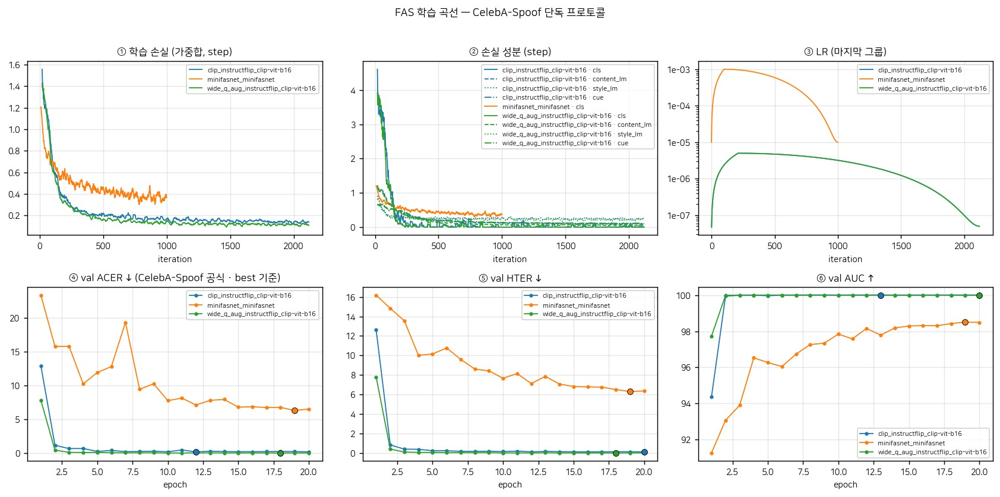

# FAS — Face Anti-Spoofing

Pierrot_FR Lab 의 얼굴 위조 방지 태스크 문서. **공통 사항**(태스크·코드·데이터·설정·평가·실행)을 모은다.

<!-- FAS-BEST:BEGIN -->
<!-- 이 블록은 scripts/FAS/sync_tables.py 가 생성한다. 손으로 고치지 말 것. -->

## 현재 최고 레시피

**`clip_instructflip_clip-vit-b16`** — InstructFLIP · CLIP ViT-B/16 · Q-Former · 학습용 FLAN-T5 · 랜드마크 정렬 crop 224

| | 공식 ACER (0.5) | 운영점 ACER (val 기준) | EER | AUC |
|---|---|---|---|---|
| test | **4.93** (APCER 9.80 / BPCER 0.05) | **1.52** (APCER 2.14 / BPCER 0.90) | 1.48 | 99.85 |
| AENet (논문) | 1.63 (APCER 2.29 / BPCER 0.96) | — | 0.9 | 99.89 |

> 놓친 spoof 의 75% 가 PC screen(유형 내 오류 50%). PC 샘플이 판정 경계(margin 0)에 몰려 있어 **공식 ACER 는 평가할 때마다 ±0.4 흔들린다** (4.60~4.93). 운영점 수치는 안정적이다. → [Phase 1](Exp/Phase_1_첫_학습과_PC_screen.md)

| 구성 | 값 (이 런의 train.log 에서 읽음) |
|---|---|
| 모델 | instructflip |
| 백본 | clip-vit-b16 |
| 변환기 | qformer |
| 학습용 LLM | google/flan-t5-base |
| 입력 | 224² · 정규화 clip |
| crop | MTCNN 5점 랜드마크 정렬 (padding 0.37, 타이트) |
| 손실 가중 | content 0.4 · style 0.4 · cls 0.15 · cue 0.05 |
| 학습량 | 20 epoch × 12,800 장 (live/fake 균형 True) |
| 최적화 | AdamW lr 5e-06 · 백본 ×0.1 · wd 1e-06 · warmup 2.0 ep · 실효배치 240 (4 GPU) |
| 정밀도·EMA | bf16 · EMA True |
| 모델 선택 | val ACER 최소 epoch |

<!-- FAS-BEST:END -->

---

## 1. 태스크

**FAS(Face Anti-Spoofing)** 는 카메라 앞의 대상이 **진짜 얼굴인지 위조물인지** 판별한다.
"라이브니스 검출", "PAD(Presentation Attack Detection)" 와 같은 말이다.

```
카메라 → [FAS: 진짜인가?] → [얼굴 인식: 누구인가?] → 승인
             ↓ 위조면 차단
```

얼굴 인식은 "누구인지"만 맞힌다. 남의 사진을 화면에 띄워 보여주면 인식 모델은 그 사람으로
정확히 판정해 버린다. FAS 는 그 앞단에서 **입력 자체의 진위**를 막는다.

### 공격 유형 (CelebA-Spoof 기준 11종)

| 매크로 | 마이크로 | 라벨 인덱스 |
|---|---|---|
| — | Real face | 0 |
| **Print** (인쇄) | Photo · Poster · A4-paper | 1, 2, 3 |
| **Mask** (마스크) | 2D face mask · 2D upper-body mask · 2D region mask | 4, 5, 6 |
| **Replay** (화면 재생) | PC screen · Pad screen · Phone screen | 7, 8, 9 |
| **Mask** | 3D mask | 10 |

### 지표 약어

| 약어 | 의미 |
|---|---|
| APCER | *Attack* Presentation Classification Error Rate — 위조를 진짜로 놓친 비율 |
| BPCER | *Bona fide* Presentation Classification Error Rate — 진짜를 위조로 막은 비율 |
| ACER | 위 둘의 평균. CelebA-Spoof 공식 벤치마크의 주 지표 |
| HTER | Half Total Error Rate = (FAR + FRR)/2. DG 문헌의 주 지표 |
| EER | Equal Error Rate — FAR = FRR 인 지점 |
| DG | Domain Generalization — 학습하지 않은 데이터셋/환경으로의 일반화 |

---

> ## 📐 알고리즘은 별도 문서로
>
> | 문서 | 알고리즘 | 원저장소 |
> |---|---|---|
> | **[InstructFLIP.md](InstructFLIP.md)** | InstructFLIP (176M, 언어 감독 VLM) | [kunkunlin1221/InstructFLIP](https://github.com/kunkunlin1221/InstructFLIP) |
> | **[MiniFASNet.md](MiniFASNet.md)** | MiniFASNet (0.43M, 경량 대조군) | [minivision-ai/Silent-Face-Anti-Spoofing](https://github.com/minivision-ai/Silent-Face-Anti-Spoofing) |
>
> 이 문서는 두 알고리즘이 **공유하는** 태스크 정의·코드 구조·데이터셋·설정·평가·실행만 다룬다.

---

## 2. 코드 구조

```
Pierrot_FR_Lab/
├── train_fas.py                    진입점
├── configs/
│   ├── paths.py                    루트 경로 해석 (env > paths.local.env > 기본값)
│   └── args_fas.py                 ★ PARAMS + PRESETS 단일 소스
├── pierrotfr/
│   ├── utils.py                    logger, cosine LR, 파라미터 카운트   ← 태스크 공통
│   ├── optim.py                    옵티마이저 그룹 분리                  ← 태스크 공통
│   ├── data/                       얼굴 공통 데이터 유틸                 ← 태스크 공통
│   │   ├── align.py                  MTCNN 5점 랜드마크 정렬
│   │   └── transforms.py             정규화 상수 (clip / imagenet)
│   └── FAS/
│       ├── config.py               config 검증 + 라벨 커버리지 진단
│       ├── data.py                 데이터셋 + collate
│       ├── instructions.py         content/style 지시문, NO_GT 처리
│       ├── engine.py               train_one_epoch / evaluate / EMA
│       ├── metrics.py              DG 계열 + CelebA-Spoof 공식
│       └── models/
│           ├── backbones.py          CLIP / DINOv2 어댑터 (레지스트리)
│           ├── qformer.py            Q-Former 자립 구현
│           ├── connectors.py         qformer / attn_pool / connector (레지스트리)
│           ├── heads.py              fusion · classifier · cue generator
│           └── instructflip.py       방법 구현
├── eval/FAS/                       evaluate.py · infer.py
├── scripts/FAS/                    prepare_celeba_spoof.py
├── tests/FAS/                      49개 테스트
└── LAB/FAS/                        FAS.md(이 문서) · InstructFLIP.md · MiniFASNet.md
```

### 2.1 모듈별 역할

**`pierrotfr/data/align.py`** — 얼굴 정렬. **모든 얼굴 태스크가 공유한다.**
태스크마다 정렬 규약이 다르면 실험 간 비교가 성립하지 않으므로 태스크 밖에 둔다.

원저자의 mxnet MTCNN(`extract_image_chips`) 규약을 그대로 이식했다 — 평균 얼굴 좌표,
padding 비율(0.37), to_center 위치(0.5W, 0.4H)까지 동일하다.
검출기만 facenet-pytorch MTCNN(동일 P/R/O-net 계열)으로 교체했다.
**원본과 수치 일치 검증: 무작위 300회 최대 오차 8.3e-17** (`tests/FAS/test_align.py`).

**`pierrotfr/FAS/models/backbones.py`** — 백본 어댑터. 모든 백본이 같은 계약을 지킨다.

```python
forward(x) -> (tokens [B,1+N,D], layer_feats [list of [B,L_i,D]])
.dim  .n_patches  .n_layers  .norm
```

| 이름 | HF id | 파라미터 | 토큰 | 패치 격자 | 권장 norm |
|---|---|---|---|---|---|
| `clip-vit-b16` | openai/clip-vit-base-patch16 | 86M | 197 | 14×14 | clip |
| `clip-vit-l14` | openai/clip-vit-large-patch14 | 304M | — | — | clip |
| `dinov2-s14` | facebook/dinov2-small | 21M | 257 | 16×16 | imagenet |
| `dinov2-b14` | facebook/dinov2-base | 86M | 257 | 16×16 | imagenet |
| `dinov2-b14-reg` | facebook/dinov2-with-registers-base | 86M | 257 | 16×16 | imagenet |
| `dinov2-l14-reg` | facebook/dinov2-with-registers-large | 300M | — | — | imagenet |

> ⚠ DINOv2 를 dense 로 쓸 땐 **registers 변종**을 쓸 것. 일반 DINOv2 는 패치 토큰에
> high-norm artifact 가 섞여 cue map 을 오염시킨다
> ([ViTs Need Registers](https://arxiv.org/abs/2309.16588)).
> registers 변종은 출력이 `[cls, reg×4, patch×N]` 이라 **레지스터를 잘라내야** 정사각이 된다
> (`_strip_registers`).

패치 수가 정사각이 아니면 **모델 생성 시점에** 막는다 — forward 중간이 아니라.

**`pierrotfr/FAS/models/connectors.py`** — 시각특징 → 쿼리 변환기. 실험 축.

| 이름 | 지시문 | 학습형 쿼리 | 2개 합 | 추론경로 | 계보 |
|---|---|---|---|---|---|
| `qformer` | **O** | O | 80M | 176M | BLIP-2 / InstructFLIP 원본 |
| `attn_pool` | X | O | 38M | 133M | 대조군 |
| `connector` | X | X | **2M** | **98M** | LLaVA / MiniCPM-V (= FaceCoT 계열) |

공통 계약: `forward(feats, text_ids=None, text_mask=None) -> [B, K, D]`

`connector` 를 쓰면 content/style 분리가 **입력 차이에서만** 온다(패치 토큰 vs 레이어 통계).
그 조건에서도 성능이 유지되면 지시문 게이팅은 불필요했다는 뜻이다.
대조군 자격은 테스트로 고정한다 — 지시문을 바꿔도 출력이 같은지 확인한다.

**`pierrotfr/FAS/models/heads.py`** — 융합과 예측 헤드.

> ⚠ 논문 식 (5) 는 `Q̂ = Q + ψ(Q, f̃_c)` — 쿼리가 스트림이다. **원저자 코드는 반대다**
> (`FusionModule.forward(content, queries)`). **코드가 맞다** — 논문대로면 출력이
> `[B,2K,D] = [B,64,D]` 라 cue map 을 정사각으로 펼 수 없다.
> 코드처럼 `[B,1+N,D]` 여야 `N=196 → 14×14` 가 성립한다.

또 원본 융합 블록은 FFN 에 residual 이 없다(`out = self.ffn(content)`). 표준 트랜스포머와
다르며 깊게 쌓으면 신호가 죽는다. 여기서는 residual 을 복원했다.

**`pierrotfr/FAS/engine.py`** — accelerate 기반 학습/평가 루프.
`gather_for_metrics` 를 써서 분산 환경의 패딩 중복 샘플을 제거한다
(`all_gather` 를 쓰면 마지막 배치가 복제돼 수치가 틀어진다).

---

## 3. 데이터셋

### 3.1 CelebA-Spoof

| | |
|---|---|
| 규모 | 625,537 장 / 10,177 명 |
| live:spoof | 1 : 3 |
| 분할 | train : val : test = **8 : 1 : 1**, 피험자 중복 없음 |
| 어노테이션 | 43 속성 (40 face attributes + spoof type + illumination + environment) |
| 라이선스 | 비영리 연구 목적만. 재배포 금지 |
| 출처 | [ZhangYuanhan-AI/CelebA-Spoof](https://github.com/ZhangYuanhan-AI/CelebA-Spoof) |
| 다운로드 | Google Drive 공개 폴더, **74 파트 × 1GB ≈ 74GB** |

표준 어노테이션 벡터 (44차원):

```
[0:40]  face attributes
[40]    spoof type    (0=Real face … 10=3D mask)
[41]    illumination  (0=미주석, 1=Normal 2=Strong 3=Back 4=Dark)
[42]    environment   (0=미주석, 1=Indoor 2=Outdoor)
[43]    live/spoof    (0=live, 1=spoof)
```

**공식 벤치마크 3종** (CelebA-Spoof 논문, ECCV 2020):

1. **Intra-Dataset** — train/test 모두 CelebA-Spoof. 지표: APCER, BPCER, ACER, EER, AUC, Recall@FPR(1%/0.5%/0.1%)
2. **Cross-Domain** — Protocol 1 (cross-medium: A4/face mask/PC 홀드아웃), Protocol 2 (cross-sensor: low/mid/high 품질)
3. **Cross-Dataset** — CelebA-Spoof ↔ CASIA-MFSD, HTER

**Intra-Dataset 기준선**:

| Model | Backbone | R@FPR=1%↑ | @0.5% | @0.1% | AUC↑ | EER↓ | APCER↓ | BPCER↓ |
|---|---|---|---|---|---|---|---|---|
| Auxiliary* | — | 97.3 | 95.2 | 83.2 | 0.9972 | 1.2 | 5.71 | 1.41 |
| BASN | VGG16 | 98.9 | **97.8** | **90.9** | **0.9991** | 1.1 | 4.0 | 1.1 |
| AENet_C,S,G | ResNet-18 | 98.9 | 97.3 | 87.3 | 0.9989 | **0.9** | **2.29** | **0.96** |

### 3.2 🔴 라벨의 함정 — 원본이 조용히 망가지는 지점

커밋된 라벨 CSV(`celeb_*_train.csv`, 각 40,000 행)를 직접 집계한 결과:

```
celeb_real_train.csv (40,000)
  spoof_type  : {0: 40000}
  illumination: {0: 40000}      ← 전부 미주석
  environment : {0: 40000}      ← 전부 미주석
  quality     : {-1: 40000}     ← 전부 -1

celeb_fake_train.csv (40,000)
  spoof_type  : {1:6810, 2:6604, 3:6840, 7:6418, 8:6636, 9:6692}
  illumination: {1:23422, 2:8106, 3:4319, 4:4153}
  environment : {1:30962, 2:9038}
  quality     : {-1: 40000}     ← 전부 -1
```

#### ① `quality` 가 항상 -1

카메라 품질은 **표준 44차원 주석에 없다**(논문 Protocol 2 의 센서 그룹은 별도 정보).
라벨 생성기가 `-1` 을 채우는데, 원본은 그걸 그대로 인덱스로 쓴다:

```python
ans = {'camera quality': quality}                  # = -1
out['style_output'] = options[ans[style_key]]      # options[-1] → "(3) High"
```

**파이썬 음수 인덱싱** 때문에 모든 이미지의 카메라 품질 정답이 `"(3) High"` **상수**가 된다.
논문 Figure 1·2 가 대표 예시로 내세운 게 바로 이 질문이다.

#### ② live 의 조명/환경이 0(미주석)인데 오프셋을 태운다

```python
'illumination condition': illumination - 1,   # live: 0-1 = -1
'enviroment': envir - 1,                      # live: 0-1 = -1
```

`illumination_options[-1]` = `"(4) Dark"`, `environment_options[-1]` = `"(2) Outdoor"`.
live 얼굴에 **틀린 정답**을 준다.

#### ③ live 에 항상 camera quality 만 질문

```python
style_key = choice(self.style_keys) if is_fake else 'camera quality'
```

질문 종류가 라벨과 상관되어 **"무엇을 물었나 → live/fake" 지름길**이 생긴다.
게다가 ①과 겹쳐 live 의 style 감독은 전부 `"(3) High"` 상수가 된다.

| | style 질문 | 정답 |
|---|---|---|
| live (50%) | 항상 camera quality | **항상 "(3) High"** — 정보량 0 |
| fake | 1/3 illumination | 정상 |
| fake | 1/3 environment | 정상 |
| fake | 1/3 camera quality | **항상 "(3) High"** |

**style 감독의 약 2/3 가 상수 라벨이다.**

#### ④ 학습 라벨에 마스크 공격이 없다

fake 의 `spoof_type` 이 `{1,2,3,7,8,9}` — 인쇄 3종 + 재생 3종뿐. 마스크(4,5,6,10)가 없다.
그런데 논문 Table 5 는 최적 설정을 "Real 1 / Pr. 3 / Re. 3 / **M2D 3** / **M3D 1**" 로 적었고
ablation 코드도 마스크를 포함한다. **커밋된 라벨과 논문 설명이 일치하지 않는다.**

#### ⑤ resolution 필터가 원래부터 불가능

config 는 `data['quality'] == 0/1/2` 로 필터하려 하는데 quality 가 전부 -1 이라
**빈 데이터프레임**이 된다. 원본 코드의 덮어쓰기 버그(`self.data = data`)가 필터를
무력화해 우연히 학습이 죽지 않았다.
→ **line 56 만 고치면 크래시한다.** quality 를 실제로 채우거나 필터를 빼야 한다.

### 3.3 이 저장소의 처리

정답이 없는 항목은 **`NO_GT` 로 표시해 손실에서 제외**한다.
없는 라벨을 지어내지 않는 게 유일하게 옳은 처리다.

```python
def answer(key, raw_value) -> str:
    if key in ("illumination", "environment"):
        idx = raw_value - 1 if raw_value >= 1 else None
    elif key == "camera quality":
        idx = raw_value if raw_value >= 0 else None
    if idx is None or not (0 <= idx < len(options)):
        return NO_GT          # 음수 인덱싱을 절대 허용하지 않는다
```

style 질문은 **이 샘플에 실제 정답이 있는 항목 중에서만** 고른다 → 질문↔라벨 상관 제거.
배치 전체가 `NO_GT` 면 빈 텐서가 T5 에 들어가 터지므로 0 을 반환해 막는다.

`config.py` 가 학습 시작 시 커버리지를 출력한다:

```
[args] style 라벨 커버리지: illumination 50% · environment 50% · camera quality 0%
```

회귀 방지: `tests/FAS/test_instructions.py` (7개 테스트).

### 3.4 외부 벤치마크 — 확보 불가

7개 모두 **공개 다운로드 URL 이 존재하지 않는다.** 기관에 신청서와 라이선스 동의서를 내고
승인받아야 개별 링크를 받는다. FAS 커뮤니티의 [FAS_DataManager](https://github.com/RizhaoCai/FAS_DataManager)
조차 16개 데이터셋 전부에 대해 URL 을 제공하지 않는다.

| 데이터셋 | 기관 | 신청 |
|---|---|---|
| MSU-MFSD (M) | Michigan State | biometrics.cse.msu.edu |
| CASIA-FASD (C) | CASIA CBSR | cbsr.ia.ac.cn |
| Replay-Attack (I) | Idiap | idiap.ch |
| OULU-NPU (O) | Univ. of Oulu | sites.google.com/site/oulunpudatabase |
| WMCA (W) | Idiap | idiap.ch |
| CASIA-CeFA (C) | CASIA | face-anti-spoofing 페이지 |
| CASIA-SURF (S) | CASIA | 동일 |

승인 후에는 `PARAMS['eval_folders']` 에 `{이름: 폴더}` 만 넣으면 cross-domain 평가가 켜진다.
폴더 구조는 `<root>/{real,fake}/*.jpg`, 파일명이 `<video>_frame<N>.jpg` 면 video 단위 집계가 켜진다.

---

## 4. 설정

**모든 값은 `configs/args_fas.py` 의 `PARAMS` 한 곳에서 바꾼다.** CLI 인자는 없다.

```
PARAMS (베이스 24항목 + model_extra 12항목)
   → PRESETS[PRESET] (실험 축만 덮어씀, model_extra 는 깊은 병합)
   → 손실 가중치 재정규화
   → args
```

### 4.1 프리셋

| preset | backbone | query_module | use_llm | w_c/w_s/w_cls/w_cue | 목적 |
|---|---|---|---|---|---|
| `clip` | clip-vit-b16 | qformer | O | .40/.40/.15/.05 | 기준선 (원논문 재현) |
| `dinov2` | dinov2-b14-reg | qformer | O | .40/.40/.15/.05 | 백본 축 |
| `dinov2_small` | dinov2-s14 | qformer | O | .40/.40/.15/.05 | 백본 축 (경량) |
| `no_llm` | clip-vit-b16 | qformer | **X** | .00/.00/.90/.10 | LLM 기여 |
| `content_only` | clip-vit-b16 | qformer | O | .667/.000/.250/.083 | style 분기 기여 |
| `attn_pool` | clip-vit-b16 | **attn_pool** | O | .40/.40/.15/.05 | 지시문 게이팅 기여 |
| `connector` | clip-vit-b16 | **connector** | O | .40/.40/.15/.05 | 학습형 쿼리 기여 |
| `no_cue` | clip-vit-b16 | qformer | O | .40/.40/.20/.00 | cue 기여 |
| `smoke` | clip-vit-b16 | qformer | O | .40/.40/.15/.05 | 파이프라인 점검 |

```bash
python train_fas.py                       # PRESET 그대로
FAS_PRESET=connector python train_fas.py  # 파일 수정 없이 교체
```

`work_dir` 이 `runs/fas/{preset}_{model}_{backbone}/` 로 갈려 결과가 섞이지 않는다.

### 4.2 손실 가중치 재정규화

항을 0 으로 끄면 가중치 합이 1 아래로 떨어져 **손실 스케일 자체가 작아진다.**
그러면 "그 항을 뺀 효과"와 "실효 LR 이 낮아진 효과"가 섞여 ablation 이 흐려진다.

`normalize_loss_weights: True` 면 살아남은 항들의 **비율을 유지한 채** 합을 1 로 맞춘다.
예: `content_only` 는 0.4/0.0/0.15/0.05 (합 0.6) → **0.667/0.000/0.250/0.083**.

### 4.3 학습 하이퍼파라미터

| 항목 | 값 | 비고 |
|---|---|---|
| epochs | 20 | |
| batch_size | 24 | GPU 당 |
| grad_accum | 10 | 실효배치 = 24 × 10 × GPU수 = **240** |
| lr0 | 5e-6 | 피크 |
| lrf | 0.01 | 최종 = lr0 × lrf |
| backbone_lr_mult | 0.1 | 백본 LR = 5e-7 |
| weight_decay | 1e-6 | |
| warmup_epochs | 2.0 | |
| clip_grad | 1.0 | |
| amp | bf16 | |
| dataset_size | 12800 | 한 epoch 에 볼 샘플 수 |

> ⚠ `dataset_size` 는 "데이터 전체를 한 번 훑는다"는 뜻이 **아니다.** CelebA-Spoof train 은
> ~50만 장이라 전량 1 epoch 은 비현실적이다. 12800 × 20 epoch ≈ 25.6만 샘플 관측,
> optimizer 스텝은 **약 1,067 회**에 불과하다.

**원논문과의 불일치** (원저자 config 기준):

| 항목 | 논문 | 원저자 config |
|---|---|---|
| batch size | 24 | 24 × accumulate 10 = **240** |
| initial lr | 1e-6 | max_lr/div_factor = **5e-7** |
| weight decay | 1e-6 | **1e-7** |
| LLM | "frozen FLAN-T5-base" | frozen + **4-bit fp4 양자화** |

---

## 5. 평가 지표

두 계열을 **모두** 낸다 — 비교 대상 논문이 서로 다른 지표를 쓰기 때문이다.

| 계열 | 지표 | 비교 대상 |
|---|---|---|
| **DG** | HTER, AUC, TPR@FPR=1% | FLIP · CFPL · InstructFLIP |
| **CelebA-Spoof 공식** | APCER, BPCER, ACER, Recall@FPR(1/0.5/0.1%) | AENet · BASN |

### 5.1 임계값 — 누수 주의

DG 문헌은 HTER 임계값을 **테스트셋 EER 에서** 뽑는 관행이 있다. 낙관 편향이 있지만
선행연구가 모두 그렇게 하므로 비교를 위해 같이 낸다.

`select_threshold_on_val: True` 면 **val 에서 가져와** 누수를 없앤다(기본값).

### 5.2 모델 선택 — 원본의 누수

원저자 코드는 **타깃 테스트셋들의 평균 HTER 로 best epoch 을 고른다**:

```python
best_step, _ = self.metric_table.loc[(slice(None), "mean"), "HTER(↓)"].idxmin()
```

7개 타깃이 valid dataloader 로 들어가고 `ModelCheckpoint(monitor="mHTER")` 도 같은 값을 본다.
별도 held-out validation split 이 없다. 20 epoch × 5 seed = 선택지 100개이므로 낙관 편향이
실제로 존재할 수 있다.

**여기서는 val 로 고르고 test 는 보고만 한다.** CelebA-Spoof 공식 분할에 val 이 없으면
`prepare_celeba_spoof.py` 가 train 에서 **subject-disjoint** 로 카브한다.

---

## 6. 실행

### 6.1 데이터 준비

```bash
# 0) 원본 압축 해제 (74 파트)
cd $FAS_DATA_ROOT/CelebA-Spoof
cat CelebA_Spoof.zip.[0-9][0-9][0-9] > CelebA_Spoof.zip
unzip -t CelebA_Spoof.zip && unzip -q CelebA_Spoof.zip -d extracted

# 1) 정렬 + 라벨 CSV + val 카브 (한 번에)
python scripts/FAS/prepare_celeba_spoof.py \
    --root $FAS_DATA_ROOT/CelebA-Spoof/extracted \
    --out  $FAS_DATA_ROOT/processed/ca

# 단계별로도 가능
#   --steps align    MTCNN 정렬만
#   --steps labels   라벨 CSV 만
#   --steps val      subject-disjoint val 카브만
```

산출물:
```
processed/ca/
├── train/{real,fake}/*.jpg      정렬된 224² crop
├── test/{real,fake}/*.jpg
├── train.csv  val.csv  test.csv
└── train_full.csv               카브 전 원본 보존
```

### 6.2 학습

```bash
python train_fas.py                                  # 단일 GPU
accelerate launch --num_processes 4 train_fas.py     # 4 GPU
FAS_PRESET=dinov2 accelerate launch --num_processes 4 train_fas.py
```

산출물: `runs/fas/{preset}_{model}_{backbone}/`
`latest.pth` · `best.pth` · `history.json` · `results.json` · `train.log`

### 6.3 평가 / 추론

```bash
# 평가 (val 에서 임계값을 가져와 누수 없이)
python eval/FAS/evaluate.py --ckpt runs/.../best.pth \
    --csv .../test.csv --val_csv .../val.csv --out results.json

# 승인받은 외부 벤치마크
python eval/FAS/evaluate.py --ckpt ... --folder /path/MCIO/msu --name MSU

# 추론 + cue map (LLM 을 로드하지 않는다)
python eval/FAS/infer.py --ckpt ... --image face.jpg --align --save_cue out/
```

### 6.4 테스트

```bash
python -m pytest tests/ -q       # 49 passed
```

주요 회귀 테스트:

| 파일 | 고정하는 것 |
|---|---|
| `test_align.py` | 유사변환이 원본 mxnet 구현과 1e-9 이내 일치 |
| `test_instructions.py` | 음수 인덱싱으로 상수 정답이 나오지 않음 |
| `test_model.py` | 융합이 이미지 토큰 길이 유지, connector 계약, 지시문 반응 여부 |
| `test_config.py` | PRESET 깊은 병합, 손실 가중 합 1, 실효배치 유지 |

---

## 7. 알려진 한계

1. **실제 데이터 미검증** — 현재까지 합성 데이터 스모크만 통과했다. CelebA-Spoof 74 파트
   다운로드는 완료됐으나 정렬·라벨 생성은 아직 돌리지 않았다.
2. **DINOv2 경로 미학습** — 백본 로드와 forward shape 만 확인했다. 수렴은 검증 못 했다.
3. **camera quality 미해결** — 논문 Protocol 2 에 센서 품질 정보가 있으나 표준 metas 에서
   끌어오는 매핑을 아직 만들지 못했다. 압축 해제 후 `metas/protocol2/` 확인 필요.
4. **마스크 공격 부재 가능성** — 커밋된 라벨 CSV 에 마스크 카테고리가 없었다. 원본
   어노테이션에 있는지 확인 필요. WMCA·CASIA-SURF 같은 마스크 중심 타깃 성능에 직결된다.
5. **cue map 정량 평가 불가** — 위조 영역 정답이 없어 해석 보조로만 쓴다.

---

## 8. 실험 결과

표는 `scripts/FAS/sync_tables.py` 가 `runs/fas/<런>/results_op.json` 과 `train.log` 에서 생성한다.
단계별 분석(왜 이런 수치가 나왔나)은 [Exp/](Exp/) 에 있다.

<!-- FAS-TABLE:BEGIN -->
<!-- 이 블록은 scripts/FAS/sync_tables.py 가 생성한다. 손으로 고치지 말 것. -->

CelebA-Spoof 공식 test (intra-dataset, 67,170장). README 의 표도 같은 스크립트가 같이 갱신한다 — 둘은 어긋날 수 없다.

| | ACER ↓ | APCER ↓ | BPCER ↓ | EER ↓ | AUC ↑ | R@FPR1% ↑ | R@FPR0.5% ↑ | R@FPR0.1% ↑ |
|---|---|---|---|---|---|---|---|---|
| InstructFLIP (우리, 임계값 0.5) | 4.93 | 9.80 | 0.05 | 1.48 | 99.85 | 97.97 | 96.80 | 92.99 |
| InstructFLIP (우리, 임계값 val 기준) | 1.52 | 2.14 | 0.90 | 1.48 | 99.85 | 97.97 | 96.80 | 92.99 |
| InstructFLIP+넓은crop·저하증강·품질감독 (우리, 임계값 0.5) | 4.85 | 9.68 | 0.03 | 1.83 | 99.77 | 97.52 | 96.44 | 93.85 |
| InstructFLIP+넓은crop·저하증강·품질감독 (우리, 임계값 val 기준) | 1.78 | 2.73 | 0.84 | 1.83 | 99.77 | 97.52 | 96.44 | 93.85 |
| MiniFASNet (우리, 임계값 0.5) | 19.66 | 30.49 | 8.84 | 19.15 | 89.70 | 40.83 | 33.57 | 19.20 |
| MiniFASNet (우리, 임계값 val 기준) | 27.19 | 52.51 | 1.87 | 19.15 | 89.70 | 40.83 | 33.57 | 19.20 |
| AENet_C,S,G (논문) | 1.63 | 2.29 | 0.96 | 0.90 | 99.89 | 98.90 | 97.30 | 87.30 |

- **임계값 0.5** 는 CelebA-Spoof 공식 규칙이다. AENet 도 이 규칙으로 쟀으므로 **공식 비교는 이 행끼리** 한다.
- **임계값 val 기준** 은 val 에서 BPCER(진짜를 막는 비율)가 1% 가 되도록 정한 임계값을 test 에 그대로 쓴 것이다. test 를 보지 않으므로 누수가 없고, 실제 배포 방식이다.
- 같은 모델의 두 행은 **ACER·APCER·BPCER 만 다르다.** EER·AUC·R@FPR 은 임계값과 무관하게 모델 자체를 잰다.
- AENet 은 논문 보고값이다(우리가 재현하지 않음). test 분할은 같다 (`metas/intra_test/test_label.json`, 67,170장).

### 실험 정의

| 런 | 정의 | 왜 돌렸나 | best epoch | 운영점 임계값 (margin) | 읽을 때 주의 |
|---|---|---|---|---|---|
| `clip_instructflip_clip-vit-b16` | InstructFLIP · CLIP ViT-B/16 · Q-Former · 학습용 FLAN-T5 · 랜드마크 정렬 crop 224 | 원논문 레시피 재현 기준선 (CelebA-Spoof 단독 프로토콜) | 12 / 20 | -33.33 | 놓친 spoof 의 75% 가 PC screen(유형 내 오류 50%). PC 샘플이 판정 경계(margin 0)에 몰려 있어 **공식 ACER 는 평가할 때마다 ±0.4 흔들린다** (4.60~4.93). 운영점 수치는 안정적이다. → [Phase 1](Exp/Phase_1_첫_학습과_PC_screen.md) |
| `wide_q_aug_instructflip_clip-vit-b16` | InstructFLIP · 얼굴 박스 2.7배 crop · 화질 저하 증강(live/spoof 양쪽, p=0.5) · protocol2 카메라 품질 style 감독 | PC screen 실패가 촬영 조건 지름길 때문인지 확인 (세 처방을 합친 후보 하나) | 18 / 20 | -33.16 | ❌ **채택 안 함.** PC screen 은 오히려 악화(test_dev 47.5→54.0%), 나머지 7개 유형은 크게 개선(Pad 5.1→0.4%, 3D mask 2.3→0%). 분리 능력(EER·운영점 ACER)은 test_dev 에서 나빠졌다 → [Phase 2](Exp/Phase_2_넓은crop과_촬영조건_처방.md) |
| `minifasnet_minifasnet` | MiniFASNet V2 · 분류 가지만 · 랜드마크 정렬 crop 80×80 · 스크래치 | 경량 대조군 — 400배 작은 모델이 같은 데이터에서 어디까지 가나 | 19 / 20 | 2.22 | ⚠ **원본 MiniFASNet 레시피가 아니다.** 푸리에 보조감독·2.7배 넓은 crop·2모델 앙상블이 빠졌고, 1,000 iter 로 미수렴(val 이 끝까지 내려감). MiniFASNet 의 성능으로 읽으면 안 된다. |

<!-- FAS-TABLE:END -->


