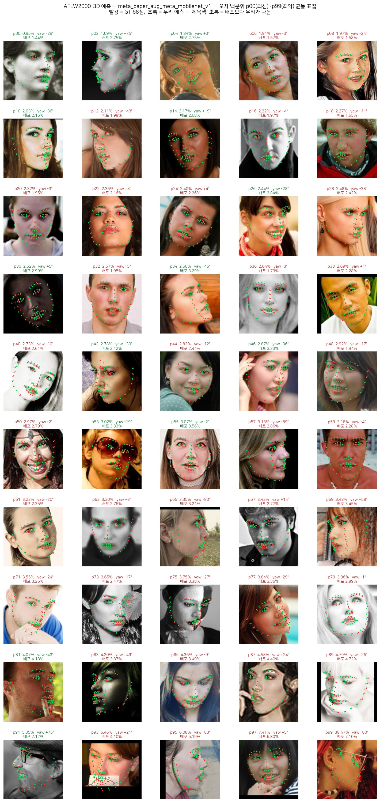
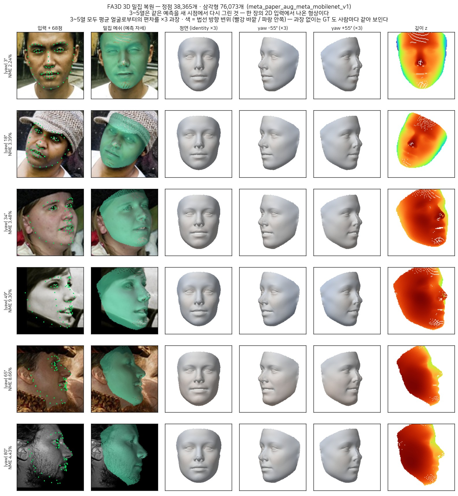

<p align="center">
  
</p>

<h1 align="center">🎭 PIERROT FACE</h1>

<p align="center">
  <b>PyTorch-based Face algorithms</b>
</p>

<p align="center">
  
  
  
  
  
  
</p>

<p align="center">
  <a href="README.md">한국어</a> | <b>English</b>
</p>

---

## 💡 Introduction

**PIERROT FACE** is a **one-person Face Vision research and development project**. The goal
is to **separate the work into large categories** — anti-spoofing / 3D alignment /
recognition — rather than lumping them into a single pipeline, so that the algorithm at each
stage can be reproduced, swapped and compared independently.

This repository ships **only the inference path of FA3D (3D Dense Face Alignment)**.
Losses, optimization, augmentation and the training datasets have been stripped out of the
training repository; what remains is **exactly what is needed to turn one checkpoint into a
face**.

> **Origin of the name** — Pierrot is originally a pantomime clown character who **mimics and
> imitates others**. It resonates with [Pierrot Universe](https://github.com/Pierrot-vision)'s
> first philosophy (MimiC) — following and combining the good parts of existing research —
> which is why we use this name.

1. **Reproduce first, then combine (MimiC)** — the default direction is to **reproduce a
   verified implementation exactly, and only then combine**. We check parity against the
   official code and tabulate every difference. **When a paper ships no training code, we
   implement it directly from the equations** and record the reasoning (3DDFA_V2 is that case).
2. **Categories and algorithms stay separate** — no category reaches into another's code, and
   algorithms can be swapped inside a category.
3. **Records first** — analysis, design rationale and how to run things all live in [LAB](LAB/).
   **When a comparison is not apples-to-apples, we say so.**
4. **A playground for personal curiosity** — above all, this is where the author's curiosity
   gets worked out.

* The training code and trained weights are not publicly released at this time.

## 📰 News

- 2026-09-02 — 🚀 **FA3D inference code released** — image/video inference · AFLW2000-3D and
  AFLW evaluation · novel-view 3D rendering · shape accuracy. It **reproduces the training
  repository's numbers to three decimal places**
- 2026-09-01 — 🎯 **We beat the released weights** — AFLW2000-3D **3.622** vs 3.683
  (**−0.061**), obtained by combining augmentation · the synergy cycle · occlusion ·
  cross-pose identity consistency 👉 [Phase 5](LAB/FA3D/Exp/Phase_5_증강과_svs.md)
- 2026-08-27 — 🧊 **FA3D (the 3DDFA_V2 training half) reimplemented** — fWPDC, meta-joint
  optimization and landmark-regression regularization, none of which exist in the author's
  repository, written from the paper; the released weights' 3.683 reproduced
  👉 [Phase 1](LAB/FA3D/Exp/Phase_1_구현과_기준선.md)

## 🧊 3D Dense Face Alignment (FA3D)

**3DDFA_V2 (ECCV 2020)** publishes inference code and released weights only — **there is no
training code.** So we reimplemented it directly from the paper's equations. This repository
is **the code that runs that result**.

- 📘 **Algorithm** (equations · derivations · parameter semantics · evaluation protocol) — [LAB/FA3D/3DDFA_V2.md](LAB/FA3D/3DDFA_V2.md)
- 📗 **Implementation and experiment log** (bugs · measurements · analysis) — [LAB/FA3D/FA3D.md](LAB/FA3D/FA3D.md)
- 📙 **Phase-by-phase record** — [LAB/FA3D/Exp/](LAB/FA3D/Exp/) (Phase 1–10)

> ⚠ The LAB documents are written in Korean — they are the original research notes,
> copied here unchanged rather than translated, so the record stays exactly as it was made.

### What it actually predicts (video demo)


### Evaluation

| Model | AFLW2000-3D ↓ | AFLW (21 pts) ↓ |
|---|---|---|
| **Ours** | **3.622** | **5.125** |
| — | — | — |
| 🎯 3DDFA_V2 released mb1 | *3.683* | *4.600* |
| 3DDFA_V2 released mb05 | *3.798* | *4.738* |
| Paper, M+R | *3.590* | *4.500* |
| Paper, M+R+S | *3.510* | *4.430* |

> ⚠ **The weights the authors released do not reproduce the paper's numbers.** Measured with the same evaluation code, mb1 comes out at 3.683 / 4.600 — **consistently 0.09–0.10 worse** than the paper's M+R (3.590 / 4.500) on both benchmarks. So the reproduction target of this project is **the released weights**, not the paper's table.

> For the full experiment log, see [LAB/FA3D/FA3D.md](LAB/FA3D/FA3D.md).

### Per-backbone results

The three accuracy rows are runs of **the same recipe (`meta_paper_aug_synergy`, b128) with
only the backbone swapped**. Cost comes from `python scripts/FA3D/bench_backbone.py` —
RTX 6000 Ada, batch 1, inference path only (neither the lrr head nor the synergy cycle
exists in this repository's models).

| Backbone | Params | MACs | CPU 1 thread | GPU b1 | AFLW2000-3D ↓ | AFLW ↓ |
|---|---:|---:|---:|---:|---:|---:|
| `mobilenet_v1` (paper default · from scratch) | 3.27M | 177M | 5.61 ms | **1.55 ms** | **3.657** | **5.085** |
| `pierrotxv2_n` (obj365 detection pretraining) | 1.30M | 79M | 3.86 ms | 2.32 ms | 3.733 | 5.222 |
| `yolo26_n` (obj365 detection pretraining) | 1.40M | 61M | 3.87 ms | 3.18 ms | 3.784 | 5.247 |
| `mobilenet_v2` (SynergyNet) | 2.30M | 93M | 5.17 ms | 3.21 ms | — | — |
| `mobilenet_v1_x05` | **0.85M** | **46M** | **2.76 ms** | 1.56 ms | — | — |
| — | — | — | — | — | — | — |
| 🎯 3DDFA_V2 released mb1 (arch = `mobilenet_v1`) | 3.27M | 177M | 5.61 ms | 1.55 ms | *3.683* | *4.600* |
| 3DDFA_V2 released mb05 (arch = `mobilenet_v1_x05`) | 0.85M | 46M | 2.76 ms | 1.56 ms | *3.798* | *4.738* |

> **Shrinking the backbone 2.5× costs only 0.08 NME** — the detection-pretrained backbones
> from the sibling lab (Pierrot_3D_Lab) come close to the from-scratch MobileNet-V1 at 40% of
> the parameters and 45% of the MACs. **On AFLW the gap is wider** (+0.14–0.16), though — it
> opens up first on real photographs and occlusion.

> ⚠ **Parameter count is not a proxy for latency.** `mobilenet_v1_x05` has a quarter of the
> parameters yet the same GPU b1 as `mobilenet_v1`, and `yolo26_n` has a third of the MACs yet
> is twice as slow on GPU — depthwise and inverted-residual blocks are bound by memory
> bandwidth, not arithmetic. The paper reports 6.2 ms on CPU for MobileNet: the same place.

> `mobilenet_v2` and `mobilenet_v1_x05` have no checkpoint trained with this recipe, hence the
> empty accuracy cells — for the `mobilenet_v1_x05` architecture the baseline is the released
> mb05 row below. The cost figures on the two released rows are **our own measurements of the
> same architecture** (weights do not change latency).

### Predictions — AFLW2000-3D



Fifty images sampled evenly across the error percentiles, p00 (best) to p99 (worst).
🟢 green = our prediction · 🔴 red = ground-truth 68 points; **a green title means we beat the
released weights on that image**. The [worst 50](docs/FA3D/aflw2000_grid_worst.jpg) are also here.

### 3D reconstruction — the same prediction, redrawn from a new viewpoint



## 🚀 Install

```bash
git clone https://github.com/Pierrot-vision/Pierrot-FACE
cd Pierrot-FACE

conda create -n fr python=3.9 -y
conda activate fr
pip install -r requirements.txt

# Register machine-specific paths once, and you never have to export them again
cp paths.local.env.example paths.local.env
#   The key one is PIERROTFR_CKPT_ROOT — point it at the training runs/ directory
```

## ⚡ Quick start

**The `.sh` scripts take no arguments.** What you would change lives in the
`---- 여기만 바꾼다 ----` ("change only here") block at the top of each file. Call the Python
entry points directly and everything is a CLI flag.

```bash
# ── Inference ─────────────────────────────────────────────────────
# Accepts an image, a directory, a list.txt, or a video. Always prints speed.
python eval/FA3D/infer.py --ckpt runs/fa3d/<run>/best.pth --source data/samples --grid 3
python eval/FA3D/infer.py --ckpt … --source clip.mp4 --mesh --corner3d 0.24 --drop-empty
python eval/FA3D/infer.py --ckpt … --source clip.mp4 --gif --fps 12

# ── Evaluation ────────────────────────────────────────────────────
# Measure the released weights with the same code — the only valid comparison
python eval/FA3D/evaluate.py --ckpt runs/fa3d/<run>/best.pth --deployed mb1 --aflw

# ── Analysis ──────────────────────────────────────────────────────
python scripts/FA3D/pred_grid.py      --ckpt … --mode spread  # prediction grid (2D)
python scripts/FA3D/pred_grid.py      --ckpt … --mode worst   # failure modes
python scripts/FA3D/pred_3d.py        --ckpt …                # dense 3D, re-rendered
python scripts/FA3D/pred_3d.py        --ckpt … --compare      # identity: GT vs ours vs released
python scripts/FA3D/shape_accuracy.py --ckpt …                # shape (identity) accuracy
python scripts/FA3D/error_analysis.py --ckpt …                # per-sample error breakdown
python scripts/FA3D/diff_grid.py      --a … --b …             # where two runs diverge
python scripts/FA3D/bench_backbone.py                         # backbone latency · MACs

# ── Bundles ───────────────────────────────────────────────────────
bash scripts/FA3D/eval.sh                     # one evaluation pass
VIDEO=clip.mp4 bash scripts/FA3D/infer.sh     # inference · figures · speed, in one go
```

**The checkpoint carries its own configuration** — backbone, input size and border
preprocessing need not be specified, and cannot be. The border-zeroing step (`aug_border`)
in particular is **preprocessing shared by training and evaluation**, so a human must not
pick it: feed a different value than training used and the model sees a distribution it has
never seen. We once mis-measured the same weights as 3.948 instead of 3.688 that way.

## 📦 Layout

```
Pierrot_FR_Infer/
├── configs/
│   ├── paths.py            # 🗺️ dataset / weight / output roots (paths.local.env · env vars)
│   └── eval_fa3d.py        #    eval-set and BFM paths — only what the checkpoint cannot know
├── paths.local.env         # machine-specific paths — not committed (copy the .example)
├── pierrotfr/FA3D/         # 📦 inference path only
│   ├── infer.py            #   checkpoint loading · batch inference · FA3D class ★entry point
│   ├── bfm.py              #   3DMM decoder — 62-d → 38,365 vertices / 68 landmarks
│   ├── crop.py             #   face crop convention (ported from 3DDFA_V2) — half the accuracy
│   ├── data.py             #   preprocessing ((x−127.5)/128 · border) + eval dataset
│   ├── detect.py           #   face detection (FaceBoxes → MTCNN → Haar fallback) · demo only
│   ├── render.py           #   point-splat renderer — novel view · mesh overlay · 68 points
│   ├── metrics.py          #   AFLW2000-3D / AFLW NME (yaw-bin convention)
│   ├── benchmark.py        #   eval-set pipeline (predict → landmarks → NME)
│   └── models/             #   backbones — neither the lrr head nor the synergy cycle is built
├── eval/FA3D/
│   ├── infer.py            # 🔍 photos/video → 68 points / 3D mesh (+H.264/GIF, timing)
│   └── evaluate.py         #    AFLW2000-3D / AFLW NME (several ckpts + released weights)
├── scripts/FA3D/           # 🧪 figures · analysis · speed (bundled by eval.sh · infer.sh)
├── LAB/                    # 📚 read-only copy of the training repo's experiment record
├── docs/                   # banner · result visualizations · demos
├── data/samples/           # demo photos — not committed
├── runs/                   # (symlink) the training repo's checkpoints — read only
└── outputs/fa3d/<run>/     # inference visualizations — regenerable, not committed
```

### What the training repository has that this one does not

| Removed | Why |
|---|---|
| `train_fa3d.py` · `engine.py` | meta-joint optimization (Algorithm 1) — the training loop |
| `losses.py` | VDC · fWPDC · lrr · parameter-space loss |
| `svs.py` | short-video-synthesis — a training augmentation |
| `models/synergy.py` | the SynergyNet cycle (MLP_for/MLP_rev) — never on the `predict()` path |
| training datasets · `Augment` | 300W-LP loader · ColorJitter · occlusion · identity groups |
| `configs/args_fa3d.py` (626 lines) | hyperparameters — **the checkpoint carries them** |
| the `fc_lm` head | §2.3 lrr regularization — even the authors ship it and throw it away |

The lrr head and the synergy cycle **cost nothing at inference** (they are not on the
`predict()` path). This repository goes one step further and **never builds the modules at
all**, so its parameter counts and latencies are those of the model that actually ships
(`python scripts/FA3D/bench_backbone.py`).

## 🤗 Reference

- PIERROT FACE is built by reproducing and combining the good parts of existing research.
- I am always grateful to that work.

📚 Papers —
[3DDFA_V2 (ECCV 2020)](https://guojianzhu.com/assets/pdfs/3162.pdf) ·
[SynergyNet (3DV 2021)](https://arxiv.org/abs/2110.09772)

🛠 Official code — [cleardusk/3DDFA_V2](https://github.com/cleardusk/3DDFA_V2) (source for the BFM, the crop convention and the released weights) · [cleardusk/3DDFA](https://github.com/cleardusk/3DDFA) (v1 — evaluation sets, tensor handling) · [choyingw/SynergyNet](https://github.com/choyingw/SynergyNet)

## 📄 License

This project (code and documentation) is licensed under **CC BY-NC-SA 4.0** — attribution,
non-commercial, share-alike. See [LICENSE](LICENSE) for details.
(Third-party datasets, models and libraries follow their own licenses. In particular the
ported model code, the BFM basis and the released weights follow their original repositories.)

❌ **No commercial use** — paid services, products, APIs, commercial model development and so
on (including model weights and inference outputs). Please contact the maintainer for
commercial licensing.

## 📮 Contact

- Please reach out by [email](mailto:peternara@naver.com) or through a
  [GitHub Issue](https://github.com/Pierrot-vision/Pierrot-FACE/issues). I will answer as
  carefully as I can, for anything I am able to answer.
- Note that questions already answered on GitHub (README, code, documentation) may not get a
  reply — thank you for understanding.
